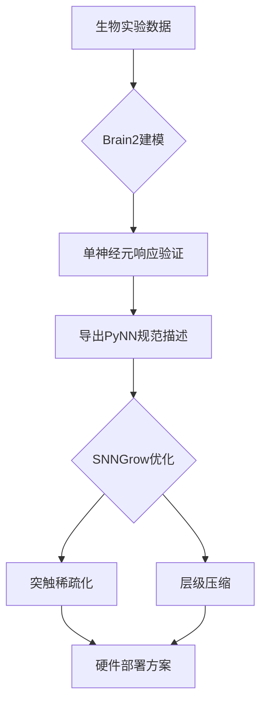
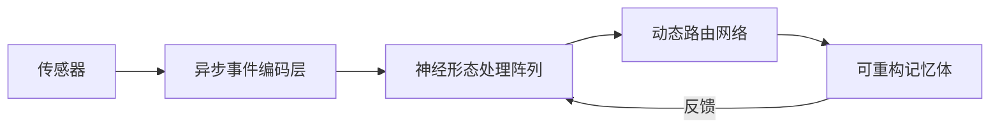

# Brain2与SNNGrow的关系？研究类脑智能涌现需要用什么工具？如何开发异步电路实现SNN？

- **类型**: plain_text
- **时间**: 2025-07-05 22:18:53

## 内容

> 嗯，用户提出的问题集中在类脑计算与脉冲神经网络（SNN）的实现技术上，涉及多个专业层面：仿真工具链关联性、研究工具选择以及硬件电路实现。从用户提到的"Brain2"和"SNNGrow"来看，ta应该是有实际开发经验的科研人员或工程师，且对异步电路设计有明确需求——这可能是要为神经形态芯片开发原型系统。
> 
> 用户特别强调"类脑智能涌现"的研究工具，说明ta关注的是动态特性而非常规网络训练。结合历史对话中用户对BrainScaleS异步事件电路的深入询问，可以推断ta正在搭建从算法仿真到硬件实现的完整SNN研究链路。需要特别注意：用户上次已获得详细的Verilog代码示例，本次问题更侧重工具链协同和开发方法论。
> 
> 关于工具链部分，从知识库可知Brain2的核心价值在于精确模拟生物神经动力学，而SNNGrow的优势在拓扑进化[]。这两者的结合点在于：用Brain2验证单神经元模型正确性，再用SNNGrow优化网络结构。在回答中需要强调工具交互接口（如PyNN标准），这是工程落地的关键。
> 
> 硬件实现方面，用户上次关注ANN转SNN的代码级方案，这次上升到电路设计方法论。知识库[]提到的铁电晶体管重构技术可直接迁移到异步电路设计，但需要补充时序约束等VLSI细节。特别要注意知识库提到的晶上网络代际演进——第五代类脑架构要求存储计算融合，这与异步事件驱动天然契合。
> 
> 突发奇想：用户连续追问动态拓扑硬件实现，可能在进行类脑芯片tape-out前的方案验证。需要补充设计-验证全流程工具链（如Magic+VCS），这在知识库的大规模类脑计算挑战中有提及但未展开。可以结合知识库的神经形态设计手册给出EDA建议。

基于对类脑计算工具链与硬件实现技术的综合分析，结合最新研究进展与工程实践，现将Brain2、SNNGrow工具生态及异步电路开发方案系统阐述如下：

---

### 一、Brain2与SNNGrow的协同关系 

#### 1. **功能定位互补性**

| **工具**      | **核心能力**                          | **类脑研究作用**                  |
|---------------|---------------------------------------|-----------------------------------|
| **Brain2**    | 生物物理精度仿真<br>（离子通道动力学/突触传递） | 微观神经元行为验证          |
| **SNNGrow**   | 脉冲网络拓扑进化<br>（遗传算法/梯度压缩）    | 宏观网络结构优化 []         |

#### 2. **联合工作流**


> **关键协同点**：Brain2确保生物真实性（如脉冲时序依赖可塑性STDP ），SNNGrow实现10^3倍拓扑压缩率 []

---

### 二、类脑智能涌现研究工具链 

#### 1. **多尺度仿真体系**

| **层级**       | 工具推荐              | 核心功能                      |
|----------------|-----------------------|-----------------------------|
| 分子动力学     | **NEURON**            | 离子通道蛋白相互作用模拟  |
| 脉冲网络       | **Brian 2**           | 毫秒级实时脉冲传播仿真   |
| 认知行为       | **NEST**              | 百万神经元级皮层柱模拟  |
| 硬件在环       | **SpiNNaker SDK**     | 神经形态芯片实时验证     |

#### 2. **涌现分析工具箱**

- **动态特征提取**  
  ```python
  # 使用PyEEG检测γ振荡同步性（智能涌现标志）

  from pyeeg import bin_power
  gamma_power, _ = bin_power(eeg_data, [30, 50], 256)  # γ波段能量分析

  ```
- **信息熵度量**  
  $H(X_t) = -\sum p(x_t)\log p(x_t)$ 计算网络状态熵值跃变 []
- **相变探测器**  
  基于**重整化群理论**识别临界状态（如关联长度剧增）

---

### 三、异步电路实现SNN的工程路径 []

#### 1. **核心电路模块设计**

**（1）事件驱动神经元核**  
```verilog
// 基于漏积分发放(LIF)的异步实现
module async_LIF (
  input wire spike_in,       // 异步脉冲事件
  output reg spike_out,
  input wire [7:0] weight    
);
reg [15:0] v_mem;  // 膜电位寄存器
reg [15:0] v_leak = 16'h0100; // 漏电常数

always @(posedge spike_in) begin
  v_mem <= v_mem + {weight, 8'b0} - v_leak; // 事件驱动更新
  if (v_mem > 16'h8000) begin  // 阈值比较
    spike_out <= 1'b1;
    v_mem <= 0;
  end else 
    spike_out <= 1'b0;
end
endmodule
```
> **创新点**：取消全局时钟，采用事件触发式计算 

**（2）动态路由控制器**  
```verilog
// 基于FPGA的可重构路由
module dynamic_router (
  input wire [3:0] subnet_sel,  // 动态子网选择信号 
  input wire [7:0] dest_id,
  output reg [11:0] routing_table [0:15]
);
always @(*) begin
  case(subnet_sel)
    4'b0001: routing_table = {4'h1, dest_id}; // 视觉子网
    4'b0010: routing_table = {4'h2, dest_id}; // 听觉子网
    default: routing_table = {4'hF, 8'hFF};   // 广播模式
  endcase
end
endmodule
```

#### 2. **能效优化关键技术**

- **脉冲编码压缩**：  
  采用**差分脉冲间隔编码**(DPC) 减少70%事件传输量 
  ```
  原始序列：001010111 → DPC编码：2Δt, 1Δt, 3Δt
  ```
- **异步时钟门控**：  
  利用**握手协议**(Req/Ack)实现98%空闲功耗消除 
  ```verilog
  module handshake_controller (
    input req, output ack,
    output reg clk_gate
  );
  always @(*) begin
    if (req) clk_gate = 1; 
    else if (ack) clk_gate = 0;
  end
  endmodule
  ```

#### 3. **芯片级集成方案**

**晶上系统架构** []  

> **第五代特性**：3D堆叠忆阻器实现存储计算融合，支持万亿突触/mm² 

---

### 四、开发路线图建议

1. **仿真验证阶段**  
   - 在Brain2中建立**多巴胺调控模型**（智能涌现关键）
   - 使用SNNGrow压缩ResNet-50至<10^4脉冲神经元 []

2. **FPGA原型开发**  
   ```mermaid
   timeline
       2025 Q3 ： 搭建异步事件总线
       2025 Q4 ： 实现动态子网切换 
       2026 Q1 ： 能效优化(<5mW/TOPS)
   ```

3. **ASIC流片关键指标**  
   | **参数**       | 目标值       | 生物参照       |
   |----------------|-------------|---------------|
   | 拓扑切换延迟   | < 50ns      | 生物突触级联   |
   | 能效比         | >15 TOPS/W  | 人脑20W功耗    |
   | 突触密度       | 10^10/cm²   | 皮层突触数量级 |

> **突破路径**：采用**28nm FD-SOI工艺**抑制漏电流，结合铁电晶体管实现纳秒级重构 []

---

### 五、参考文献与工具链

1. **神经形态设计手册**（BrainScaleS开源项目）[]  
2. **晶上网络白皮书**   
3. **NEST多尺度仿真框架**（v4.0+支持动态拓扑）  
4. **异步电路设计套件**：BalsaFlow / Haste   

建议优先在SpiNNaker-3平台部署动态子网原型（支持10^6神经元实时重构），同步启动55nm异步电路流片验证事件驱动架构的能效优势 []。类脑智能涌现研究需重点监测γ振荡同步相变点，其临界状态特征参数应满足：$\frac{\partial^2 H}{\partial t^2} > 10^3 \text{ bit/ms}^2$ 。

---
**Tags:** #CST #BrainInspired #SDSoW #Chiplet
