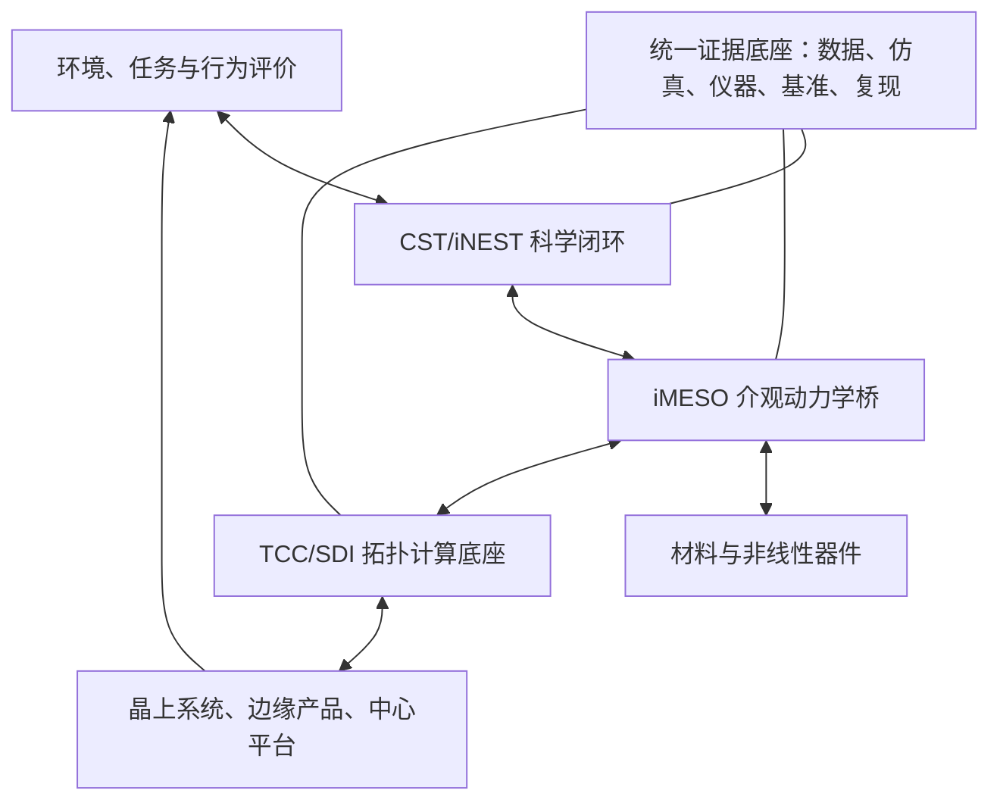

# CST—iNEST—iMESO—TCC 理论技术工程一体化研究与发展规划

> 面向 2026 年 9 月国家自然科学基金、军科委和苏州实验室论证的共同母版，也是 2027—2035+ 智涌脑路线的研究与工程执行基线。
>
> **时间轴唯一基准**：`D:\iNEST\Write\Code\other\iNEST4.md`。代际年份和连接规模按 `[规划目标]` 继承；CST 数值、自然常数阈值、能效及“2035 必然实现 AGI”等论断须重新验证。

## 0. 执行摘要

### 0.1 五项总判断

1. **科学主线**：研究“网络结构、动力学、物理载体与环境交互在何种条件下产生可重复的新能力”。CST 是候选测量框架，iNEST 是科学范式与系统架构；尚未独立验证的标量不能直接等同于智能。
2. **工程主线**：TCC 研究“如何把拓扑、路由、变换、存储和互连统一为可编程计算底座”，优先在智能算力、晶上信号处理、超低轨卫星智能体和 DRBE 晶圆级装备中形成可测量优势。
3. **介观桥梁**：iMESO 定义器件与大系统之间可测量、可控制、可组合的动力学单元，承担“材料/器件非线性 → 网络方程参数 → 系统行为”的双向映射。
4. **统一策略**：采用“**两条主线 + 一座桥 + 一个证据底座**”：CST+iNEST 科学线、TCC 工程线、iMESO 介观桥、CSTBench/MesoBench 证据底座。
5. **规模原则**：连接规模是智能涌现不可删除的独立变量和必要条件候选，但不是充分条件。每代智涌脑必须同时通过**规模门、动力学门、行为门、工程门**；小网络仿真不得宣称通用智能。

### 0.2 当前状态与合规表达

| 对象 | 状态 | 可以表述 | 不可表述 |
|---|---|---|---|
| CST 标量公式 | `[候选理论]` | 结构—时间—耦合的候选综合指数 | 已成为智能物理定律 |
| 六个自然常数 | `[待验证假设]` | 作为预注册固定阈值模型参与比较 | 已被第一性原理证明、对应六级智能 |
| 40 系统、ρ=0.976、UCCP 100% | `[待独立复现]` | 论文内部探索性重构结果 | 跨物种实测或独立验证结论 |
| 材料/器件 α | `[待系统辨识]` | 定义有效物理增益并由实验估计 | `α=ln(M_eff)` 是材料定律或有固定典型值 |
| iNEST 局部机制 | `[候选机制族]` | 局部可塑性、调制、稳态和重构的组合 | SOC 与 STDP/BCM 等是同层“规则” |
| iMESO | `[概念原型]` | 可形成介观单元、接口和工具链 | 已形成完备理论和成熟硬件体系 |
| TCC | `[工程研发]` | 通过公开基准验证拓扑内计算价值 | 已全面优于所有 scale-up/scale-out 网络 |

> **北极星命题**：只有当理论给出可证伪预测，动力学把预测映射到可控变量，工程平台完成可重复干预，且新增能力在独立任务、数据和跨尺度实验中成立时，才能称为“智能涌现工程闭环”。

## 1. 方法、范围与证据制度

### 1.1 六级证据标签

- `[引用]`：同行评议论文、标准或厂商正式规格；必须附 DOI/URL，并区分论文结论与厂商宣称。
- `[推导]`：由明确假设和来源推出；必须给出量纲、边界条件和完整过程。
- `[仿真]`：固定代码、版本、种子、配置、原始结果和重放脚本。
- `[实测]`：来自器件、FPGA、芯片、晶圆或系统仪器测量，保留校准、误差和样本记录。
- `[待测]`：指标和方法已定义，尚无合格数据。
- `[规划目标]`：用于项目管理的里程碑，不构成科学事实或能力证明。

每个性能指标还必须绑定任务编号、验证方法、对照基线、验收规则和数据负责人。无法满足者一律留为 `[待测]`，不允许以“经验估计”补数。

### 1.2 冲突裁决顺序

发生冲突时依次采用：**可复现实测/仿真原始数据 > 同行评议外部证据 > 预注册协议 > 最新术语与符号基线 > 项目规划 > 宣传材料**。文件名中的“V32”“最终版”“权威版”不构成证据等级。

### 1.3 四层对象及边界

| 层次 | 核心问题 | 主要产物 | 成功条件 |
|---|---|---|---|
| CST | 如何测量和证伪涌现潜力 | 向量、场、用例指数、基准数据 | 对未见系统有增量预测力 |
| iNEST | 何种局部机制与网络条件产生何种能力 | 动力学、架构、任务谱系 | 干预可重复地产生能力跃迁 |
| iMESO | 如何跨越器件与系统尺度 | 介观单元、模型、IR、测控接口 | 可测、可控、可组合、可移植 |
| TCC | 如何把拓扑和网络变成计算资源 | 原语、互连、编译器、运行时 | 公开基准上形成可复现优势 |

### 1.4 统一闭环

闭环顺序是：**假设 → 方程 → 可控参数 → 介观映射 → 系统实现 → 行为实验 → 反事实干预 → 独立复现 → 理论修正**，而不是“计算一个 CST 分数后宣布智能等级”。

## 2. CST V32 与既有规划的批判性诊断

### 2.1 版本与证据不一致

当前名为 `A1_CST_Theory_V32_MERGED_CLEAN.md` 的稿件页眉仍写 `v25-FINAL`，并保留“40-system validated”“ρ=0.976”“100% accuracy”等结论。内部《CST Experiment Alignment Diagnosis》同时确认，早期仿真并未计算完整 CST，`T_c` 分量不全，`Γ_st` 定义不一致。因此当前最严格的表述应为：

> `[仿真/待独立复现]` 在作者定义、人工重构与归一化协议下，40 个系统样本呈现较高秩相关；这不是 40 个系统的 CST 直接实测，也尚不能证明阈值普适性、因果性或跨域可辨识性。

必须同时披露：数据直接性等级、缺失值填补、归一化锚点、人工标签来源、阈值是否在见到标签后选择、系统发育相关性、误差传播、代码和原始数据。不能以“来自论文中的局部数据”替代“CST 全量直接测量”。

### 2.2 连接规模缺项是模型设定缺陷

若 CST 仅由归一化的 `S_c`、`T_c`、`Γ_st` 和 `α` 构成，则规模差异可能在归一化后消失；一个小网络可能获得与超大网络相同的标量。这与有限尺寸效应、状态空间容量、长程整合和人脑巨大连接规模所提示的必要规模约束不一致。

但也不能反向断言“连接越多必然越智能”。应把规模作为**独立解释变量和阶段门**，并至少报告：

| 变量 | 定义 | 防止的误判 |
|---|---|---|
| `N_phy` | 物理节点总数 | 用复杂节点内部晶体管冒充网络节点 |
| `E_phy` | 物理实现的连接总数 | 用理论完全图冒充已实现连接 |
| `E_act(Δt)` | 观察窗内实际激活连接数 | 静态布线冒充动态参与 |
| `E_prog` | 可独立编程或重构的连接数 | 广播扇出冒充独立自由度 |
| `E_causal` | 扰动后对系统状态有可辨识因果效应的连接数 | 相关性冒充有效作用 |
| `N_eff/E_eff` | 经相关、冗余和粗粒化后的有效自由度/作用边 | 重复连接冒充复杂度 |

`iNEST4.md` 的 `10^6→10^14` 统一解释为 `[规划目标] E_phy`；各代验收时必须同时报告 `E_act`、`E_prog` 和 `E_causal`。规模定义一旦变更，历史数据必须重算，禁止换口径保持“达标”。

### 2.3 六个自然常数不是已证明阈值

`1/√2、1、φ、e、π、δ` 在不同数学与物理问题中重要，不等于它们天然构成智能等级边界。当前把 Shannon、热力学、黄金分割、Landauer、Kuramoto、Feigenbaum 分别映射到六级智能，存在以下断裂：

1. 各常数来自不同对象、量纲和边界条件，尚无共同生成定理；
2. 从某物理系统存在该常数，不能推出 CST 在该数值出现行为相变；
3. 等级标签和阈值若来自同一批样本，会产生循环验证；
4. 固定阈值若随规模、任务或测量窗口漂移，则不具普适性。

正确处理是把自然常数模型记为预注册候选 `M_const`，与连续模型 `M_cont`、自由变点模型 `M_cp`、规模—动力学交互模型 `M_scale` 比较。只有在锁定数据前固定阈值，且在独立系统、独立实验室和未见任务上显著优于更简单模型，才能升级证据等级。

### 2.4 α 不能先验等同于材料“档位数”

`α=ln(M_eff)` 将数字状态数、神经元电位层次和材料非线性混成同一量，缺乏统一的微观哈密顿量、粗粒化映射和实验辨识协议。忆阻器 `α=2.8–4.5`、人脑 `α=3.91` 等值现阶段应撤出验收指标。

修订后，`α_eff` 仅作为某模型、工作点、激励谱和时间窗下的**有效耦合增益**。通过阶跃/脉冲/多音激励、迟滞环、记忆核、噪声谱、温漂和循环数据进行系统辨识；报告后验分布或置信区间，而不是按材料类别给固定常数。若不同激励下无法稳定辨识，则应使用参数向量或核函数替代单一 α。

### 2.5 临界性不是“谱半径等于 1”

`ρ(A)≈1` 只在特定线性化、离散时间和近似假设下有意义。面对有向、非正规、带时延、非线性、随机和时变网络，至少联合考察：Jacobian 稳定性、Lyapunov 谱、伪谱与瞬态放大、时延特征根、分支比、易感性、亚稳态、恢复时间、可控性和任务行为。

神经雪崩幂律也不是智能的充分证据。Touboul 与 Destexhe 等研究表明，非临界随机过程也可能产生近似幂律。SOC 应定义为待检验的宏观运行区，而不是与 STDP、BCM 或三因子学习并列的局部更新规则。

### 2.6 “去制动最大涌现”方向错误

抑制、泄漏、稳态调节、资源约束和延迟反馈共同决定稳定性与可塑性窗口。完全去除制动通常会导致饱和、同步塌缩、振荡或混沌失控。正确命题是：**识别随任务和尺度变化的可控运行包络，并在探索性、响应性、稳定性和能耗之间优化**，而非最大化某个复杂度分数。

### 2.7 六级智能必须以行为定义

| 等级 | 工作定义 | 最低证据要求 |
|---|---|---|
| I 感知 | 从噪声环境中形成稳定、可泛化的状态辨识 | 未见样本、扰动鲁棒性、校准对照 |
| II 反应 | 根据当前与短时历史选择情境相关动作 | 闭环环境、时序对照、反事实刺激 |
| III 适应 | 在分布变化后通过经验改变策略并保持旧能力 | 在线学习、迁移、遗忘与恢复测试 |
| IV 创造 | 产生新颖且有效、非模板复现的方案 | 新颖性与有效性双盲评价、强基线对照 |
| V 通用 | 跨领域迁移、组合、抽象与自主学习 | 预注册任务族、长期自主性、安全边界 |
| VI 超级 | 在广泛领域稳定超越人类并保持可控 | 尚无可操作的近期验收协议，属远期研究 |

生物物种不得直接贴等级标签；“小鼠通用智能”“某物种 CST 实测值”等表述全部停用。生物数据只用于具体可观测机制或任务比较，不作为人类级能力的替身。

### 2.8 立即退役或降级的主张

| 原主张 | 新状态 | 处理 |
|---|---|---|
| 六个常数已被证明为普适智能阈值 | `[待验证假设]` | 进入三模型盲测 |
| 40 个生物/人工系统 CST 实测，ρ=0.976 | `[探索性重构]` | 发布数据谱系并独立复现 |
| UCCP 100% 准确率证明理论 | `[训练内描述]` | 增加留出集、置信区间和泄漏审计 |
| α 是材料固有常数且等于 `ln(M_eff)` | `[候选参数化]` | 由系统辨识替代查表 |
| 10^7 或其他小规模网络可由 CST 证明通用智能 | `[禁止外推]` | 只报告该规模下已完成任务 |
| 单一 `σ`、谱半径或雪崩即证明智能跃迁 | `[证据不足]` | 改为多指标动力学门 |
| 2035 年实现 AGI 是必然结果 | `[规划目标]` | 以四重阶段门和停机条件管理 |

## 3. 第三方证据与产业边界

### 3.1 顶刊证据矩阵

| 研究方向 | 第三方证据 | 可支撑的判断 | 不能支撑的判断 |
|---|---|---|---|
| 高阶网络 | Battiston et al., *Physics Reports* 2020, [DOI](https://doi.org/10.1016/j.physrep.2020.05.004)；Battiston et al., *Nature Physics* 2021, [DOI](https://doi.org/10.1038/s41567-021-01371-4)；Bick et al., *SIAM Review* 2023, [DOI](https://doi.org/10.1137/21M1414024) | 成对边不足以描述所有群体相互作用；单纯边数不是完整复杂度 | 某个高阶拓扑必然产生智能 |
| 高阶动力学 | Majhi et al., *JRSI* 2022, [DOI](https://doi.org/10.1098/rsif.2022.0043)；Millán et al., *Nature Physics* 2025, [DOI](https://doi.org/10.1038/s41567-024-02757-w)；Battiston et al., *Nature Reviews Physics* 2026, [DOI](https://doi.org/10.1038/s42254-025-00916-3) | 高阶结构会改变同步、传播、稳定性和相变 | CST 的指数形式或六阈值已被这些工作证明 |
| 因果涌现与介观层 | Hoel et al., *PNAS* 2013, [DOI](https://doi.org/10.1073/pnas.1314922110)；Yang et al., *NSR* 2024, [DOI](https://doi.org/10.1093/nsr/nwae279)；Zhang et al., *npj Complexity* 2025, [DOI](https://doi.org/10.1038/s44260-025-00028-0) | 适当粗粒化可能提高因果可解释性；介观层值得独立建模 | 任意粗粒化都更智能或 iMESO 已获验证 |
| 神经临界性 | Beggs & Plenz, *J. Neuroscience* 2003, [DOI](https://doi.org/10.1523/JNEUROSCI.23-35-11167.2003)；Kinouchi & Copelli, *Nature Physics* 2006, [DOI](https://doi.org/10.1038/nphys289)；Shew et al., *J. Neuroscience* 2009, [DOI](https://doi.org/10.1523/JNEUROSCI.3864-09.2009) | 临界附近可出现动态范围、信息传输等优势 | 临界性等于智能，或所有智能系统必须精确在单一点 |
| 临界性质疑 | Touboul & Destexhe, *PRE* 2017, [DOI](https://doi.org/10.1103/PhysRevE.95.012413)；Meshulam et al., *PRL* 2019, [DOI](https://doi.org/10.1103/PhysRevLett.123.178103) | 幂律证据需要替代模型、有限尺寸与粗粒化检验 | 观察到雪崩或尺度律即可宣布 SOC/智能跃迁 |
| 神经形态计算 | Marković et al., *Nature Reviews Physics* 2020, [DOI](https://doi.org/10.1038/s42254-020-0208-2) | 事件驱动、存算融合与物理动力学是可行技术方向 | 已证明可低成本扩展到通用智能 |
| 忆阻与存内计算 | Xia & Yang, *Nature Materials* 2019, [DOI](https://doi.org/10.1038/s41563-019-0291-x)；Wang et al., *Nature Reviews Materials* 2020, [DOI](https://doi.org/10.1038/s41578-019-0159-3)；Yao et al., *Nature* 2020, [DOI](https://doi.org/10.1038/s41586-020-1942-4) | 忆阻器可承担存内计算、可塑性和非线性动力学 | 器件离散性、漂移和可靠性不再需要工程管理 |
| 物理网络智能 | Milano et al., *Nature Materials* 2021, [DOI](https://doi.org/10.1038/s41563-021-01099-9)；Wan et al., *Nature* 2022, [DOI](https://doi.org/10.1038/s41586-022-04992-8)；Aguirre et al., *Nature Communications* 2024, [DOI](https://doi.org/10.1038/s41467-024-45670-9) | 材料/器件网络可表现记忆、适应和任务求解 | 单器件实验等同于网络级涌现或六级智能 |
| 新型神经形态系统 | Pedersen et al., *Nature Communications* 2024, [DOI](https://doi.org/10.1038/s41467-024-52259-9)；Yik et al. 2025, [DOI](https://doi.org/10.1038/s41467-025-56739-4)；Muir & Sheik 2025, [DOI](https://doi.org/10.1038/s41467-025-57352-1) | 异构器件、动力学计算和硬件学习持续进步 | 产业成熟度或 CST 特定参数已有共识 |

### 3.2 产业事实矩阵

下表均为 `[官方规格/厂商宣称]`，只证明工程规模和技术趋势，不等同于第三方性能验证。

| 平台/标准 | 官方信息 | 对本项目的启示 |
|---|---|---|
| Intel Hala Point | 1.15 billion neurons，[官方页](https://www.intel.com/content/www/us/en/research/neuromorphic-computing.html) | 大规模事件驱动神经形态系统可工程实现；“神经元数”与本项目“连接数”不得混用 |
| Cerebras WSE-3 | 46,225 mm²、4 trillion transistors、900,000 AI cores，[官方页](https://www.cerebras.ai/chip) | 晶圆级集成已成为中心算力路线，验证晶上系统的产业窗口 |
| NVIDIA GB200/GB300 NVL72 | 机架级 NVLink 总带宽宣称 130 TB/s，[官方页](https://www.nvidia.com/en-us/data-center/gb200-nvl72/) | TCC 必须与顶级 scale-up 机架做同负载、同规模、同可靠性对比，不能只与旧以太网比较 |
| UCIe 2.0/3.0 | 2.0 引入 3D 封装支持；3.0 支持 48/64 GT/s，[规范页](https://www.uciexpress.org/specifications) | TCC-Link 应考虑兼容/桥接主流开放芯粒生态，而非封闭替代一切 |

### 3.3 外部证据形成的真实战略窗口

1. `[引用]` 复杂网络、高阶相互作用、因果粗粒化和物理神经形态均已形成国际前沿，但尚无统一的“智能涌现工程学”。
2. `[推导]` 这为 iNEST 提供的是**可竞争的研究空白**，不是现成背书。差异化应来自可证伪理论、跨尺度动力学和工程干预闭环。
3. `[引用]` 晶圆级芯片、机架级 scale-up、UCIe 芯粒正在快速演进。TCC 的窗口在“拓扑即计算、互连可编程、通信—计算协同”，不能依赖传统网络停滞。
4. `[规划目标]` 项目对外叙事应是“建立开放、可复现的拓扑流形涌现智能研究范式”，而不是提前宣称已经破解 AGI。

## 4. CST 2.0：从单标量到可证伪测量科学

### 4.1 五条公理化要求

1. **可操作性**：每个量必须有观察窗、仪器、算法、误差和缺失数据规则。
2. **规模不可消去**：节点、物理边、激活边、可编程边、因果边和有效自由度必须独立报告。
3. **情境依赖**：复杂性是尺度、时间窗、任务、环境、载体和工作点的函数，而非脱离情境的材料常数。
4. **因果优先**：相关结构只能生成候选解释；能力机制必须通过干预、消融、恢复和迁移验证。
5. **模型竞争**：固定阈值、自由变点、连续关系和无效模型必须在锁定数据前共同注册。

### 4.2 三层测量体系

**第一层：CST-Vector（原始测量向量）**

$$
\mathbf z=(\mathbf n,\mathbf s,\mathbf d,\mathbf c,\mathbf p,\mathbf b,\mathbf q)
$$

- `n`：`N_phy, E_phy, E_act, E_prog, E_causal, N_eff, E_eff` 等规模量；
- `s`：连通、层级、模块、小世界、高阶单纯形/超边、路径与流形量；
- `d`：稳定性、Lyapunov 谱、分支比、熵率、亚稳态、记忆核、可塑性和时间尺度；
- `c`：结构—功能耦合、定向信息流、跨尺度耦合和干预响应；
- `p`：噪声、能耗、时延、器件非线性、漂移、温度和可靠性；
- `b`：按任务定义的行为能力、泛化、适应、恢复和安全；
- `q`：数据质量、直接性等级、置信区间和复现状态。

**第二层：CST-Field（复杂度场）**

$$
\mathcal F_{CST}=\mathcal F(\ell,\Delta t,\mathcal T,\mathcal E,\mathcal P,\omega)
$$

其中 `ℓ` 为粗粒化尺度，`Δt` 为观察窗，`T` 为任务族，`E` 为环境，`P` 为物理载体/工作点，`ω` 为随机实现。输出是向量或概率分布，而不是一个永久不变的分数。

**第三层：CST-Index（预注册用例指数）**

$$
I_u=f_u(\mathbf z;\theta_u),\quad u\in\{预测,控制,比较,认证\}
$$

每个 `f_u` 只能服务一个声明清楚的用例，并在验证数据揭盲前锁定权重和变换。不同用例不得共享一个“万能排名”。

### 4.3 保留 CST-0，但改变其科学地位

现有公式作为候选指数 `CST-0` 保留：

$$
CST_0=(S_cT_c)\exp(\alpha_{eff}\Gamma_{st})
$$

$$
S_c=(C\cdot H\cdot M\cdot R_{sw})^{1/4},\qquad
T_c=(\lambda_{eff}\cdot\Phi\cdot\Psi\cdot\Theta)^{1/4}
$$

这确保 `S_c` 和 `T_c` 均保持四分量术语一致；但四分量、等权几何平均、指数耦合和 `α_eff` 均是待检验建模选择，不再称为唯一判据。`α_eff` 的量纲、可辨识性和工作点依赖须由 iMESO 系统辨识给出。

### 4.4 规模—动力学模型竞争

令 `Y` 为预注册行为端点，至少比较：

$$
\begin{aligned}
M_0 &: Y\sim CST_0 \\
M_N &: Y\sim f(\log E_{eff}) \\
M_A &: Y\sim f(\log E_{eff})+g(\mathbf z_{dyn}) \\
M_I &: Y\sim f(\log E_{eff})+g(\mathbf z_{dyn})+h(\log E_{eff},\mathbf z_{dyn}) \\
M_{const} &: Y\sim \text{六个固定自然常数变点} \\
M_{cp} &: Y\sim \text{由训练集估计的自由变点}
\end{aligned}
$$

使用按实验室、物种/架构族和时间批次的分组留出；比较未见数据上的预测对数得分、校准、误差、复杂度惩罚和对简单基线的增量价值。只有 `M_const` 稳定优于其他模型时，才继续讨论自然常数的普适解释。

### 4.5 有限尺寸与能力包络

`E_eff` 不是 CST 的装饰项，而是能力包络和相变圆整的控制变量。候选有限尺寸分析为：

$$
O(E,u)=E^{-\beta/\nu}\,\Phi\left((u-u_c)E^{1/\nu}\right)
$$

其中 `O` 是可观测动力学/行为量，`u` 是可控耦合或驱动参数。该式仅为 `[候选推导框架]`；研究任务是检验不同规模曲线能否塌缩、临界区是否随规模漂移、行为增益是否在规模放大后保持。没有跨数量级数据，不得外推到 `10^12–10^14`。

### 4.6 智能等级与 CST 的关系

六级智能由第 2.7 节行为协议定义；CST 只预测条件概率：

$$
P(L\ge k\mid \mathbf z,\mathcal T,\mathcal E,\ell,\Delta t)
$$

不得再用 `CST≥常数` 自动发证。每一级须形成任务集、强基线、消融、跨环境迁移、长期稳定性和安全约束。连接规模只决定是否有资格进入该代研究，不替代行为证据。

### 4.7 V32 修复与 CSTBench

| 任务 | 内容 | 验收 |
|---|---|---|
| CST-V01 | 冻结 40 系统数据谱系、原始来源、转换和缺失值 | 任一表格单元可追溯至原始数据；无来源值删除 |
| CST-V02 | 独立重跑 V32 全部计算 | 新环境一键复现图表与统计；差异有审计记录 |
| CST-V03 | 六模型预注册盲测 | 留出集揭盲前锁定阈值、变换和主端点 |
| CST-V04 | 有限尺寸系列实验 | 报告尺度漂移、置信区间和外推边界 |
| CST-V05 | 因果干预与结构保持对照 | 区分边数、拓扑、动力学和任务训练效应 |
| CST-V06 | 第二实验室独立复现 | 原作者不接触测试标签；发布复现报告 |

`CSTBench` 交付数据模式、质量标签、计算 API、基线模型、预注册模板、容器环境和证据卡。若 `CST_0` 在独立数据上无增量预测价值，则退役该标量，但保留 Vector/Field 测量体系继续研究。

## 5. iNEST 统一动力学：从局部规则到行为能力

### 5.1 五层因果链

| 层 | 对象 | 不能混淆为 |
|---|---|---|
| L0 物理载体 | 电导、相变、迟滞、噪声、挥发、时延 | 抽象“智能参数” |
| L1 局部规则 | 状态更新、相关可塑性、调制、稳态、结构生灭 | SOC、智能等级 |
| L2 网络动力学 | 传播、同步、亚稳、分岔、吸引子、因果流 | 行为能力本身 |
| L3 宏观运行态 | 亚临界、临界区、超临界、混沌、锁定 | 一条局部学习规则 |
| L4 行为能力 | 感知、反应、适应、创造、通用、安全 | 单个动力学统计量 |

### 5.2 候选随机时延网络方程

以下是 `[候选模型]`，用于统一仿真、器件辨识和硬件映射，不称为已证明的智能方程：

$$
d x_i(t)=\left[f_i(x_i;\mu_i)+\sum_j A_{ij}(t)g_{ij}\big(x_i(t),x_j(t-\tau_{ij});w_{ij},\zeta_{ij}\big)+B_i u(t)\right]dt
-\gamma_i(t)\nabla V_i(x)dt+\Sigma_i(x,t)dW_i(t)
$$

其中 `x_i` 是节点状态，`A_ij` 是连接存在性/类型，`w_ij` 是强度，`ζ_ij` 是器件内部状态，`τ_ij` 是时延，`u` 是环境输入，`γ∇V` 是约束与稳态控制，`ΣdW` 是内外噪声。制动项既可能抑制探索，也可能保证可观测性和安全性；其最优值必须实验确定，不能预设为零。

### 5.3 四条简单规则的统一修订

团队已有 `SDI_Four_Rules_v5_FINAL` 的工程内核可保留，但名称和逻辑层级修订如下：

| 修订规则 | 数学角色 | 原工程含义 | 科学修订 |
|---|---|---|---|
| R1 相关可塑性 | 快时间尺度 `P_corr` | STDP 强化/削弱 | STDP 是候选实例；允许速率、三因子和器件特定规则竞争 |
| R2 结构探索 | 中时间尺度 birth proposal | 新生低权连接 | 由任务误差、局部活动、资源和随机探索共同提议 |
| R3 稳态调节 | 慢时间尺度负反馈 | E/I 平衡与突触缩放 | 保留制动；目标区间由系统辨识和任务优化确定 |
| R4 竞争选择 | 更慢时间尺度 death/consolidation | 相对修剪与固化 | 必须有资源预算、连通保护、恢复与灾变防护 |

**SOC 不再列为 R4 或第五条局部规则**。它是上述机制可能产生的宏观运行区；FEP/主动推断可作为 R1/R2 的调制目标，BCM 可作为 R1/R3 之间的滑动阈值机制，均不被宣称为唯一生物真理。

### 5.4 多时间尺度可塑性方程

$$
\dot w_{ij}=\epsilon_f P_{corr}(x_i,x_j,\Delta t)
+\epsilon_m m(t)e_{ij}(t)
+\epsilon_s P_{homeo}(r_i,\theta_i)
-\lambda_w w_{ij}+\xi^w_{ij}(t)
$$

$$
\dot\theta_i=\eta_\theta(r_i^2-\theta_i),\qquad
A_{ij}(t^+)=\mathcal S(A_{ij},w_{ij},c_{ij},E_{ij},\xi_{ij})
$$

`e_ij` 是资格迹，`m(t)` 是奖励/预测误差/自由能等调制信号，`θ_i` 是 BCM/稳态阈值，`c_ij` 是资源成本，`E_ij` 是环境与任务证据，`S` 是新生、修剪、固化和类型转换的随机结构算子。四条规则是该方程族的一种离散实现，而不是自然界唯一参数集。

### 5.5 器件到方程的映射

非线性器件先写为：

$$
\dot\zeta=F(\zeta,V,T,\mathcal H)+\sigma_\zeta\xi(t),\qquad I=G(\zeta,V,T)V
$$

其中 `H` 表示历史。通过统一激励协议辨识以下量：记忆核、阈值、增益、迟滞面积、非对称性、挥发时间、饱和、噪声、温漂、循环漂移和器件间分布。映射关系为：

- 电导/状态 → `w_ij, ζ_ij`；
- 易失性与保持 → `λ_w`、快慢时间尺度；
- 脉冲响应与非对称性 → `P_corr`；
- 随机开关 → 结构探索噪声；
- 抑制/泄漏/限流 → `γ∇V` 与安全包络；
- 互连时延与带宽 → `τ_ij`、事件丢失和耦合核。

“放宽一致性”只能在**系统对分布、漂移和故障的容忍包络已经实测**后成立。iNEST 不追求每个器件精确一致，但追求非线性分布可辨识、可编程、可校准、可监控和可恢复。

### 5.6 理论推导任务链

| 任务 | 内容 | 交付与证伪条件 |
|---|---|---|
| DYN-01 | 量纲化与无量纲化 | 所有项单位一致；列出独立无量纲群 |
| DYN-02 | 存在唯一性与数值稳定 | 给出适用条件；求解器通过收敛阶测试 |
| DYN-03 | 平均场/主方程/Fokker–Planck | 与小网络精确仿真误差可量化 |
| DYN-04 | 固定点、分岔、Lyapunov、伪谱 | 预测的边界可由参数扫描复现 |
| DYN-05 | 时延与非正规瞬态 | 区分渐近稳定和瞬态爆发 |
| DYN-06 | 有限尺寸与粗粒化 | 报告曲线塌缩、尺度漂移和失效区 |
| DYN-07 | 可控性、可观性与因果干预 | 能预测哪类局部控制改变宏观行为 |
| DYN-08 | 离散 SDI/RTL 映射误差 | 软件方程、FPGA 和器件轨迹在误差预算内对齐 |

### 5.7 三元生成内核的科学定位

“对称性破缺—局部规则—时空粗粒化”可作为 `[候选机制框架]` 生成实验假设；“惯性制动只维持、不参与生成”“去除负特征值即可高阶涌现”“三元是充要条件”均未完成同行评议和严格证明。规划采用更中性的四要素：**驱动/破缺、局部更新、跨尺度组织、稳定/资源约束**，通过全因子消融确定必要性、充分性和交互作用。

### 5.8 必须产生的可证伪预测

1. 在控制 `E_eff` 后，特定结构—动力学交互仍能预测未见任务表现；否则 CST 的协同项无增量价值。
2. 相同边数和度序列下，改变高阶结构或时延分布会产生可预测的行为差异；否则“拓扑流形”解释被削弱。
3. 器件非线性参数经辨识后可预测网络运行区；若必须逐网络重新拟合，则 iMESO 跨尺度映射失败。
4. 四规则消融产生方向稳定、跨种子、跨拓扑和跨硬件的影响；若只在单一仿真配置成立，则不得称为普适规则。
5. 规模放大后能力不应仅来自更多训练样本或参数；必须通过匹配计算预算、随机网络和静态拓扑对照分离。

## 6. iMESO：器件—网络—系统的介观桥梁

### 6.1 严格定义

> **iMESO 单元**是由一组物理节点、软件定义化合键、局部状态与测控端口构成的介观动力学模块；它必须同时满足**可测量、可辨识、可控制、可组合、可迁移、可失效隔离**。

“介观”不由固定节点数定义，而由闭包性质定义：模块内部快变量可被局部模型解释，模块之间通过受控接口耦合，粗粒化后仍保留完成目标任务所需的因果信息。

### 6.2 iMESO 六件套

| IP/模块 | 功能 | 最小交付 |
|---|---|---|
| MesoCell | 非线性节点、局部存储、事件生成与状态机 | 数字参考模型 + FPGA/器件实例 |
| MesoBond | 软件定义化合键：方向、符号、强度、时延、可塑性、可靠性 | 统一寄存器和事件协议 |
| MesoProbe | 在线观测、扰动、校准和安全切断 | 时间戳事件、状态采样、干预 API |
| MesoModel | 器件与介观单元系统辨识模型 | 参数后验、误差预算、版本化模型卡 |
| MesoIR | 拓扑、动力学、规则、约束和任务的中间表示 | 文法、类型系统、验证器、序列化格式 |
| MesoRuntime | 配置、调度、闭环控制、故障恢复和证据采集 | 仿真/FPGA/芯片统一运行接口 |

### 6.3 软件定义化合键

每条逻辑键至少描述：

$$
b_{ij}=\langle src,dst,type,sign,w,\tau,rule,state,qos,energy,reliability,provenance\rangle
$$

“化合”指一条逻辑关系可由数据传输、状态更新、同步、变换、学习和可靠性动作共同组成，不是宣传性比喻。MesoBond 必须支持：静态/动态、有向/双向、兴奋/抑制、多时间尺度、局部规则版本、拥塞/故障反馈和可审计配置。

### 6.4 介观粗粒化与组合

对候选划分 `π:X→Z`，同时评价：

- 动力学预测损失 `L_dyn`；
- 干预分布保持 `L_do`；
- 任务充分性损失 `L_task`；
- 接口通信与能耗 `C_io`；
- 可控性/可观性损失 `L_ctrl`。

候选目标为 `[推导框架]`：

$$
\pi^*=\arg\min_\pi \big(L_{dyn}+\lambda_{do}L_{do}+\lambda_tL_{task}+\lambda_cC_{io}+\lambda_xL_{ctrl}\big)
$$

权重必须按用例预注册。若粗粒化仅提高表面指标却损失干预可预测性，则不得称为因果涌现。

### 6.5 iMESO 核心实验

| 编号 | 实验 | 验收 |
|---|---|---|
| MESO-01 | 同一器件跨激励系统辨识 | 参数可辨识性、置信区间和残差检验通过 |
| MESO-02 | 器件分布到网络行为预测 | 在未见批次和温度下给出校准预测 |
| MESO-03 | 数字—FPGA—器件三域等价 | 轨迹统计和任务端点在预注册误差内 |
| MESO-04 | 模块组合与接口扰动 | 组合后模型误差可分解，故障不无界传播 |
| MESO-05 | 粗粒化因果保持 | 干预响应优于等复杂度随机划分基线 |
| MESO-06 | 在线漂移与恢复 | 监测到漂移并完成校准/隔离，保留证据链 |

## 7. TCC：拓扑中心计算的工程底座

### 7.1 边界与统一关系

- **iNEST：1+1>N**，研究能力何时、为何从复杂网络中涌现。
- **TCC：1+1>2**，研究拓扑、路由和变换如何在工程上产生非加性系统收益。
- **iMESO：跨尺度桥**，把前者的动力学变量映射为后者的可编程硬件对象。

“通信≈计算≈智能”以及 Route—Transform 同构目前是 `[候选架构命题]`。必须分别证明语义等价、数值误差、复杂度、硬件代价和适用边界，不能用概念图替代定理。

### 7.2 TCC 分层平台

| 层 | 核心 IP | 作用 |
|---|---|---|
| L0 物理/封装 | 电/光互连、键合、时钟、供电、散热 | 提供晶上可扩展通道 |
| L1 TCC-Link | 链路、流控、可靠性、遥测、故障重构 | 统一晶粒/晶圆/板/机架连接 |
| L2 SDI 化合键 | 拓扑、状态、规则、QoS 软件定义 | 使连接成为可编程计算对象 |
| L3 TCC 原语 | route、reduce、transform、fuse、map、scatter/gather 等 | 数据移动中完成计算和变换 |
| L4 MesoIR/TCC-IR | 图、流形、任务到硬件映射 | 编译与形式验证 |
| L5 Runtime | 调度、拥塞、能耗、故障和自适应控制 | 运行期闭环 |
| L6 应用 | 智能算力、信号处理、卫星智能体、DRBE | 形成产品和系统价值 |

### 7.3 优先从智能算力切入

首批工作负载选择通信占比高、拓扑可利用、可建立强基线的任务：

1. 集合通信：AllReduce、AllGather、ReduceScatter、All-to-All；
2. 大模型：张量/流水/专家并行、KV 传输、稀疏路由；
3. 图与稀疏计算：GNN、图搜索、稀疏聚合；
4. 信号处理：FFT、波束形成、矩阵/张量变换；
5. 多智能体：事件广播、局部共识、任务重构。

### 7.4 与 scale-up/scale-out 的公平对比

| 维度 | 必测指标 | 对照 |
|---|---|---|
| 语义 | 输出等价、数值误差、确定性 | NCCL/MPI/标准算子 |
| 性能 | 端到端时延、有效吞吐、尾延迟、重叠率 | 同节点、同链路、同批量、同精度 |
| 效率 | 总系统能量、数据搬运字节、每有效任务能耗 | 包含主机、交换、内存和空闲功耗 |
| 扩展 | 强/弱扩展效率、拥塞、拓扑敏感性 | scale-up 与 scale-out 分开报告 |
| 鲁棒 | 故障检测、降级、恢复、数值一致性 | 链路/节点故障注入 |
| 代价 | 面积、带宽占用、缓冲、软件复杂度、TCO | 完整物料与开发代价 |

所有具体优越倍数保留 `[待测]`。只有至少两个外部团队在公开基准、同等资源约束下复现，才能使用“优于”而非“有潜力”。

### 7.5 三类系统路线

| 系统 | TCC 价值命题 | 第一阶段证明 |
|---|---|---|
| 智能算力中心 | 减少 collective/稀疏路由的数据搬运与同步开销 | 可重放大模型通信 trace + FPGA/仿真闭环 |
| 超低轨卫星智能体 | 在受限功耗、链路间歇和高动态拓扑下自治协同 | 硬件在环链路/故障/任务重构实验 |
| DRBE 晶圆级装备 | 将阵列信号流、变换和控制闭环映射到晶上拓扑 | 端到端数据采集—处理—控制时序演示 |

## 8. 从 MVP 开始的双轨研发路线

### 8.1 MVP-S：智能涌现科学闭环

**目标**：不是证明“通用智能”，而是在可控小网络上证明一条完整、可复现的因果链。

| 子系统 | MVP 内容 | 验收 |
|---|---|---|
| CSTBench | 数据模式、六模型、有限尺寸、证据卡 | 同一容器一键复现全部主结果 |
| MesoSim | SDDE/事件网络、四规则、器件模型、参数扫描 | 数值收敛与随机种子不确定性报告 |
| TaskLab | 感知、闭环反应、在线适应三个任务族 | 未见环境、强基线和消融完整 |
| CausalLab | 保持边数的拓扑重排、机制消融、延迟与噪声干预 | 预测方向在独立配置重复 |
| HW Replay | FPGA 实现一个 MesoCell 网络并重放 trace | 软件—硬件统计差异在预注册误差内 |

MVP-S 只可声明：“在所给规模、任务、数据和硬件条件下，某些结构—动力学交互与某项能力存在可重复因果关系”。不得把任务表现升级为六级智能证书。

### 8.2 MVP-T：TCC 工程闭环

**目标**：在 FPGA/仿真器上完成最小 TCC-Link + SDI 化合键 + 原语 + 编译运行时，并与标准网络实现同任务对比。

| 子系统 | 最小范围 | 验收 |
|---|---|---|
| TCC-Link v0.1 | 多端点、可靠传输、时间戳、遥测、故障注入 | 协议一致性与故障恢复测试通过 |
| 原语 v0.1 | route、reduce、transform、fuse 至少各一个 | 与参考算子语义一致 |
| TCC-IR | 拓扑、数据流、原语、精度和约束 | 编译前验证非法映射 |
| Compiler/Runtime | 图映射、缓冲、调度、遥测闭环 | 生成可运行配置与完整 trace |
| Benchmark | collective + FFT/信号流 + 稀疏聚合 | 与 NCCL/MPI/CPU/GPU 或等价参考公平对比 |

性能、能效和扩展收益全部为 `[待测]`。MVP-T 的首要门槛是**语义正确、测量可信、基线公平、结果可复现**，不是预设倍数。

### 8.3 MVP-M：器件—介观映射闭环

1. 先用数字模型和可编程噪声/漂移建立仪器协议；
2. 接入单器件和小阵列，估计 `F,G,Σ,τ` 等模型参数；
3. 将后验参数注入 MesoSim 预测网络行为；
4. 在未用于拟合的激励、温度、批次和任务上验证；
5. 只有跨批次预测成立，才进入大阵列和晶上集成。

### 8.4 2026 年 7 月 27 日—9 月 6 日冲刺

| 周期 | 关键行动 | 负责人 | 必须交付 |
|---|---|---|---|
| 7/27–8/2 | 冻结术语、主张、时间轴、连接口径 | 复旦 + PMO，三方会签 | 术语基线、主张账本、iNEST4 时间基线声明 |
| 8/3–8/9 | 锁定候选方程和预注册实验 | 复旦 + NDSC + 天大 | 动力学 v0.1、实验协议、统计分析计划 |
| 8/10–8/16 | CSTBench/MesoSim 软件 MVP | NDSC 主责、复旦验收 | 可运行仓库、样例数据、复现报告 |
| 8/17–8/23 | FPGA/TCC MVP 与硬件测量链 | 天大 + NDSC | 演示、原始 trace、误差与资源报告 |
| 8/24–8/30 | 三套申报材料与红队质询 | 三方 + 苏州实验室 | NSFC、军科委、苏州版母稿和答辩题库 |
| 8/31–9/6 | 独立复现和汇报演练 | 非开发团队 + 外部顾问 | 复现报告、失败清单、最终汇报包 |

### 8.5 9 月最低可汇报状态

- 一套没有相互矛盾的术语、符号、时间和证据基线；
- 一张理论—动力学—介观—TCC—应用统一架构图；
- 一个可运行的 CSTBench/MesoSim；
- 一个小网络因果闭环演示，明确不外推智能等级；
- 一个 TCC 原语与公平基线对照演示；
- 三套面向不同评审逻辑的申报材料；
- 一份第三方/跨团队复现报告和失败清单。

### 8.6 三种申报叙事不能混写

| 渠道 | 核心问题 | 强调 | 回避 |
|---|---|---|---|
| NSFC | 拓扑流形和跨尺度动力学如何产生新能力 | 可证伪假设、数学问题、预注册实验、国际学术空白 | 产品倍数、未经验证的 AGI 时间承诺 |
| 军科委 | TCC 如何形成晶上系统与装备的新质能力 | 任务闭环、可靠性、安全、受限资源、工程门 | 以抽象 CST 分数替代装备指标 |
| 苏州实验室 | 材料—器件—网络—系统如何联合创新 | 非线性映射、介观单元、工艺/测控、团队与平台 | 把器件一致性问题简单宣布为“不重要” |

## 9. 智涌脑 2027—2035+ 权威代际路线

### 9.1 唯一时间基线与继承规则

本节只以 `D:\iNEST\Write\Code\other\iNEST4.md` 为时间来源，取代此前投资演示网页及其他派生材料。锁定主轴为：

| 年份 | 代际 | 连接规模口径 | 能力研究目标 | 科学状态 |
|---|---|---:|---|---|
| 2027 | Gen1 | `E_phy=10^6` | 感知 | `[规划目标]` |
| 2029 | Gen2 | `E_phy=10^8` | 反应 | `[规划目标]` |
| 2031 | Gen3 | `E_phy=10^10` | 适应 | `[规划目标]` |
| 2033 | Gen4 | `E_phy=10^12` | 创造研究 | `[规划目标/待验证]` |
| 2035 | Gen5 | `E_phy=10^14` | 通用研究 | `[规划目标/待验证]` |
| 2035+ | Gen6 | 不预设 | 超级智能理论探索 | `[远期假设]` |

连接规模统一指物理实现边 `E_phy`，不得用节点内部状态、软件虚拟边、完全图潜在边或累积事件数替代。验收同步披露 `N_phy/E_phy/E_act/E_prog/E_causal/N_eff/E_eff`。

### 9.2 每代四重门

1. **G-S 规模门**：达到该代 `E_phy` 规划规模，口径经独立审计；同时报告有效、激活、可编程和因果连接。
2. **G-D 动力学门**：在目标工作包络内有稳定性、亚稳态、可塑性、恢复和有限尺寸证据；不要求一个人为固定 CST 值。
3. **G-B 行为门**：通过对应等级的预注册任务族、未见环境、强基线、消融和长期测试；一个任务成功不能代表整个等级。
4. **G-E 工程门**：功耗、时延、可靠性、面积、良率、可编程性和成本按产品用例 `[待测]`；原始数据可追溯并通过外部复现。

**代际命名规则**：达到规模门但未过行为门，称“GenN 规模原型”；达到行为门但规模不足，称“某任务能力实验”；四门均通过才称“GenN 产品/研究系统”。

### 9.3 分代研发与沿途产品

#### 2026—2027：MVP → Gen1（端侧感知）

- 科学：完成 CSTBench、有限尺寸基线、感知任务和结构—动力学因果干预；
- 技术：MesoCell/MesoBond v0.1、四规则可插拔引擎、器件模型库；
- 工程：FPGA → 小阵列 → `10^6 E_phy` 规模原型；
- 产品：事件感知、异常检测、多模态传感融合等端侧模块；
- 退出条件：若在匹配计算和规模下，动态拓扑对未见任务无增量价值，则暂停放大，先修正机制。

#### 2028—2029：Gen2（闭环反应）

- `[规划目标]` 2028 完成千万级连接中间验证，2029 达到 `10^8 E_phy`；
- 科学：情境动作、短时记忆、闭环因果反馈和扰动恢复；
- 技术：多 iMESO 单元组合、TCC-Link v1、在线拓扑重构；
- 产品：机器人避障、动态监测、任务相关控制、低时延边缘协同；
- 关键门：反应必须依赖环境闭环和历史，排除固定查表、训练集泄漏和人工脚本。

#### 2030—2031：Gen3（在线适应）

- `[规划目标]` 达到 `10^10 E_phy`，形成端—边—小型中心协同；
- 科学：分布变化下在线学习、迁移、灾难性遗忘、世界模型和策略切换；
- 技术：MesoIR/编译器正式版、晶上/多晶粒扩展、长期稳态控制；
- 产品：工业过程自适应、多机器人协同、复杂装备边缘自治；
- 关键门：必须在冻结模型或受限更新预算下展示持续适应，不能把离线重训练写成在线涌现。

#### 2032—2033：Gen4（创造能力研究）

- `[规划目标]` 达到 `10^12 E_phy` 晶圆级/多晶圆研究平台；
- 科学：反事实、新颖且有效的方案生成、组合迁移和因果模型重构；
- 技术：大规模介观粗粒化、可验证动态重构、中心侧研究云；
- 产品定位：优先作为科研与工业创新辅助平台，不提前承诺自主创造智能产品；
- 关键门：新颖性与有效性双盲评审，并对检索、模板拼接和大模型基线做严格排除。

#### 2034—2035：Gen5（通用能力研究）

- `[规划目标]` 达到 `10^14 E_phy`，接近人脑突触数量级仅作为规模参照，不据此推导人类智能；
- 科学：跨领域组合、抽象、元学习、长期自主学习和安全约束；
- 技术：多晶圆/多中心、异构电—光互连、故障自治和大规模运行时；
- 产品定位：中心侧通用研究基础设施；任何“AGI”命名必须通过公开、预注册、跨机构评估；
- 关键门：若行为门未通过，仍称“Gen5 规模研究平台”，不得用规模代替能力。

#### 2035+：Gen6（远期基础探索）

不预设 Feigenbaum 常数、固定连接规模或实现日期。研究递归自改进、开放式演化、复杂系统安全和可控性，并设独立伦理与安全审查。是否进入工程化由 Gen5 证据决定。

### 9.4 生态阶段对齐

| 阶段 | iNEST4 时间 | 本规划的合规目标 |
|---|---|---|
| 启动 | 2027 Q1–Q2 | 白皮书、开源工具、Gen1、核心团队；代码行数不是核心 KPI |
| 增长 | 2028–2029 | 千万中试、Gen2、产业联盟、首批开发者和第三方复现 |
| 扩展 | 2030–2032 | Gen3、标准立项、端—边—中心接口和行业试点 |
| 成熟 | 2033–2035 | Gen4/Gen5 研究平台、认证体系和国际生态；商业价值与 AGI 均按证据更新 |

`iNEST4.md` 中的开发者数、联盟数量、生态价值、云平台接入和能效倍数统一作为 `[规划目标]`，由年度经营计划另行核定，不作为理论成功证据。

### 9.5 代际继承原则

- 接口继承：MesoBond、MesoIR、TCC-Link 和证据卡向后兼容；
- IP 继承：每代复用前代节点、键、编译、运行时和测控 IP，不按代重建烟囱；
- 数据继承：前代所有原始数据、失败实验和模型卡进入下一代验证集；
- 安全继承：规模每增两个数量级，先完成故障、漂移、失控和回滚验证；
- 能力不自动继承：更大规模若未通过行为回归测试，不得假设比前代更智能。

## 10. 组织分工、工作包与协同机制

### 10.1 联合体建议结构

以下人员与角色按团队当前规划记录为 `[拟议组织]`，正式材料须由各单位书面确认：

- 邬江兴院士、徐南平院士：联合领衔与战略委员会；
- 刘勤让：执行负责人/总师，负责理论—工程—应用闭环；
- 复旦大学张帆教授：智能涌现理论、架构、行为验证与学术生态；
- NDSC 李沛杰研究员：高阶拓扑、软件定义互连、化合键、工具链和 TCC 桥接；
- 天津大学于和善副研究员：晶上物理智能实现、FPGA/芯片/晶圆工程和测试；
- 北京大学杨玉超教授团队：动态忆阻器、非线性器件和器件—方程映射；
- 浙江大学潘纲教授团队：脑启发架构、认知任务和应用验证；
- 苏州实验室童祎研究员：材料、界面、缺陷、工艺、可靠性和系统集成平台；
- 中科院李国齐团队：神经形态系统与独立协同验证接口；
- 海河实验室李涛教授：TCC/晶上系统项目接口与装备场景协同。

“七单位协同”的正式口径建议为：复旦、NDSC、天大、北大、浙大、苏州实验室、中科院协同团队；海河实验室作为 TCC 工程与重大专项接口。若法人或申报规则不同，应在合同中重定义，不在科学文本中暗改。

### 10.2 三个主责中心

| 主责单位 | 不可转移的核心责任 | 关键交付 |
|---|---|---|
| 复旦 | CST 公理、可证伪性、iNEST 架构、六级行为任务、学术生态 | CST 2.0、任务谱系、论文、NSFC 母稿、独立学术评审 |
| NDSC | 高阶拓扑、随机网络动力学工具、SDI 化合键、MesoIR/MesoSim、TCC 编译运行时 | 工具链、协议、仿真器、软件定义互连原型、军科委技术母稿 |
| 天大 | 器件参数映射、FPGA/ASIC/晶上实现、仪器测量、测试和工程闭环 | 硬件平台、测量数据、误差预算、工程验证和可制造性报告 |

三者的交接物不是 PPT，而是版本化的：方程/协议、测试向量、模型卡、硬件 trace、原始数据、误差预算和验收报告。

### 10.3 协同单位的不可替代贡献

| 单位 | 优势定位 | 与主线的接口 |
|---|---|---|
| 北大杨玉超团队 | 动态忆阻器、非线性电子器件、物理动力学实现 | 交付器件响应和模型，不预设固定 α；与天大共同完成 MESO-01/02 |
| 浙大潘纲团队 | 脑启发智能架构、认知任务与系统应用 | 与复旦定义行为门，与 NDSC/天大完成任务到硬件映射 |
| 苏州实验室 | 功能材料、界面/缺陷、工艺、键合、可靠性和平台组织 | 主持材料—器件—晶上系统联合项目，完成跨批次与寿命数据 |
| 中科院协同团队 | 神经形态平台与系统验证 | 承担对照实现和第二团队复现，避免开发者自证 |
| 海河实验室 | 晶上系统/TCC 重大专项与装备接口 | 将 TCC 原语、互连和工具链接入超低轨与 DRBE 场景 |

### 10.4 十个工作包

| WP | 名称 | 主责 | 主要协同 | 2026–2027 里程碑 |
|---|---|---|---|---|
| WP0 | 证据治理与术语基线 | 复旦/PMO | 全体 | 主张账本、数据谱系、预注册制度 |
| WP1 | CST 2.0 测量科学 | 复旦 | NDSC、中科院 | CSTBench、V32 独立复现、模型竞争 |
| WP2 | iNEST 统一动力学 | 复旦 | NDSC、浙大 | 候选方程、分岔/有限尺寸、行为预测 |
| WP3 | 高阶拓扑与因果粗粒化 | NDSC | 复旦 | 高阶网络库、iMESO 划分和干预算法 |
| WP4 | 材料与器件系统辨识 | 苏州/北大 | 天大 | 器件数据集、模型卡、跨批次预测 |
| WP5 | iMESO 单元与 SDI 化合键 | NDSC | 天大、北大 | MesoCell/Bond/Probe v0.1 |
| WP6 | TCC-Link 与晶上原型 | 天大 | NDSC、苏州、海河 | FPGA TCC-Link、晶上测控、可靠性实验 |
| WP7 | 编译器、运行时与研发环境 | NDSC | 复旦、天大 | MesoIR/TCC-IR、MesoSim、统一 SDK |
| WP8 | 行为、应用和产品验证 | 复旦/浙大 | 天大、中科院、场景方 | 感知/反应/适应任务和三个应用 Demo |
| WP9 | 标准、生态与产业化 | 执行负责人 | 全体 | 开源治理、专利池、接口规范、联合实验室 |

### 10.5 RACI 决策规则

- 科学定义与行为等级：复旦 `A`，NDSC/浙大 `R`，其他 `C`；
- SDI/TCC 协议和工具链：NDSC `A/R`，天大 `R`，复旦 `C`；
- 硬件实现与测试：天大 `A/R`，苏州/北大 `R`，NDSC `C`；
- 材料工艺与可靠性：苏州实验室 `A`，北大/天大 `R`；
- 独立复现：开发主责单位不得兼任 `A`，由中科院协同团队或外部实验室承担；
- 数据发布与主张升级：证据委员会 `A`，任何单一课题组无权自行升级。

### 10.6 四年 2 亿元先导项目的合理化配置

以下为 `[规划目标]` 预算框架，最终额度按设备共享、流片方案和财政科目审计调整：

| 类别 | 比例 | 规划金额 | 合理性说明 |
|---|---:|---:|---|
| 人员与人才 | 24% | 4,800 万元 | 支撑苏州 30–50 人执行团队及联合岗位；避免人员经费过低 |
| 材料、器件、工艺与流片 | 28% | 5,600 万元 | 多材料路线、小阵列、封装、MPW/工程批次和失败冗余 |
| 仪器、晶上集成与测试平台 | 22% | 4,400 万元 | 优先共享/改造，新增设备须有利用率和开放计划 |
| 软件工具链、数据与算力 | 10% | 2,000 万元 | MesoSim、编译运行时、数据治理、仿真和持续集成 |
| 系统原型与场景验证 | 10% | 2,000 万元 | Gen1/MVP、TCC、端边应用和第三方测试 |
| 开放基金、复现、标准/IP | 4% | 800 万元 | 独立复现、挑战赛、标准、专利和国际合作 |
| 风险准备与审计 | 2% | 400 万元 | 失败路线止损、替代工艺和证据审计 |

预算不得按单位平均分配，应按阶段门释放：概念/模型 10%，MVP 20%，中期独立复现 25%，晶上工程样机 30%，外部验收与生态 15%。未过门的课题停止扩张，预算转入备选路线或验证平台。

### 10.7 苏州 30–50 人执行团队

建议形成 5 个常设组：材料工艺 8–12 人、器件与表征 8–10 人、晶上集成 6–10 人、模型工具 5–8 人、测试/质量/数据 5–8 人；另设 3–5 人 PMO/系统工程。团队人数是上限区间，岗位必须与 WP 和仪器利用率绑定。

### 10.8 300 人、10–15 年组织

| 阶段 | 核心人数 | 组织重点 |
|---|---:|---|
| 2026–2027 | 60–100 | 理论核、MVP、工具链、材料/器件和测试闭环 |
| 2028–2029 | 120–180 | Gen2、多芯/晶上工程、行业试点、质量体系 |
| 2030–2032 | 200–260 | Gen3、标准、开发者生态、产品线和量产准备 |
| 2033–2035+ | 约 300 | Gen4/Gen5 研究平台、中心系统、国际生态和产业化 |

长期组织按“科学、平台、产品、证据、安全”五条线管理；论文与产品均须共享基础设施，避免理论组、硬件组和应用组各自建立不兼容的指标体系。

## 11. 核心 IP、工具生态与产业路径

### 11.1 七层核心 IP 树

| 层级 | 核心 IP | 保护方式 | 第一开发步骤 |
|---|---|---|---|
| P1 测量科学 | CST-Vector/Field、证据卡、有限尺寸与模型竞争协议 | 论文 + 数据规范 + 软件著作权 | 冻结数据模式与预注册模板 |
| P2 动力学 | 随机时延网络、多时间尺度可塑性、稳定包络与控制 | 论文 + 算法专利（满足可专利性时） | 完成量纲化和可证伪预测 |
| P3 介观模型 | MesoCell/MesoBond/MesoProbe、粗粒化与系统辨识 | 架构/方法专利 + 接口规范 | 形成数字参考模型和测试向量 |
| P4 TCC 架构 | TCC-Link、SDI 化合键、拓扑内原语、可靠性 | 架构/电路/协议专利 | FPGA 语义正确原型 |
| P5 工具链 | MesoIR/TCC-IR、编译器、运行时、仿真器 | 开源核心 + 商业插件 + 软件著作权 | 统一 IR 和后端接口 |
| P6 晶上系统 | 芯粒/晶圆拓扑、供电散热、测控和故障隔离 | 集成/封装/测试专利 + 工艺秘密 | 多芯粒工程验证 |
| P7 产品系统 | 感知模块、机器人控制、智能算力、卫星、DRBE | 场景专利 + 产品认证 + 数据资产 | 从一个可付费痛点完成试点 |

专利申请必须建立在已完成的现有技术检索、可实施实施例和可验证效果上。科学公式、自然规律和宽泛愿景不能直接构成高质量专利壁垒。

### 11.2 IP 开发的六步闭环

1. **问题与现有技术图谱**：检索论文、专利、标准和开源实现，标记自由实施风险；
2. **最小可证明发明点**：用接口、状态机、数据流、时序和边界条件表达，不用口号；
3. **参考实现与对照**：代码/RTL/器件实验能复现，保存失败路径和性能证据；
4. **组合布局**：基础专利覆盖不变量，分案覆盖器件、协议、编译、测试和场景；
5. **标准必要性评估**：优先把互操作接口开放为标准，把差异化实现保留为专利/商业模块；
6. **年度清理**：无法实施、无法举证或无商业路径的专利停止维护，预算转向核心族。

### 11.3 开源、标准与商业边界

| 开放层 | 建议内容 | 战略原因 |
|---|---|---|
| 开放科学 | CSTBench 数据模式、分析协议、基线和复现工具 | 建立学术可信度，降低“自证理论”风险 |
| 开放接口 | MesoIR 基础规范、TCC-Link 互操作子集、证据卡 | 吸引高校、器件和系统合作伙伴 |
| 开源参考 | 仿真器核心、CPU/FPGA 参考后端、教学任务 | 形成开发者入口和事实标准 |
| 商业能力 | 高性能后端、验证工具、运行时优化、器件 PDK、系统 IP | 支撑持续研发和产业化 |
| 受控能力 | 军事任务、装备参数、安全策略和敏感数据 | 按保密和供应链制度隔离 |

所有开源仓库需具备许可证、贡献者协议、版本兼容、复现实例、CVE/安全响应和长期维护责任人。不能把“代码公开”误写成生态已形成。

### 11.4 工具生态最小产品矩阵

| 产品 | 用户 | 免费/开放入口 | 商业/项目能力 |
|---|---|---|---|
| CSTBench | 复杂系统与神经科学研究者 | 数据模式、基线、Notebook | 大规模分析、认证与数据治理 |
| MesoSim | 动力学/器件/架构研究者 | CPU 模拟器和示例 | 分布式仿真、器件 PDK、硬件协同 |
| MesoStudio | 算法与硬件开发者 | 拓扑可视化与调试 | 性能分析、仪器接入、团队协作 |
| TCC Compiler | 智能算力和信号处理开发者 | IR、验证器、参考后端 | 优化后端、运行时和平台支持 |
| iNEST TaskLab | 认知/应用团队 | 标准任务和基线 | 行业任务包、认证、数据闭环 |
| EvidenceHub | 评审、合作方、质量团队 | 公开证据卡 | 私有项目审计和合规交付 |

### 11.5 端—边—中心产品阶梯

| 阶段 | 产品形态 | 价值验证 | 不应提前承诺 |
|---|---|---|---|
| 端侧 | 事件感知/异常检测/自适应传感模块 | 功耗、延迟、鲁棒、部署成本 `[待测]` | “感知即智能涌现” |
| 边侧 | 机器人闭环控制、多传感融合、设备自治 | 分布变化适应、停机减少、安全 `[待测]` | 跨域通用能力 |
| 边缘集群 | 多智能体协同、工业过程优化 | 通信负载、任务完成率、恢复 `[待测]` | 无约束自主性 |
| 中心侧 | TCC 智能算力、复杂系统研究云 | collective、稀疏路由、TCO `[待测]` | 全面替代 GPU 网络 |
| 装备侧 | 超低轨卫星智能体、DRBE 晶圆系统 | 任务闭环、可靠性、受限资源 `[待测]` | 未经装备试验的战斗力结论 |

商业化遵循“开发套件 → 联合验证 → 小批产品 → 行业平台 → 标准生态”。上市只能作为企业经营的远期可能结果，不能写入科研验收，也不能反向驱动科学结论美化。

### 11.6 生态增长飞轮

生态 KPI 优先采用复现率、外部贡献、兼容实现、版本留存、标准采纳和付费续用；论文数、代码行数、注册人数和媒体曝光只作为辅助指标。

## 12. 研究能力转型与读书交流计划

### 12.1 团队必须补齐的能力栈

| 模块 | 基础内容 | 必须能做出的产物 |
|---|---|---|
| 非线性动力学 | 稳定性、分岔、Lyapunov、时延、随机过程 | 对候选方程完成分析和数值交叉验证 |
| 复杂/高阶网络 | 随机图、谱、社区、多层、超图、单纯复形 | 生成匹配零模型并做结构干预 |
| 统计物理 | 相变、有限尺寸、重整化、响应函数 | 区分真临界、伪幂律和尺度漂移 |
| 因果与信息 | SCM、干预、转移熵、有效信息、粗粒化 | 设计相关与因果分离实验 |
| 计算神经科学 | 编码、可塑性、稳态、E/I、行为任务 | 把生物机制变成可检验模型而非类比 |
| 材料/器件 | 输运、迟滞、噪声、可靠性、系统辨识 | 将器件数据映射为模型后验 |
| 体系结构 | NoC、芯粒、晶圆、互连、编译器、可靠性 | 完成 TCC 端到端原型和公平基准 |
| 科学方法 | 预注册、功效、开放数据、复现、负结果 | 形成审计合格的证据包 |

### 12.2 24 周共同课程

| 周次 | 主题 | 实作 |
|---|---|---|
| 1–3 | 非线性系统与数值方法 | 复现固定点、Hopf、混沌和求解器收敛 |
| 4–6 | 随机/时延动力学 | SDDE 模拟、置信区间和延迟稳定边界 |
| 7–9 | 复杂与高阶网络 | 配置模型、高阶相互作用和拓扑消融 |
| 10–12 | 相变与有限尺寸 | 伪幂律对照、曲线塌缩和模型选择 |
| 13–15 | 因果涌现与粗粒化 | 干预保持和随机划分对照 |
| 16–18 | 可塑性与主动推断 | STDP/三因子/稳态规则的任务比较 |
| 19–21 | 器件系统辨识与 iMESO | 从 I–V/脉冲数据估计模型并预测网络 |
| 22–24 | TCC 架构与联合挑战 | 软件—FPGA 闭环、公开复现和答辩 |

### 12.3 每周交流制度

- 周一“方程与假设会”：只讨论定义、量纲、可证伪预测；
- 周三“数据与代码会”：现场从空环境重放，PPT 结果不计入验收；
- 周五“红队会”：由未参与开发者寻找反例、数据泄漏和更简单解释；
- 每月“跨层接口会”：器件、模型、架构和任务用同一测试向量交接；
- 每季度“外部复现会”：邀请无利益绑定团队重跑并公开差异。

### 12.4 阅读产出要求

每篇核心论文形成一页证据卡：研究问题、对象/规模、方法、主结论、限制、可复现资源、对 CST/iNEST/iMESO/TCC 的真实启示、不能支持的主张。读书会不以摘要数量验收，而以复现、反例和可转化实验验收。

## 13. 阶段门、风险管理与科学止损

### 13.1 七个硬阶段门

| 门 | 进入条件 | 放行条件 | 不通过时的处理 |
|---|---|---|---|
| G0 定义门 | 术语、口径、主张账本初稿完成 | 独立审阅无“仿真=实测”“目标=结论”混淆 | 冻结对外材料，先修订基线 |
| G1 数据门 | 数据/代码/仪器协议可访问 | 全链条谱系、版本、种子、校准与缺失值审计通过 | 删除无来源点，不允许补写数字 |
| G2 理论门 | 候选模型与主端点明确 | 至少两个竞争模型、可证伪预测与量纲检查完成 | 退回为探索性框架，不能申报“定律” |
| G3 仿真门 | MesoSim/CSTBench 可运行 | 留出评估、消融、有限尺寸和不确定性报告完成 | 限制结论于特定配置 |
| G4 物理门 | 器件/FPGA 参考实现可用 | 软件—硬件误差、漂移、功耗和故障数据通过 | 优化映射或停止扩大规模 |
| G5 系统门 | TCC/应用原型接入 | 公平基线、端到端任务、鲁棒与安全通过 | 缩小应用范围或改进工程底座 |
| G6 复现门 | 开发者报告完成 | 第二团队独立复现主结论，差异可解释 | 结论降级，禁止宣传性升级 |

任何阶段门均可产生高价值负结果。负结果应进入 EvidenceHub 和下一阶段设计，不能被删除后以新的版本号覆盖。

### 13.2 主要科学风险与对策

| 风险 | 早期信号 | 对策 | 决策阈值 |
|---|---|---|---|
| CST 无增量预测力 | 与边数/训练规模基线相当 | 保留 Vector/Field，退役 CST-0 聚合式 | 两个独立留出集未超过简单模型 |
| 自然常数阈值不稳定 | 阈值随规模/任务漂移 | 转为自由变点或连续模型 | `M_const` 在预注册比较中持续落后 |
| 四规则不跨配置 | 效果只在单一拓扑/种子出现 | 建立机制库，明确适用边界 | 多拓扑或硬件重放失败 |
| 介观映射不可迁移 | 换器件批次/温度即重拟合 | 建立参数不确定性和校准模块 | 未见批次预测无校准 |
| 放大后行为退化 | 更多连接只提高能耗和同步 | 优先提高 `E_eff`、模块化和控制，而非盲目堆边 | 规模增量无行为增益 |
| TCC 无系统优势 | 强基线下无端到端收益 | 聚焦特定通信密集/动态拓扑工作负载 | 同资源比较无收益且开销更高 |
| 器件可靠性拖累系统 | 漂移、失配、失效超出补偿 | 设计冗余、在线辨识、容错与工艺备选 | 长时/温度/循环测试未达产品需求 |
| 组织接口断裂 | 指标口径、代码和样机不兼容 | 用 MesoIR、测试向量和联合验收约束 | 连续两次交付无法端到端重放 |

### 13.3 反对意见的预答辩

| 典型质询 | 规范回答 |
|---|---|
| “小网络为什么能研究通用智能？” | 不能。小网络只用于验证局部机制、尺度律和因果干预；通用能力是 2035 规划研究目标，必须通过规模和行为双门。 |
| “CST 的六常数有何证据？” | 目前是待证伪的固定阈值假设，已纳入模型竞争，不作为已证明理论或验收阈值。 |
| “器件不一致为何可接受？” | 不是天然可接受；必须量化分布、漂移和失效，并证明系统在容忍包络内可预测、可校准、可恢复。 |
| “为何不直接做大模型？” | 不是替代所有大模型，而是在通信、能耗、动态拓扑和物理适应性成为瓶颈的任务上探索补充路线，并与强基线公平比较。 |
| “TCC 的创新与普通 NoC/互连有何区别？” | 必须通过可编程化合键、拓扑内原语、编译运行时与端到端系统测量证明；名称本身不构成区别。 |
| “如何防止理论自证？” | 预注册、盲测、第二团队复现、数据谱系和红队质询写入阶段门与预算释放条件。 |

### 13.4 质量与安全底线

- 使用真实生物数据时遵循数据许可、隐私、动物伦理和人类受试者规范；
- 对自主系统保留人类监督、可回滚、故障隔离、日志和安全边界；
- 对军民两用成果按任务分级管理，科学基线可开放、敏感实现可控；
- 对大规模能源和散热问题报告系统总能耗，不以单算子峰值掩盖系统代价；
- 禁止用人类、动物或任何物种的“智能等级”作未经充分证据支持的宣传标签。

## 14. 决策清单与下一步

### 14.1 立刻冻结的基线

1. 时间与规模：`iNEST4.md` 的 2027/2029/2031/2033/2035、`10^6/10^8/10^10/10^12/10^14 E_phy`；
2. 科学状态：CST 标量、六自然常数和 α 统一视为候选，不作为事实；
3. 等级定义：按行为协议，不按 CST 单阈值；
4. 连接口径：统一报告七类规模量；
5. 工程接口：MesoBond、MesoIR、TCC-Link、证据卡和测试向量；
6. 对外表述：所有数字带证据标签，所有能力带任务和验收条件。

### 14.2 未来 30 天的可执行清单

| 优先级 | 行动 | 责任 | 成功判据 |
|---|---|---|---|
| P0 | 形成 CST/iNEST/iMESO/TCC 术语与主张账本 | 复旦 + PMO | 每项结论有标签、来源、负责人、失效条件 |
| P0 | 将 V32 40 系统数据全部回溯并独立重跑 | 复旦 + 独立审计 | 任何数字均有原始来源或被删除 |
| P0 | 发布 CSTBench/MesoSim 最小容器 | NDSC | 新机器从零运行成功 |
| P0 | 锁定器件激励与测量协议 | 北大 + 苏州 + 天大 | 能输出带不确定性的模型卡 |
| P1 | 完成 TCC FPGA 语义正确 Demo | 天大 + NDSC | 参考实现一致，trace 可重放 |
| P1 | 预注册 MVP-S 三类任务和消融 | 复旦 + 浙大 | 在任何测试结果出现前锁定 |
| P1 | 完成 NSFC/军科委/苏州三版母稿 | 执行负责人 + 全体 | 同一事实基线、不同评审叙事 |
| P2 | 建立外部复现与红队专家库 | 中科院协同团队 | 独立测试计划和经费到位 |

### 14.3 本规划的结论

最具颠覆性的不是预先宣布一个 CST 常数、某种器件或某个规模必然产生智能，而是建立一套**能够让这一命题被严格证明、也能够被诚实推翻的跨尺度工程科学**。若 CST/iNEST 的核心假设成立，iMESO 和 TCC 将使其以可编程、可测控、可复用的方式落到端、边、中心和装备系统；若部分假设不成立，统一证据底座仍会沉淀为复杂网络、物理智能、晶上系统和智能算力的长期核心能力。这正是支撑 300 人、10–15 年持续攻关且可沿途产品化的稳健路线。

## 15. 来源、版本与可追溯性

### 15.1 内部输入的权威级别

| 文件 | 在本规划中的用途 | 当前证据级别 | 处理规则 |
|---|---|---|---|
| `D:\iNEST\Write\Code\other\iNEST4.md` | 智涌脑代际、年份、`E_phy` 规模和生态节奏 | `[规划基线]` | 仅继承时间与规模主轴，不继承未经复验的指标/能力断言 |
| [CST V32 合并稿](http://127.0.0.1:8899/vault/50_Output/51_Papers/A1_ARS%E8%AF%84%E5%AE%A1%E4%B8%8E%E7%BB%88%E7%A8%BF/A1_CST_Theory_V32_MERGED_CLEAN.md) | CST 候选公式、论文结构、待复现主张 | `[作者稿/待独立复现]` | 需修复版本头、数据谱系和模型竞争后再进入对外论文 |
| [CST 实验对齐诊断](http://127.0.0.1:8899/vault/30_TCC/31_Theory/CST_Experiment_Alignment_Diagnosis.md) | 既有仿真与符号定义不一致的审计 | `[内部诊断]` | 作为 V32 修订和实验重新设计的约束 |
| [CST 符号基准](http://127.0.0.1:8899/vault/30_TCC/31_Theory/CST_Symbol_Baseline_%E7%AC%A6%E5%8F%B7%E5%9F%BA%E5%87%86_%E5%85%A8%E5%B1%80%E6%9D%83%E5%A8%81%E5%9F%BA%E7%BA%BF.md) | 历史符号、四分量定义与旧阈值 | `[历史基线/待迁移]` | 其 `α` 查表、自然常数和绝对等级表述须按本规划降级 |
| [iNEST 与 TCC 工程边界](http://127.0.0.1:8899/vault/50_Output/54_Code/iNEST/iNEST_TCC_%E5%B7%A5%E7%A8%8B%E8%BE%B9%E7%95%8C%E5%AE%9A%E4%B9%89.md) | 科学线与工程线的任务边界 | `[工程治理基线]` | 由本规划的 iMESO 和 TCC 分层进一步细化 |
| [SDI Four Rules v5](http://127.0.0.1:8899/vault/40_iNEST/45_Simulation/sdi_sim/SDI_Four_Rules_v5_FINAL.md) | 四规则工程实现与历史仿真 | `[仿真基线]` | 参数只适用于原实验；跨规模/载体需重新验证 |
| [iMESO 专著索引](http://127.0.0.1:8899/vault/50_Output/53_Monographs/iMESO%E7%90%86%E8%AE%BA%EF%BC%9A%E4%BB%8B%E8%A7%82%E5%B0%BA%E5%BA%A6%E6%99%BA%E8%83%BD%E6%B6%8C%E7%8E%B0.md) | iMESO 已有写作与资料索引 | `[撰写中]` | 由 MESO-01 至 MESO-06 补成可证伪理论和工程文档 |
| [复杂系统三元生成内核笔记](http://127.0.0.1:8899/vault/30_TCC/31_Theory/getnote_2026-06-21_getnote_2026-06-21_%E5%A4%8D%E6%9D%82%E7%B3%BB%E7%BB%9F%E6%B6%8C%E7%8E%B0%E7%9A%84%E7%BB%9F%E4%B8%80%E7%90%86%E8%AE%BA_%E4%B8%89%E5%85%83%E7%94%9F%E6%88%90%E5%86%85%E6%A0%B8%E4%B8%8E%E6%83%AF%E6%80%A7%E5%88%B6%E5%8A%A8%E7%9A%84%E5%8A%A8%E5%8A%9B%E5%AD%A6%E6%A1%86%E6%9E%B6.md) | 候选动力学叙事 | `[内部假设]` | 不将其定理或因果断言当作已发表结论 |

### 15.2 外部参考的使用方式

本规划第 3 节所列 DOI 和官方页用于界定国际已知事实、方法边界和产业状态。任何后续文档引用时应回到原文核对结论、样本、方法和限制；不得引用本规划的二次摘要来制造“权威链”。

### 15.3 版本治理

1. 本文件是“集成规划 v1.0”，不替代正式论文、实验报告、工艺规范或项目合同；
2. CST 公式、分量、阈值或 `α_eff` 定义发生变化时，先更新**符号/数据/模型变更提案**，再更新本文和派生材料；
3. 时间轴或连接规模发生变化时，仅允许由 `iNEST4.md` 的正式继任版本触发；本文记录迁移理由和差异；
4. 任何主张升级必须附带证据卡、复现任务和批准记录；任何主张降级也必须同步传播到指南、PPT、网页和申报书；
5. 不允许以覆盖旧文件方式删除失败实验；失败结果进入归档、索引和后续模型比较。

### 15.4 建议的派生文档顺序

1. `CST_Research_Baseline_v5.0`：由第 2、4、5 节生成，替代历史符号基线中的过度断言；
2. `iNEST_MVP_Protocol_v1.0`：由第 8 节生成，包含预注册、代码和仪器接口；
3. `iMESO_Interface_and_Model_Spec_v1.0`：由第 6 节生成；
4. `TCC_Smart-Compute_MVP_v1.0`：由第 7、8 节生成；
5. `NSFC/Military/Suzhou` 三种申报母稿：由第 8、9、10、13 节生成，引用同一个事实账本；
6. `iNEST4` 的正式继任规划：只有在四重阶段门获得新证据时更新代际叙事。

---

**审计结论（2026-07-26）**：本规划以 `iNEST4.md` 的时间与连接规模作为智涌脑唯一规划轴；以可复现、可证伪和跨团队复现作为 CST/iNEST/iMESO/TCC 的共同科学工程准入条件。现有自然常数、跨物种数值、材料 α 典型值和 AGI 预测均被保留为待验证对象，而非结论。

<!-- orphan-cleanup: no MOC found, tagged -->
