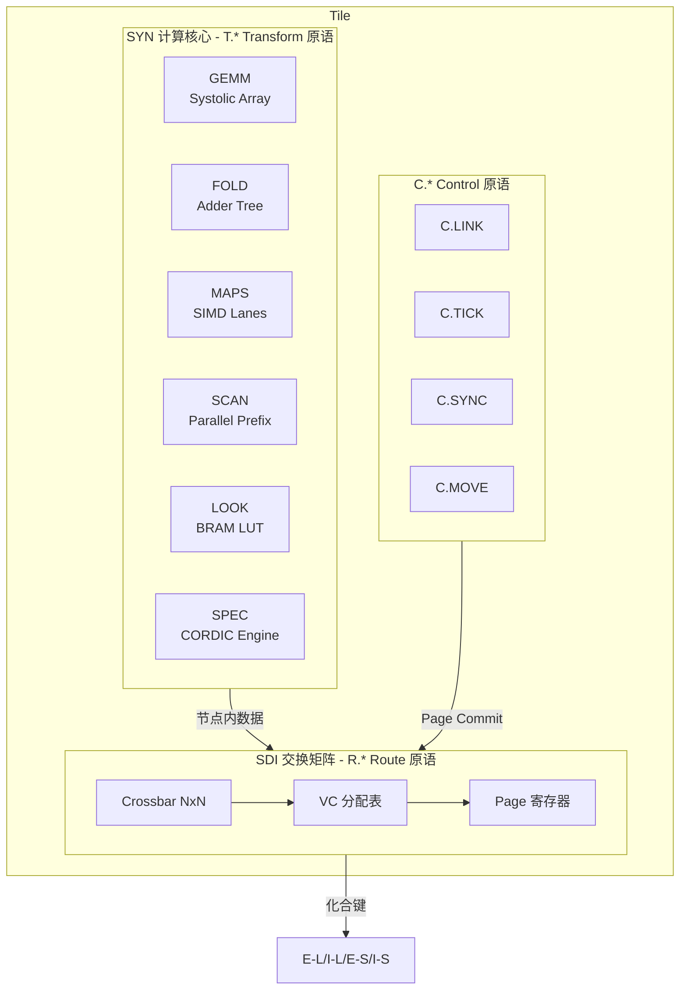
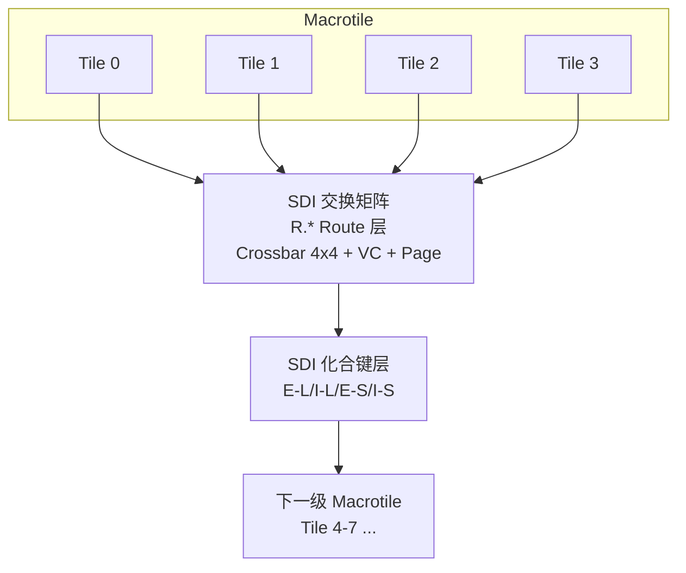
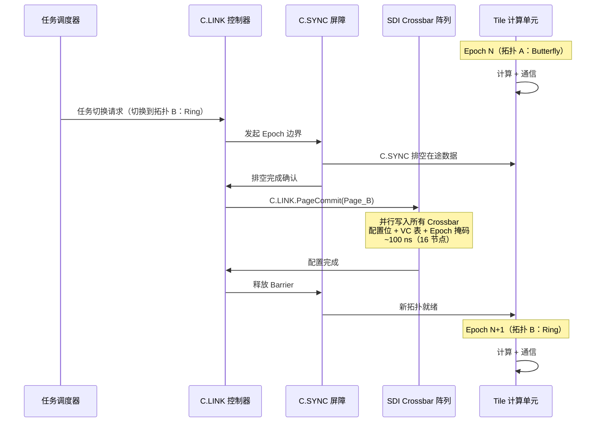
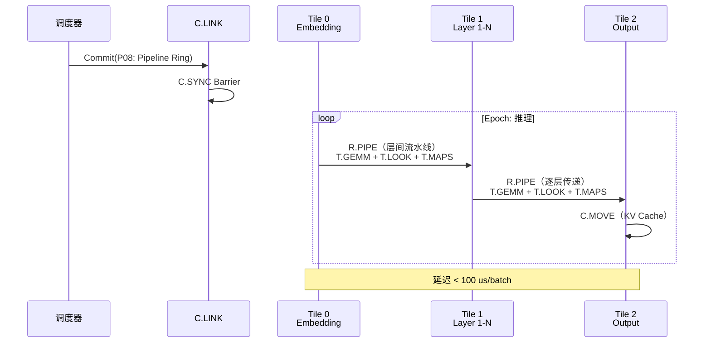
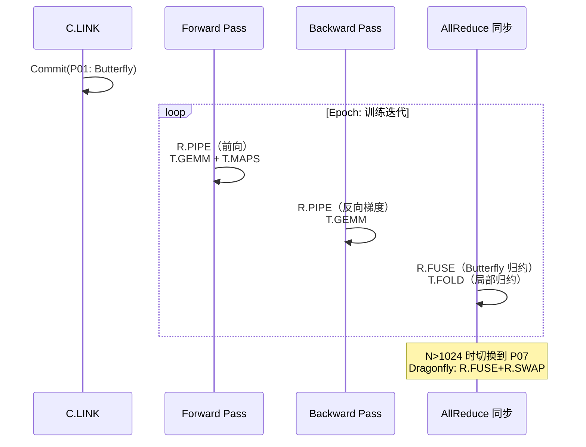
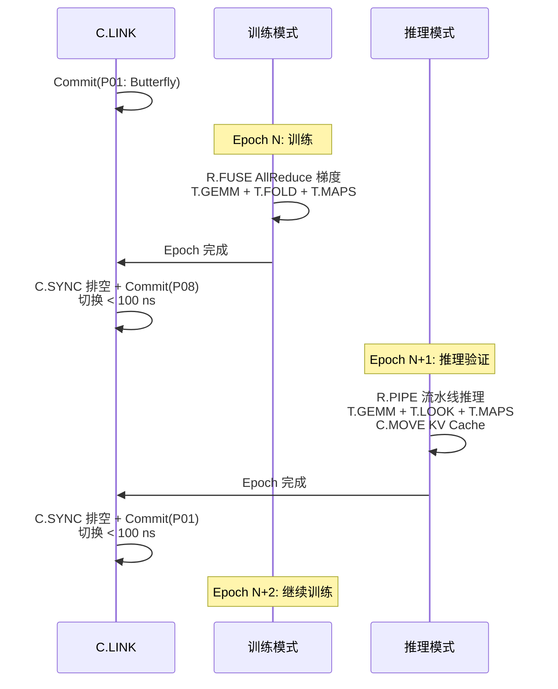
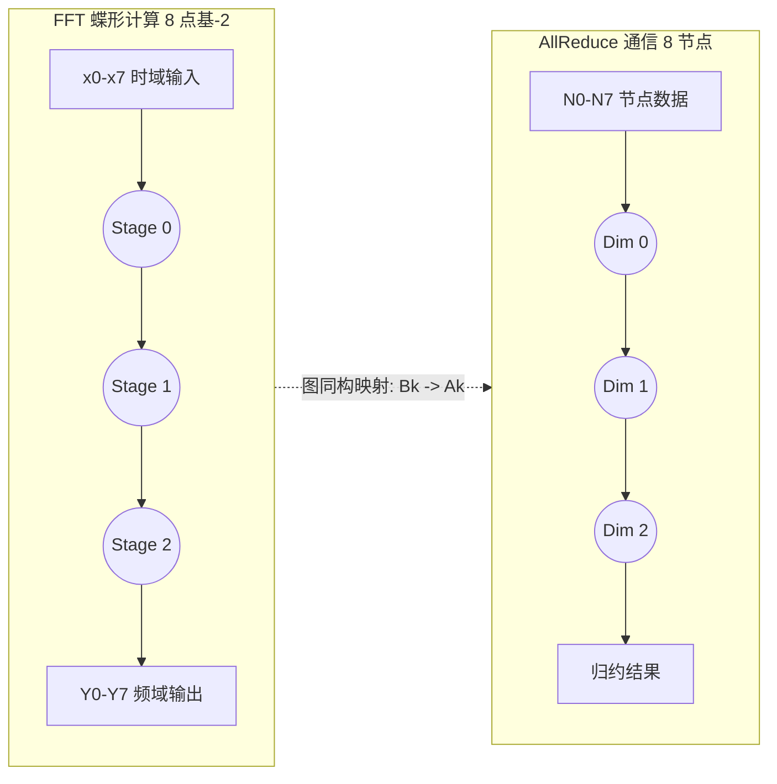
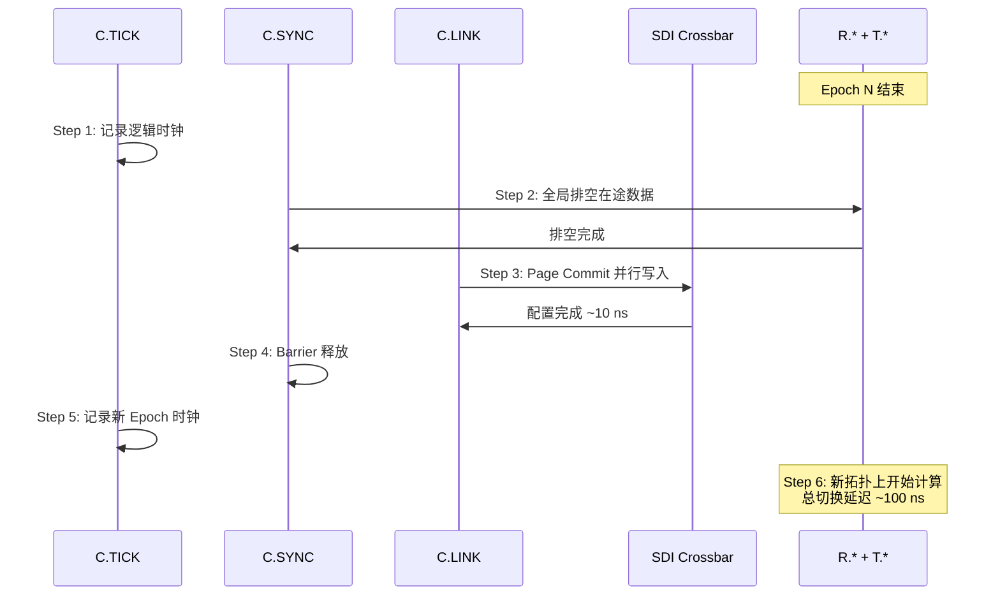

# TCC R.T.C 原语系统架构与 SDI 拓扑变换底层机理

> 从纯推理 → 纯训练 → 训推一体 → 信号处理（FFT/DBF）的完整工作流，以及 SDI 如何在物理层改变拓扑的底层实现机理。

---

## 第一章  R.T.C 三类原语在典型实现系统中的架构

### 1.1  Tile 微架构：TCC 最小可复用计算单元

一个 Tile 包含三类硬件引擎，分别对应 R.T.C 三层原语：



*图 1-1：Tile 微架构。R.* 层控制数据在网络中流动，T.* 层在节点内执行计算，C.* 层管理全局状态。*

### 1.2  三类原语的硬件分布与职责边界

<table>
<thead><tr>
<th style="text-align:center">字母</th>
<th style="text-align:left">全称</th>
<th style="text-align:center">中文</th>
<th style="text-align:center">数量</th>
<th style="text-align:left">硬件载体</th>
<th style="text-align:left">职责</th>
<th style="text-align:left">数据域</th>
<th style="text-align:left">助记</th>
</tr></thead>
<tbody>
<tr>
<td style="text-align:center"><strong>R</strong></td>
<td style="text-align:left">Route</td>
<td style="text-align:center">路由</td>
<td style="text-align:center">6</td>
<td style="text-align:left">SDI 交换矩阵</td>
<td style="text-align:left">节点间数据传输</td>
<td style="text-align:left">网络链路上</td>
<td style="text-align:left">数据在路上</td>
</tr>
<tr>
<td style="text-align:center"><strong>T</strong></td>
<td style="text-align:left">Transform</td>
<td style="text-align:center">变换</td>
<td style="text-align:center">6</td>
<td style="text-align:left">SYN 计算核心</td>
<td style="text-align:left">节点内代数运算</td>
<td style="text-align:left">节点本地数据</td>
<td style="text-align:left">数据在节点</td>
</tr>
<tr>
<td style="text-align:center"><strong>C</strong></td>
<td style="text-align:left">Control</td>
<td style="text-align:center">控制</td>
<td style="text-align:center">4</td>
<td style="text-align:left">Tile 全局控制器</td>
<td style="text-align:left">拓扑配置 / 时钟 / 同步 / DMA</td>
<td style="text-align:left">系统状态寄存器</td>
<td style="text-align:left">系统在掌舵</td>
</tr>
</tbody>
</table>


> R.T.C 三层前缀天然正交：任意 R.* 原语仅操作网络数据流，任意 T.* 原语仅操作节点内数据，任意 C.* 原语仅操作系统状态。三者无重叠，不存在跨层等效替代。

### 1.3  TCC-16 原语全表

#### R.*  Route 原语（6个）

<table>
<thead><tr>
<th style="text-align:left">#</th>
<th style="text-align:left">原语名</th>
<th style="text-align:left">发音</th>
<th style="text-align:left">语义</th>
<th style="text-align:left">最优物理拓扑</th>
</tr></thead>
<tbody>
<tr>
<td style="text-align:left">R1</td>
<td style="text-align:left"><strong>R.FUSE</strong></td>
<td style="text-align:left">/fju:z/</td>
<td style="text-align:left">AllReduce</td>
<td style="text-align:left">Butterfly</td>
</tr>
<tr>
<td style="text-align:left">R2</td>
<td style="text-align:left"><strong>R.PULL</strong></td>
<td style="text-align:left">/pul/</td>
<td style="text-align:left">AllGather</td>
<td style="text-align:left">Radial Tree</td>
</tr>
<tr>
<td style="text-align:left">R3</td>
<td style="text-align:left"><strong>R.CAST</strong></td>
<td style="text-align:left">/kaest/</td>
<td style="text-align:left">Broadcast</td>
<td style="text-align:left">Sparse Tree</td>
</tr>
<tr>
<td style="text-align:left">R4</td>
<td style="text-align:left"><strong>R.SWAP</strong></td>
<td style="text-align:left">/swop/</td>
<td style="text-align:left">AlltoAll</td>
<td style="text-align:left">Full Crossbar</td>
</tr>
<tr>
<td style="text-align:left">R5</td>
<td style="text-align:left"><strong>R.PIPE</strong></td>
<td style="text-align:left">/paip/</td>
<td style="text-align:left">ReduceScatter</td>
<td style="text-align:left">Ring Pipeline</td>
</tr>
<tr>
<td style="text-align:left">R6</td>
<td style="text-align:left"><strong>R.MESH</strong></td>
<td style="text-align:left">/mesh/</td>
<td style="text-align:left">Neighbor Exchange</td>
<td style="text-align:left">2D/3D Mesh</td>
</tr>
</tbody>
</table>


#### T.*  Transform 原语（6个）

<table>
<thead><tr>
<th style="text-align:left">#</th>
<th style="text-align:left">原语名</th>
<th style="text-align:left">发音</th>
<th style="text-align:left">语义</th>
<th style="text-align:left">物理实现</th>
<th style="text-align:left">硬件成本</th>
</tr></thead>
<tbody>
<tr>
<td style="text-align:left">T1</td>
<td style="text-align:left"><strong>T.GEMM</strong></td>
<td style="text-align:left">/djem/</td>
<td style="text-align:left">矩阵乘加 C=aAB+bC</td>
<td style="text-align:left">Systolic Array</td>
<td style="text-align:left">~50K LUT</td>
</tr>
<tr>
<td style="text-align:left">T2</td>
<td style="text-align:left"><strong>T.FOLD</strong></td>
<td style="text-align:left">/fold/</td>
<td style="text-align:left">向量归约</td>
<td style="text-align:left">Adder Tree</td>
<td style="text-align:left">~5K LUT</td>
</tr>
<tr>
<td style="text-align:left">T3</td>
<td style="text-align:left"><strong>T.MAPS</strong></td>
<td style="text-align:left">/maeps/</td>
<td style="text-align:left">逐元素映射 y=f(x)</td>
<td style="text-align:left">SIMD Lanes</td>
<td style="text-align:left">~10K LUT</td>
</tr>
<tr>
<td style="text-align:left">T4</td>
<td style="text-align:left"><strong>T.SCAN</strong></td>
<td style="text-align:left">/skaen/</td>
<td style="text-align:left">前缀扫描 / 蝶形 FFT</td>
<td style="text-align:left">Parallel Prefix</td>
<td style="text-align:left">~15K LUT</td>
</tr>
<tr>
<td style="text-align:left">T5</td>
<td style="text-align:left"><strong>T.LOOK</strong></td>
<td style="text-align:left">/luk/</td>
<td style="text-align:left">查表 / 非线性变换</td>
<td style="text-align:left">BRAM LUT</td>
<td style="text-align:left">~5K LUT+BRAM</td>
</tr>
<tr>
<td style="text-align:left">T6</td>
<td style="text-align:left"><strong>T.SPEC</strong></td>
<td style="text-align:left">/spek/</td>
<td style="text-align:left">特殊函数逼近</td>
<td style="text-align:left">CORDIC / 分段</td>
<td style="text-align:left">~8K LUT</td>
</tr>
</tbody>
</table>


#### C.*  Control 原语（4个）

<table>
<thead><tr>
<th style="text-align:left">#</th>
<th style="text-align:left">原语名</th>
<th style="text-align:left">发音</th>
<th style="text-align:left">语义</th>
<th style="text-align:left">硬件成本</th>
</tr></thead>
<tbody>
<tr>
<td style="text-align:left">C1</td>
<td style="text-align:left"><strong>C.LINK</strong></td>
<td style="text-align:left">/link/</td>
<td style="text-align:left">SDI 拓扑配置 / Page Commit</td>
<td style="text-align:left">~2K LUT</td>
</tr>
<tr>
<td style="text-align:left">C2</td>
<td style="text-align:left"><strong>C.TICK</strong></td>
<td style="text-align:left">/tik/</td>
<td style="text-align:left">全局分布式逻辑时钟</td>
<td style="text-align:left"><500 LUT</td>
</tr>
<tr>
<td style="text-align:left">C3</td>
<td style="text-align:left"><strong>C.SYNC</strong></td>
<td style="text-align:left">/sink/</td>
<td style="text-align:left">Epoch 边界同步 / 排空检测</td>
<td style="text-align:left">~1K LUT</td>
</tr>
<tr>
<td style="text-align:left">C4</td>
<td style="text-align:left"><strong>C.MOVE</strong></td>
<td style="text-align:left">/mu:v/</td>
<td style="text-align:left">DMA 数据搬运 / 地址重映射</td>
<td style="text-align:left">~3K LUT</td>
</tr>
</tbody>
</table>


### 1.4  多 Tile 组网：Tile → Macrotile → 系统



**扩展路径**：4 Tile → Macrotile（16–64 Tile，单 FPGA）→ 晶圆级（256–1024 Macrotile）→ 多晶圆（10⁴–10⁶ Tile），通过 SDI 化合键 Kronecker 积分形级联实现规模无关性扩展。

---

## 第二章  SDI 改变物理拓扑的底层原理与实现机理

> SDI 不是传统交换机。它直接改变 Crossbar 物理通断状态，在 **物理层（L1）** 重构走线关系，而非在固定走线上通过包头做逻辑转发。

### 2.1  传统交换机 vs SDI：根本区别

<table>
<thead><tr>
<th style="text-align:left">维度</th>
<th style="text-align:left">传统交换机（CLOS / Dragonfly / IB）</th>
<th style="text-align:left">SDI 交换矩阵</th>
</tr></thead>
<tbody>
<tr>
<td style="text-align:left"><strong>工作层</strong></td>
<td style="text-align:left">链路层 / 网络层（L2/L3 Packet Forwarding）</td>
<td style="text-align:left"><strong>物理层（L1 Circuit Switching）</strong></td>
</tr>
<tr>
<td style="text-align:left"><strong>改变什么</strong></td>
<td style="text-align:left">修改包头 + 查路由表决定转发端口</td>
<td style="text-align:left"><strong>修改物理走线的通断状态</strong></td>
</tr>
<tr>
<td style="text-align:left"><strong>物理拓扑是否改变</strong></td>
<td style="text-align:left">否——物理连线固定</td>
<td style="text-align:left"><strong>是——物理走线关系直接改变</strong></td>
</tr>
<tr>
<td style="text-align:left"><strong>切换时间</strong></td>
<td style="text-align:left">ms–s 级（路由协议收敛）</td>
<td style="text-align:left"><strong>~100 ns（原子 Page Commit）</strong></td>
</tr>
<tr>
<td style="text-align:left"><strong>切换粒度</strong></td>
<td style="text-align:left">逐流 / 逐包</td>
<td style="text-align:left">全交换矩阵原子切换</td>
</tr>
</tbody>
</table>


### 2.2  SDI Crossbar：物理拓扑可编程的核心器件

SDI 交换矩阵的物理实现是一个 **N×N 可编程 Crossbar Switch**，每个交叉点 = 1 个传输门 + 1 个配置位。

**4×4 Crossbar 示例**：N=4，16 个交叉点，配置字 = 16 bits = 2 bytes，可表达 65536 种连接模式，去除非连通后约 10⁴ 种有效拓扑。

#### 2.2.1  Crossbar 配置示例

**配置为 Ring 拓扑**：
```text
  O0<-I1, O1<-I2, O2<-I3, O3<-I0
  效果：Tile0 -> Tile3 -> Tile2 -> Tile1 -> Tile0（环形）
```

**配置为 Butterfly 拓扑**：
```text
  O0<-I2, O1<-I3, O2<-I0, O3<-I1
  效果：(0,2)配对, (1,3)配对（蝶形，最优 AllReduce）
```

#### 2.2.2  三级扩展机制

**Layer 1：多级 Crossbar 级联**
```mermaid
flowchart TB
    subgraph Leaf[Leaf 级]
        S0[SDI 4x4<br/>Tile 0-3]
        S1[SDI 4x4<br/>Tile 4-7]
        S2[SDI 4x4<br/>Tile 8-11]
    end
    S0 & S1 & S2 --> SPINE[Inter-Macrotile Crossbar]
    SPINE --> MT[Macrotile 级网络<br/>直径 O(log N)]
```

**Layer 2：VC（Virtual Channel）**——同一物理走线分时承载 4 条虚拟通道：VC0 训练梯度流 / VC1 推理激活流 / VC2 控制信令 / VC3 预留。

**Layer 3：SDI 化合键（分形级联的数学基础）**

<table>
<thead><tr>
<th style="text-align:left">化合键</th>
<th style="text-align:left">数学运算</th>
<th style="text-align:left">功能</th>
</tr></thead>
<tbody>
<tr>
<td style="text-align:left">平行键</td>
<td style="text-align:left">G₁ □ G₂（笛卡尔积）</td>
<td style="text-align:left">规模化复制</td>
</tr>
<tr>
<td style="text-align:left"><strong>交叉键</strong></td>
<td style="text-align:left"><strong>G₁ ⊗ G₂（Kronecker 积）</strong></td>
<td style="text-align:left"><strong>分形自相似扩展 ★最关键★</strong></td>
</tr>
<tr>
<td style="text-align:left">融合键</td>
<td style="text-align:left">G₁ ⊠ G₂（强乘积）</td>
<td style="text-align:left">紧耦合异构</td>
</tr>
<tr>
<td style="text-align:left">叠加键</td>
<td style="text-align:left">G₁ ∪ G₂（图并集）</td>
<td style="text-align:left">松耦合异构融合</td>
</tr>
<tr>
<td style="text-align:left">替换键</td>
<td style="text-align:left">G₁ ⊲ G₂（图替换）</td>
<td style="text-align:left">局部拓扑替换</td>
</tr>
</tbody>
</table>


> Kronecker 积是最关键的键算子——通过对小「种子图」反复施加 ⊗，可生成具有自相似分形结构的大规模网络。**这是 TCC 从 10² 核扩展到 10⁸ 核的数学基础。**

### 2.3  Page Commit：纳秒级拓扑切换的原子操作



*图 2-1：Page Commit 时序。总延迟 = T_drain(~50ns) + T_commit(~10ns) + T_barrier(~40ns) ≈ 100 ns。*

<table>
<thead><tr>
<th style="text-align:left">延迟分量</th>
<th style="text-align:left">操作</th>
<th style="text-align:left">耗时</th>
</tr></thead>
<tbody>
<tr>
<td style="text-align:left">T_drain</td>
<td style="text-align:left">C.SYNC 全局排空在途数据</td>
<td style="text-align:left">≈50 ns</td>
</tr>
<tr>
<td style="text-align:left">T_commit</td>
<td style="text-align:left">并行写入所有 SDI Crossbar 配置位（多 Bank BRAM）</td>
<td style="text-align:left">≈10 ns</td>
</tr>
<tr>
<td style="text-align:left">T_barrier</td>
<td style="text-align:left">C.SYNC Barrier 释放确认</td>
<td style="text-align:left">≈40 ns</td>
</tr>
<tr>
<td style="text-align:left"><strong>总计</strong></td>
<td style="text-align:left"><strong>16 节点全切换</strong></td>
<td style="text-align:left"><strong>< 100 ns</strong></td>
</tr>
<tr>
<td style="text-align:left"><strong>总计</strong></td>
<td style="text-align:left"><strong>256 节点（多级 Crossbar）</strong></td>
<td style="text-align:left"><strong>< 500 ns</strong></td>
</tr>
</tbody>
</table>


对比传统交换机路由收敛（ms–s 级）：SDI Page Commit **快 10⁴–10⁷ 倍**。

### 2.4  Topology Page 的预编译与存储

12 种预编译拓扑 Page 存储在 FPGA Block RAM 中，每 Page ≈ 1–4 KB，总计 ≈ 50 KB（约 VU13P BRAM 的 10%）。

<table>
<thead><tr>
<th style="text-align:left">Page ID</th>
<th style="text-align:left">拓扑类型</th>
<th style="text-align:left">适用场景</th>
<th style="text-align:left">关键原语</th>
</tr></thead>
<tbody>
<tr>
<td style="text-align:left">P01</td>
<td style="text-align:left">Butterfly</td>
<td style="text-align:left">AllReduce 梯度同步</td>
<td style="text-align:left">R.FUSE</td>
</tr>
<tr>
<td style="text-align:left">P02</td>
<td style="text-align:left">Ring</td>
<td style="text-align:left">ReduceScatter 流水线</td>
<td style="text-align:left">R.PIPE + R.PULL</td>
</tr>
<tr>
<td style="text-align:left">P03</td>
<td style="text-align:left">2D Mesh</td>
<td style="text-align:left">邻居通信 / 视频分析</td>
<td style="text-align:left">R.MESH</td>
</tr>
<tr>
<td style="text-align:left">P04</td>
<td style="text-align:left">Fat-Tree</td>
<td style="text-align:left">多播 / 广播</td>
<td style="text-align:left">R.CAST</td>
</tr>
<tr>
<td style="text-align:left">P05</td>
<td style="text-align:left">Crossbar</td>
<td style="text-align:left">AlltoAll / MoE 路由</td>
<td style="text-align:left">R.SWAP</td>
</tr>
<tr>
<td style="text-align:left">P06</td>
<td style="text-align:left">Hypercube</td>
<td style="text-align:left">FFT / DBF 信号处理</td>
<td style="text-align:left">T.SCAN + R.FUSE</td>
</tr>
<tr>
<td style="text-align:left">P07</td>
<td style="text-align:left">Dragonfly</td>
<td style="text-align:left">大规模 Scale-out 训练</td>
<td style="text-align:left">R.FUSE + R.SWAP</td>
</tr>
<tr>
<td style="text-align:left">P08</td>
<td style="text-align:left">Pipeline</td>
<td style="text-align:left">推理流水线</td>
<td style="text-align:left">R.PIPE</td>
</tr>
<tr>
<td style="text-align:left">P09</td>
<td style="text-align:left">Hybrid</td>
<td style="text-align:left">训推一体 / 多传感器融合</td>
<td style="text-align:left">R.MESH + R.PIPE</td>
</tr>
</tbody>
</table>


---

## 第三章  四种场景的完整工作流

### 3.1  场景一：纯推理（Pure Inference）

**任务特征**：单向数据流（输入→各层→输出），低延迟，无需反向传播和梯度同步。



*图 3-1：纯推理工作流。层间使用 Pipeline Ring 拓扑。*

<table>
<thead><tr>
<th style="text-align:left">阶段</th>
<th style="text-align:left">R.* Route</th>
<th style="text-align:left">T.* Transform</th>
<th style="text-align:left">C.* Control</th>
</tr></thead>
<tbody>
<tr>
<td style="text-align:left">Layer Forward</td>
<td style="text-align:left">R.PIPE（层间）</td>
<td style="text-align:left">T.GEMM + T.LOOK + T.MAPS</td>
<td style="text-align:left">C.MOVE（KV Cache）</td>
</tr>
<tr>
<td style="text-align:left">多卡推理归约</td>
<td style="text-align:left">R.FUSE（AllReduce）</td>
<td style="text-align:left">T.FOLD（归约）</td>
<td style="text-align:left">C.SYNC</td>
</tr>
<tr>
<td style="text-align:left">拓扑切换</td>
<td style="text-align:left">—</td>
<td style="text-align:left">—</td>
<td style="text-align:left">C.LINK.Commit(P08→P01)</td>
</tr>
</tbody>
</table>


### 3.2  场景二：纯训练（Pure Training）

**任务特征**：双向数据流（前向+反向），梯度 AllReduce 是核心瓶颈。



*图 3-2：纯训练工作流。梯度同步使用 Butterfly 拓扑，大规模下切换至 Dragonfly。*

<table>
<thead><tr>
<th style="text-align:left">阶段</th>
<th style="text-align:left">R.* Route</th>
<th style="text-align:left">T.* Transform</th>
<th style="text-align:left">C.* Control</th>
</tr></thead>
<tbody>
<tr>
<td style="text-align:left">Forward Pass</td>
<td style="text-align:left">R.PIPE</td>
<td style="text-align:left">T.GEMM + T.MAPS + T.LOOK</td>
<td style="text-align:left">C.MOVE（检查点）</td>
</tr>
<tr>
<td style="text-align:left">Backward Pass</td>
<td style="text-align:left">R.PIPE</td>
<td style="text-align:left">T.GEMM + T.MAPS</td>
<td style="text-align:left">—</td>
</tr>
<tr>
<td style="text-align:left">Gradient AllReduce</td>
<td style="text-align:left"><strong>R.FUSE</strong></td>
<td style="text-align:left"><strong>T.FOLD</strong></td>
<td style="text-align:left">C.SYNC</td>
</tr>
<tr>
<td style="text-align:left">Weight Update</td>
<td style="text-align:left">—</td>
<td style="text-align:left">T.MAPS（SGD/Adam）</td>
<td style="text-align:left">—</td>
</tr>
</tbody>
</table>


### 3.3  场景三：训推一体（Train-Inference Unified）

**任务特征**：训练和推理交替，需在「梯度同步拓扑」和「推理流水线拓扑」之间快速切换——TCC 液态拓扑最典型的应用场景。



*图 3-3：训推一体工作流。每 Epoch 边界 100 ns 完成拓扑切换，开销 < 2%。*

<table>
<thead><tr>
<th style="text-align:center">指标</th>
<th style="text-align:left">定义</th>
<th style="text-align:left">目标值</th>
<th style="text-align:left">实测说明</th>
</tr></thead>
<tbody>
<tr>
<td style="text-align:center">κ</td>
<td style="text-align:left">切换时间内有效计算保持率</td>
<td style="text-align:left">≥ 95%</td>
<td style="text-align:left">Page Commit 窗口内计算不中断</td>
</tr>
<tr>
<td style="text-align:center">σ</td>
<td style="text-align:left">训推切换性能退化率</td>
<td style="text-align:left">≤ 5%</td>
<td style="text-align:left">切换后吞吐量下降比例</td>
</tr>
<tr>
<td style="text-align:center">T_ratio</td>
<td style="text-align:left">切换开销 / Epoch 长度</td>
<td style="text-align:left">≈ 2%</td>
</tr>
</tbody>
</table>


### 3.4  场景四：信号处理（FFT / DBF）

**任务特征**：FFT 蝶形计算图与 AllReduce 通信图存在图论同构，同一套物理走线可 100% 复用。DBF（数字波束形成）可映射为 T.GEMM + R.SWAP。



*图 3-4：FFT-AllReduce 同构定理。φ(b_{l,i}) = a_{l,i}，第 l 层蝶形单元对应第 l 维归约节点。物理走线完全相同。*

<table>
<thead><tr>
<th style="text-align:left">阶段</th>
<th style="text-align:left">R.* Route</th>
<th style="text-align:left">T.* Transform</th>
<th style="text-align:left">C.* Control</th>
</tr></thead>
<tbody>
<tr>
<td style="text-align:left">数据重排</td>
<td style="text-align:left">R.SWAP（全交换）</td>
<td style="text-align:left">—</td>
<td style="text-align:left">C.MOVE（地址重映射）</td>
</tr>
<tr>
<td style="text-align:left">蝶形计算</td>
<td style="text-align:left">R.FUSE（走线复用）</td>
<td style="text-align:left"><strong>T.SCAN</strong>（蝶形乘加）</td>
<td style="text-align:left">C.TICK（Stage 同步）</td>
</tr>
<tr>
<td style="text-align:left">旋转因子</td>
<td style="text-align:left">—</td>
<td style="text-align:left">T.SPEC（CORDIC）</td>
<td style="text-align:left">—</td>
</tr>
<tr>
<td style="text-align:left">DBF 波束形成</td>
<td style="text-align:left">R.SWAP（天线交换）</td>
<td style="text-align:left">T.GEMM（权值矩阵乘）</td>
<td style="text-align:left">C.SYNC（帧同步）</td>
</tr>
</tbody>
</table>


<table>
<thead><tr>
<th style="text-align:left">复用维度</th>
<th style="text-align:left">说明</th>
</tr></thead>
<tbody>
<tr>
<td style="text-align:left">物理走线</td>
<td style="text-align:left">FFT 蝶形计算图与 AllReduce 通信图在图论上严格同构——同一组差分走线完全共享</td>
</tr>
<tr>
<td style="text-align:left">复用方式</td>
<td style="text-align:left">SDI Page 切换改变 Crossbar 配置，Epoch N: AllReduce → Epoch N+1: FFT 蝶形</td>
</tr>
<tr>
<td style="text-align:left">物理改动</td>
<td style="text-align:left"><strong>零改动</strong>——仅 Crossbar 配置寄存器的 bit 值不同，导线物理连接关系通过传输门切换</td>
</tr>
<tr>
<td style="text-align:left">额外成本</td>
</tr>
</tbody>
</table>


---

## 第四章  总结

### 4.1  一次完整的拓扑切换生命周期



*图 4-1：六步拓扑切换生命周期。总延迟 ~100 ns（16 节点），~500 ns（256 节点）。*

### 4.2  四场景拓扑切换总览

<table>
<thead><tr>
<th style="text-align:left">场景切换</th>
<th style="text-align:left">源拓扑</th>
<th style="text-align:left">目标拓扑</th>
<th style="text-align:left">切换原因</th>
<th style="text-align:left">关键 R.*</th>
<th style="text-align:left">关键 T.*</th>
</tr></thead>
<tbody>
<tr>
<td style="text-align:left">推理→训练</td>
<td style="text-align:left">P08 Pipeline</td>
<td style="text-align:left">P01 Butterfly</td>
<td style="text-align:left">需梯度 AllReduce</td>
<td style="text-align:left">R.PIPE→R.FUSE</td>
<td style="text-align:left">T.GEMM（共用）</td>
</tr>
<tr>
<td style="text-align:left">训练→推理</td>
<td style="text-align:left">P01 Butterfly</td>
<td style="text-align:left">P08 Pipeline</td>
<td style="text-align:left">推理验证</td>
<td style="text-align:left">R.FUSE→R.PIPE</td>
<td style="text-align:left">T.GEMM+T.LOOK</td>
</tr>
<tr>
<td style="text-align:left">训练→FFT</td>
<td style="text-align:left">P01 Butterfly</td>
<td style="text-align:left">P06 Hypercube</td>
<td style="text-align:left">FFT 蝶形复用</td>
<td style="text-align:left">R.FUSE（复用）</td>
<td style="text-align:left">T.GEMM→T.SCAN</td>
</tr>
<tr>
<td style="text-align:left">信号处理→训练</td>
<td style="text-align:left">P06 Hypercube</td>
<td style="text-align:left">P01 Butterfly</td>
<td style="text-align:left">回归 AI 训练</td>
<td style="text-align:left">R.FUSE（复用）</td>
<td style="text-align:left">T.SCAN→T.GEMM</td>
</tr>
<tr>
<td style="text-align:left">规模扩展</td>
<td style="text-align:left">P01 Butterfly</td>
<td style="text-align:left">P07 Dragonfly</td>
<td style="text-align:left">N>1024</td>
<td style="text-align:left">R.FUSE→R.FUSE+R.SWAP</td>
<td style="text-align:left">—</td>
</tr>
<tr>
<td style="text-align:left">多传感器融合</td>
<td style="text-align:left">P08 Pipeline</td>
<td style="text-align:left">P10 Multi-Tree</td>
<td style="text-align:left">多数据源汇聚</td>
<td style="text-align:left">R.PIPE→R.CAST</td>
<td style="text-align:left">T.GEMM→T.FOLD</td>
</tr>
</tbody>
</table>


### 4.3  核心论断

<table>
<thead><tr>
<th style="text-align:center">#</th>
<th style="text-align:left">核心论断</th>
<th style="text-align:left">关键要点</th>
</tr></thead>
<tbody>
<tr>
<td style="text-align:center">1</td>
<td style="text-align:left"><strong>R.T.C 三层正交</strong></td>
<td style="text-align:left">R.*（Route）操作节点间数据流，T.*（Transform）操作节点内数据，C.*（Control）操作系统状态。三者无重叠、无冗余，构成 16 原语的代数完备体系</td>
</tr>
<tr>
<td style="text-align:center">2</td>
<td style="text-align:left"><strong>SDI 是物理层可编程</strong></td>
<td style="text-align:left">直接改变 Crossbar 矩阵的物理通断状态，在物理层重构走线关系。Page Commit 在 ~100 ns 内原子完成全交换矩阵拓扑切换，比传统网络协议收敛快 10⁴–10⁷ 倍</td>
</tr>
<tr>
<td style="text-align:center">3</td>
<td style="text-align:left"><strong>FFT-AllReduce 同构</strong></td>
<td style="text-align:left">蝶形计算图与 AllReduce 通信图在图论上严格同构。同一组物理走线在训练 Epoch 执行 AllReduce，在信号处理 Epoch 执行 FFT 蝶形——<strong>物理布线 100% 复用</strong></td>
</tr>
<tr>
<td style="text-align:center">4</td>
<td style="text-align:left"><strong>化合键分形级联</strong></td>
<td style="text-align:left">5 类 SDI 化合键通过 Kronecker 积的自相似迭代，实现从单芯粒到晶圆到机柜的规模无关性扩展——拓扑的涌现属性（Q、σ、α）在六个数量级的规模变化中保持恒定</td>
</tr>
</tbody>
</table>


---

**关联条目**

[[TCC计算范式命名规范3.0]] | [[TCC_iNEST_LiquidTopology_v1.0]] | [[iNEST_Roadmap_v2.0_权威路线图]] | [[TCC_Core_Concepts]] | [[SDI_Four_Rules_v5_FINAL]] | [[基于元拓扑与SDI化合键的通信原语生成理论]]

---

*版本 v1.2 | 2026-07-08 | Mermaid 图表 + 三反引号修复 + 原语名修正（R.*=Route, T.*=Transform）*

---
## 相关链接
- [[TCC_TRC原语架构与SDI拓扑变换机理_v1.0]]
- [[tcc_first_principles]]
- [[TCC原语体系统一方案_v1.0_已归档]]
- [[2026-06-28_Getnote_2026-06-28_TCC BP]]
- [[getnote_2026-06-28_TCC BP]]
