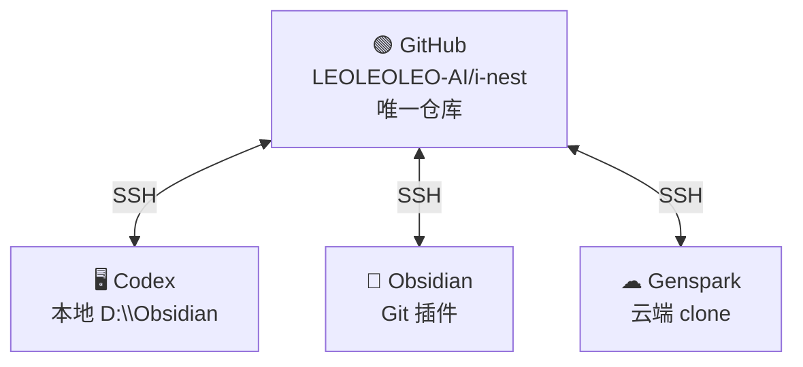

# iNEST 同步架构 v3.0 — GitHub 单一信源

> 更新：2026-07-11 | Gitee 已废弃（配额死锁）

## 架构



## 工作区目录结构

```
workspace/
├── 10_Inbox/          # 收件箱
├── 20_Processing/     # 处理中
├── 30_TCC/            # 拓扑中心计算
│   ├── 31_Theory/     # 理论
│   ├── 32_Tech/       # 技术
│   ├── 33_Dev/        # 开发
│   ├── 34_Projects/   # 项目
│   └── 35_Simulation/ # 仿真
├── 40_iNEST/          # 智能网络系统
├── 50_Output/         # 论文/专利/代码
├── 60_MOC/            # 知识地图
├── 70_Dashboard/      # 研发看板
├── 80_Archive/        # 归档
└── 90_System/         # 系统配置
```

## 各平台同步方式

| 平台 | 方式 |
|------|------|
| Codex | 输入 `同步github` → 执行脚本 |
| Obsidian | Git 插件 `Ctrl+Shift+G` |
| Genspark | 发送同步提示词 |

## 同步脚本

```powershell
powershell -File "D:\Obsidian\scripts\gitee_sync.ps1"
```
流程：得到大脑拉取 → GitHub fetch → commit → push


<!-- orphan-cleanup: no MOC found, tagged -->
