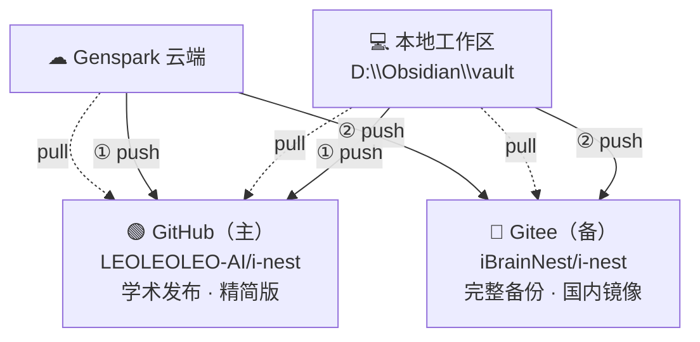

# Triangle 同步架构 v2.0 — GitHub 主 + Gitee 备

> 更新：2026-07-11 | 策略：GitHub 优先（学术发布），Gitee 备份（完整版）

## 架构图



## 双仓库策略

| 维度 | GitHub（主） | Gitee（备） |
|------|-------------|------------|
| 推送顺序 | ① 优先 | ② 紧随 |
| 用途 | 学术发布、开源 | 完整备份、国内 |
| 保留策略 | 精简版 | 完整版 |
| 推送频率 | 每日一次 | 实时同步 |
| 约束 | 不含大数据文件 | 含所有历史 |
| 失败处理 | 暂停 Gitee 推送 | 仅 WARN |

## 当前工作区目录结构

```
workspace/
├── 10_Inbox/          # 收件箱（当日剪藏、灵感）
├── 20_Processing/     # 处理中
├── 30_TCC/            # 拓扑中心计算
│   ├── 31_Theory/     #   理论推导
│   ├── 32_Tech/       #   技术方案
│   ├── 33_Dev/        #   开发实现
│   ├── 34_Projects/   #   项目文档
│   └── 35_Simulation/ #   仿真程序与结果
├── 40_iNEST/          # 智能网络系统
│   ├── 31~35/         #   理论-仿真
│   └── 41~45/         #   工程-仿真 v2
├── 50_Output/         # 产出
│   ├── 51_Papers/     #   论文
│   ├── 52_Patents/    #   专利
│   ├── 54_Code/       #   开源代码
│   └── 55_Guides/     #   指南
├── 60_MOC/            # 知识地图
├── 70_Dashboard/      # 研发看板
├── 80_Archive/        # 归档（历史版本）
└── 90_System/         # 系统配置
    ├── Meta/          #   同步提示词
    ├── scripts/       #   流水线脚本
    └── templates/     #   模板
```

## 各平台同步方式

### Codex（本机）
```powershell
powershell -NoProfile -File "D:\Obsidian\scripts\gitee_sync.ps1"
```
自动完成：得到大脑拉取 → GitHub push ① → Gitee push ②

### Obsidian（本机）
Git 插件已配置 `github` 和 `origin` 双远程，`Ctrl+Shift+G` 手动 push

### Genspark（云端）
发送 [Genspark_Sync_Prompt.md](http://127.0.0.1:8899/vault/90_System/Meta/Genspark_Sync_Prompt.md) 中的提示词

## 推送规则（强制执行）

```
✅ GitHub 推送失败 → 暂停 Gitee 推送（保持双库一致）
✅ 推送前先 pull（避免冲突）
✅ 冲突时以本地为准（本地始终最新）
❌ 跳过 GitHub 直接推 Gitee
❌ 在两个仓库上直接修改
```


<!-- orphan-cleanup: no MOC found, tagged -->
