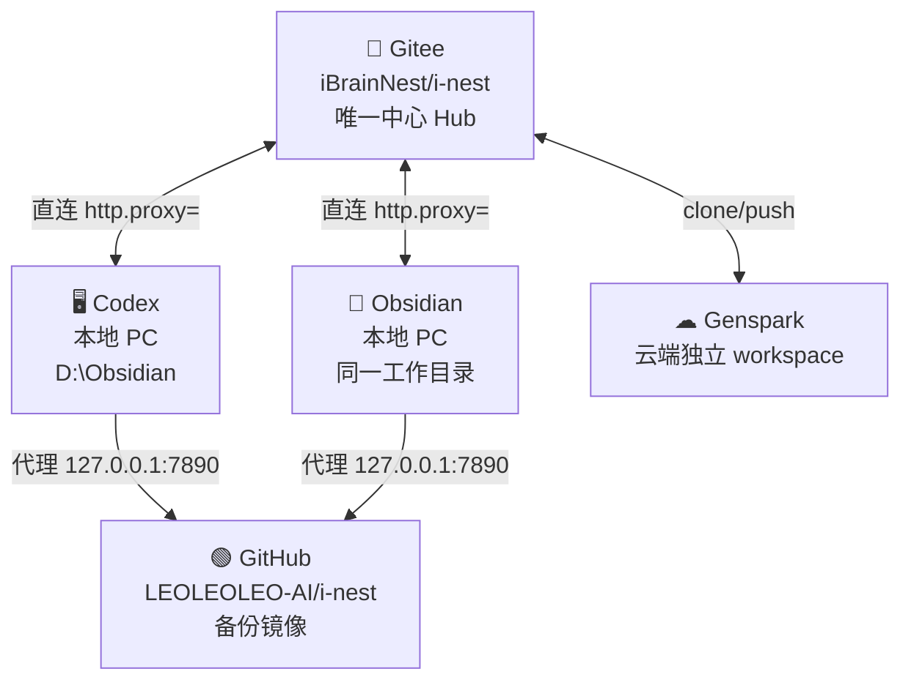

# Triangle 同步架构 — Gitee 中心 Hub

## 架构图



## 同步规则

| 规则 | 说明 |
|------|------|
| **Gitee = 唯一信源** | 所有平台均以 Gitee 为中枢，push/pull 均走 Gitee |
| **本地共享** | Codex 与 Obsidian 共享 `D:\Obsidian\home\work\.openclaw\workspace`，无需互相通知 |
| **云端独立** | Genspark 在云端自行 clone/pull/push |
| **GitHub = 镜像** | 仅本地脚本推送，Genspark 不直接写 GitHub |
| **冲突处理** | 出现冲突时以 Gitee 最新版本为准，手动 merge |

## 各平台同步方式

### Codex（本机）
触发词：`同步gitee` / `执行同步`
实际执行：
```
powershell -NoProfile -File "D:\Obsidian\scripts\gitee_sync.ps1"
```
脚本自动完成：得到大脑拉取 → Gitee fetch/push → GitHub push

### Obsidian（本机）
方式 A：Obsidian Git 插件（已配置 origin = Gitee）
方式 B：终端执行同上脚本

### Genspark（云端）
发送以下提示词给 Genspark Claw：
见 `Genspark_Sync_Prompt.md`

## 代理配置
- **Gitee**: 直连（`-c http.proxy=` 清空）
- **GitHub**: 代理 `http://127.0.0.1:7890`
- **全局 git config**: `http.proxy=http://127.0.0.1:7890`
