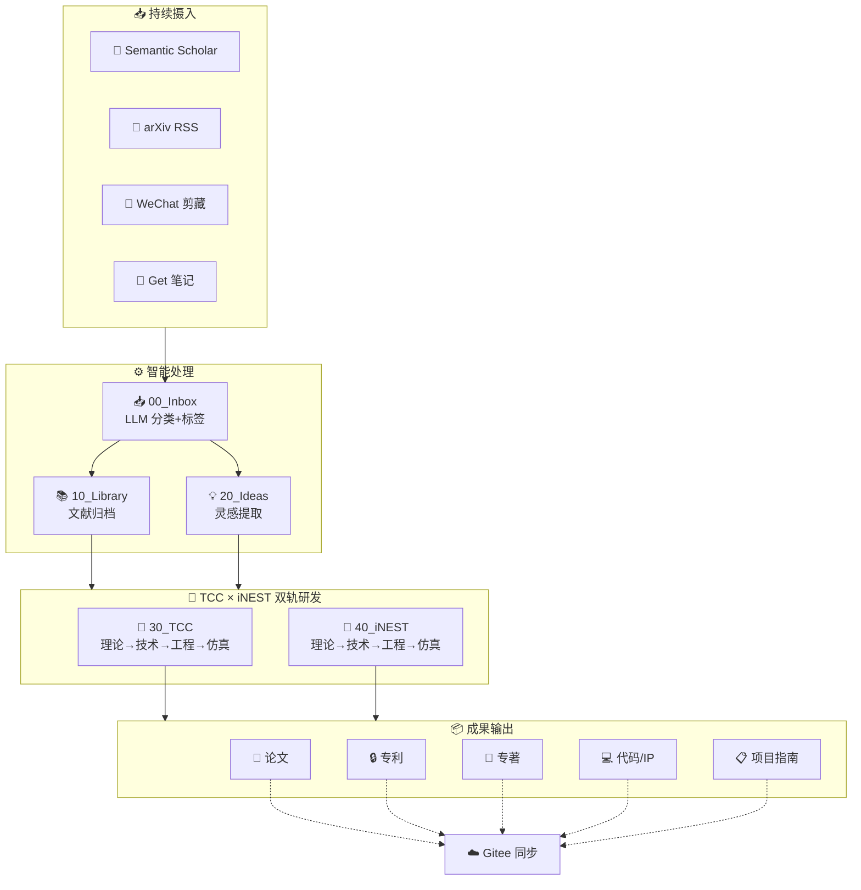

# 🏔️ TCC × iNEST 研发中枢

> 📅 **`$= date(today).format("yyyy年MM月dd日 dddd")`** | 知识资产 · **`$= dv.pages().length`** 篇笔记 | 管道 · `$= (dv.pages('"00_Inbox"').where(p => p.file.name != ".gitkeep").length > 0) ? "⏳ 待处理" : "✅ 畅通"` | Git · 328MB

---

## ⚡ 一键操作

```button
name 🔄 Git 同步
type command
action obsidian-git:pull
color blue
```
```button
name ☁️ Git 推送
type command
action obsidian-git:push
color green
```
```button
name 🔍 审查歧义
type link
action 60_MOC/00_Needs_Review.md
color purple
```
```button
name 🏥 系统诊断
type link
action 60_MOC/00_Diagnostic_Report.md
color purple
```

---

## 📊 知识资产总览

```dataviewjs
const total = dv.pages().length;
const inbox = dv.pages('"00_Inbox"').where(p => p.file.name != ".gitkeep").length;
const lib = dv.pages('"10_Library"').where(p => p.file.name != ".gitkeep").length;
const ideas = dv.pages('"20_Ideas"').where(p => p.file.name != ".gitkeep").length;
const tcc = dv.pages('"30_TCC"').where(p => p.file.name != ".gitkeep").length;
const inest = dv.pages('"40_iNEST"').where(p => p.file.name != ".gitkeep").length;
const output = dv.pages('"50_Output"').where(p => p.file.name != ".gitkeep").length;
const journal = dv.pages('"99_Journal"').where(p => p.file.name != ".gitkeep").length;

dv.el("div", `
<div class="stats-row" style="display:grid;grid-template-columns:repeat(4,1fr);gap:10px;margin:12px 0;">
  <div class="stat-card ${inbox > 0 ? 'warn' : ''}" style="border-left:3px solid ${inbox > 0 ? '#ef4444' : '#22c55e'};">
    <div class="stat-num">${inbox}</div>
    <div class="stat-label">📥 待处理</div>
  </div>
  <div class="stat-card" style="border-left:3px solid #6366f1;">
    <div class="stat-num">${lib}</div>
    <div class="stat-label">📚 文献库</div>
  </div>
  <div class="stat-card" style="border-left:3px solid #f59e0b;">
    <div class="stat-num">${ideas}</div>
    <div class="stat-label">💡 灵感</div>
  </div>
  <div class="stat-card" style="border-left:3px solid #06b6d4;">
    <div class="stat-num">${journal}</div>
    <div class="stat-label">📓 日记</div>
  </div>
</div>`);
```

---

## 🎯 TCC × iNEST 双轨进度

```dataviewjs
const tracks = [
  { name: 'TCC 拓扑中心计算', color: '#4f8ef7', path: '30_TCC',
    dims: [
      { label: '理论攻关', sub: '31_Theory' },
      { label: '技术研究', sub: '32_Tech' },
      { label: '工程落地', sub: '33_Engineering' },
      { label: '仿真实验', sub: '35_Simulation' },
      { label: '项目策划', sub: '34_Projects' }
    ]},
  { name: 'iNEST 智能涌现', color: '#f76f4f', path: '40_iNEST',
    dims: [
      { label: '理论攻关', sub: '41_Theory' },
      { label: '技术研究', sub: '42_Tech' },
      { label: '工程落地', sub: '43_Engineering' },
      { label: '仿真实验', sub: '45_Simulation' },
      { label: '项目策划', sub: '44_Projects' }
    ]}
];

let html = '<div style="display:grid;grid-template-columns:1fr 1fr;gap:16px;margin:8px 0;">';
for (const track of tracks) {
  const total = dv.pages('"' + track.path + '"').where(p => p.file.name != ".gitkeep").length;
  html += `<div style="background:var(--background-secondary);border-radius:10px;padding:16px;border-top:4px solid ${track.color};">
    <h3 style="margin:0 0 10px;color:${track.color};">${track.name} <span style="font-size:0.8em;color:var(--text-muted);">${total} 笔记</span></h3>`;
  for (const dim of track.dims) {
    const cnt = dv.pages('"' + track.path + '/' + dim.sub + '"').where(p => p.file.name != ".gitkeep").length;
    const pct = total > 0 ? Math.min(100, Math.round(cnt / total * 100)) : 0;
    const barColor = pct > 30 ? track.color : pct > 10 ? '#f59e0b' : '#94a3b8';
    html += `<div style="margin:6px 0;"><span style="font-size:0.85em;">${dim.label}</span><span style="float:right;font-size:0.8em;color:var(--text-muted);">${cnt} 篇</span>
      <div style="background:var(--background-primary-alt);border-radius:4px;height:8px;margin-top:3px;">
        <div style="width:${pct}%;height:100%;background:${barColor};border-radius:4px;transition:width 0.5s;"></div>
      </div></div>`;
  }
  html += '</div>';
}
html += '</div>';
dv.el("div", html);
```

---

## 📦 成果矩阵

```dataviewjs
const categories = [
  { name: '论文', path: '51_Papers', icon: '📄', color: '#4f8ef7' },
  { name: '专利', path: '52_Patents', icon: '🔒', color: '#f76f4f' },
  { name: '专著', path: '53_Monographs', icon: '📖', color: '#8b5cf6' },
  { name: '指南', path: '55_Guides', icon: '📋', color: '#22c55e' },
  { name: '代码/IP', path: '54_Code', icon: '💻', color: '#f59e0b' },
];

let html = '<div style="display:grid;grid-template-columns:repeat(5,1fr);gap:8px;margin:8px 0;">';
for (const cat of categories) {
  const cnt = dv.pages('"50_Output/' + cat.path + '"').where(p => p.file.name != ".gitkeep").length;
  const recent = dv.pages('"50_Output/' + cat.path + '"')
    .where(p => p.file.name != ".gitkeep")
    .sort(p => p.file.mtime, "desc")
    .limit(1);
  const hasRecent = recent.length > 0;
  const bg = cnt > 50 ? '#22c55e' : cnt > 10 ? '#f59e0b' : '#94a3b8';
  html += `<div style="background:var(--background-secondary);border-radius:10px;padding:14px;text-align:center;border-bottom:3px solid ${bg};">
    <div style="font-size:2em;">${cat.icon}</div>
    <div style="font-size:1.6em;font-weight:700;color:${bg};">${cnt}</div>
    <div style="font-size:0.85em;color:var(--text-muted);">${cat.name}</div>
    ${hasRecent ? `<div style="font-size:0.7em;color:var(--text-faint);margin-top:4px;">${recent[0].file.name.substring(0,20)}...</div>` : ''}
  </div>`;
}
html += '</div>';
dv.el("div", html);
```

---

## 🔬 仿真 & 实验

```dataviewjs
const tccSim = dv.pages('"30_TCC/35_Simulation"').where(p => p.file.name != ".gitkeep").length;
const inestSim = dv.pages('"40_iNEST/45_Simulation"').where(p => p.file.name != ".gitkeep").length;
const tccRecent = dv.pages('"30_TCC/35_Simulation"').where(p => p.file.name != ".gitkeep").sort(p=>p.file.mtime,"desc").limit(3);
const inestRecent = dv.pages('"40_iNEST/45_Simulation"').where(p => p.file.name != ".gitkeep").sort(p=>p.file.mtime,"desc").limit(3);

let html = '<div style="display:grid;grid-template-columns:1fr 1fr;gap:12px;">';

html += `<div style="background:var(--background-secondary);border-radius:10px;padding:14px;border-left:3px solid #4f8ef7;">
  <strong style="color:#4f8ef7;">🧪 TCC 仿真 (${tccSim} 项)</strong>
  <ul style="margin:6px 0 0;padding-left:18px;font-size:0.85em;">`;
for (const p of tccRecent) {
  html += `<li>${dv.fileLink(p.file.path, false, p.file.name.substring(0,50))} <span style="color:var(--text-faint);">${p.file.mtime.toFormat("MM-dd")}</span></li>`;
}
html += '</ul></div>';

html += `<div style="background:var(--background-secondary);border-radius:10px;padding:14px;border-left:3px solid #f76f4f;">
  <strong style="color:#f76f4f;">🐛 iNEST 仿真 (${inestSim} 项)</strong>
  <ul style="margin:6px 0 0;padding-left:18px;font-size:0.85em;">`;
for (const p of inestRecent) {
  html += `<li>${dv.fileLink(p.file.path, false, p.file.name.substring(0,50))} <span style="color:var(--text-faint);">${p.file.mtime.toFormat("MM-dd")}</span></li>`;
}
html += '</ul></div>';

html += '</div>';
dv.el("div", html);
```

---

## 🔧 终端命令

> [!tip]+ 📥 每日文献抓取 (Semantic Scholar + arXiv)
> ```powershell
> python 90_System/scripts/daily_crawl.py
> ```

> [!tip]+ 🧠 收件箱智能分类 (DeepSeek LLM)
> ```powershell
> python 90_System/scripts/process_inbox.py --limit 20
> python 90_System/scripts/process_inbox.py --dry-run
> ```

> [!tip]+ 🔗 重建双向链接图谱
> ```powershell
> python 90_System/scripts/build_graph.py --auto-fix
> ```

> [!tip]+ 🚀 一键全流程
> ```powershell
> python 90_System/scripts/pipeline.py daily
> ```

---

## 🗺️ 知识管道全景



---

## 🔥 今日焦点

```dataviewjs
const recent = dv.pages('"30_TCC" or "40_iNEST" or "50_Output" or "10_Library" or "20_Ideas"')
  .where(p => p.file.mtime > dv.date("now") - dv.duration("7 days"))
  .sort(p => p.file.mtime, "desc")
  .limit(8);

if (recent.length === 0) {
  dv.paragraph("📭 近一周无活跃文档。运行「每日文献抓取」获取新内容。");
} else {
  let html = '<div style="display:grid;grid-template-columns:1fr 1fr;gap:6px;">';
  for (const p of recent) {
    const path = p.file.path;
    const dir = path.split("/")[0];
    const icon = dir === "30_TCC" ? "🧠" : dir === "40_iNEST" ? "🐛" : dir === "50_Output" ? "📦" : dir === "10_Library" ? "📚" : "💡";
    html += `<div style="background:var(--background-secondary);border-radius:6px;padding:6px 10px;font-size:0.85em;">
      ${icon} ${dv.fileLink(p.file.path, false, p.file.name.substring(0,45))}<br/>
      <span style="color:var(--text-faint);font-size:0.8em;">${p.file.mtime.toFormat("MM-dd HH:mm")}</span>
    </div>`;
  }
  html += '</div>';
  dv.el("div", html);
}
```

---

## 📋 最新文献

```dataviewjs
const papers = dv.pages('"10_Library"')
  .where(p => p.file.name != ".gitkeep")
  .sort(p => p.file.mtime, "desc")
  .limit(6);

dv.table(
  ["标题", "日期"],
  papers.map(p => [
    dv.fileLink(p.file.path, false, p.file.name.substring(0,60) + (p.file.name.length > 60 ? "..." : "")),
    p.file.mtime.toFormat("MM-dd HH:mm")
  ])
);
```

---

## ⏭️ 后续任务

> [!important]+ 📌 定时自动化 (已注册)
> - **每日 08:00** · 自动文献抓取
> - **每日 09:00** · 收件箱 AI 分类
> - **每日 15:00** · 收件箱 AI 分类
> - **每周日 03:00** · 全量重组 + MOC 更新

> [!warning]+ ⚡ 待办事项
> - [ ] Gitee 服务端触发 GC（`https://gitee.com/iBrainNest/i-nest/settings#git-gc`）
> - [ ] 评估 GitHub 作为主力仓库（免费无硬限）
> - [ ] 协调 Genspark 同步策略（分支隔离 vs 统一推送）
> - [ ] `_archive` 中 1,978 文件 → 有价值内容批量提取

---

## 🔗 快速导航

| 导航 | 目标 |
|:---|:---|
| 📊 研发看板 | [[60_MOC/iNEST-Home_Dashboard]] |
| 📋 进度跟踪 | [[60_MOC/PROGRESS_TRACKER]] |
| 🗺️ 知识结构 | [[60_MOC/00_Vault_Structure]] |
| 🏥 系统诊断 | [[60_MOC/00_Diagnostic_Report]] |
| 🧠 TCC MOC | [[60_MOC/TCC-MOC]] |
| 🐛 iNEST MOC | [[60_MOC/iNEST-MOC]] |

---

> *TCC × iNEST — 摄入 → 分类 → 加工 → 产出 · `$= date(today).format("yyyy-MM-dd")`*
