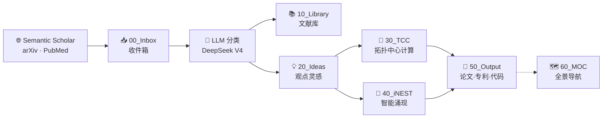

# 🏠 TCC × iNEST 研发中枢

> 📅 `$= date(today).format("YYYY-MM-DD dddd")` | 📥 `$= dv.pages('"00_Inbox"').where(p => p.file.name != ".gitkeep").length` 待处理 | 📊 [HTML看板](http://127.0.0.1:8900/home/work/.openclaw/workspace/dashboard/index.html)

---

## 📥 信息摄入流水线



---

## 📈 实时统计

```dataviewjs
const inbox = dv.pages('"00_Inbox"').where(p => p.file.name != ".gitkeep").length;
const lib = dv.pages('"10_Library"').where(p => p.file.name != ".gitkeep").length;
const ideas = dv.pages('"20_Ideas"').where(p => p.file.name != ".gitkeep").length;
const tcc = dv.pages('"30_TCC"').where(p => p.file.name != ".gitkeep").length;
const inest = dv.pages('"40_iNEST"').where(p => p.file.name != ".gitkeep").length;
const output = dv.pages('"50_Output"').where(p => p.file.name != ".gitkeep").length;
dv.el("div", `<div class="stats-row">
  <div class="stat-card"><div class="stat-num">${inbox}</div><div class="stat-label">📥 收件箱</div></div>
  <div class="stat-card"><div class="stat-num">${lib}</div><div class="stat-label">📚 文献库</div></div>
  <div class="stat-card"><div class="stat-num">${ideas}</div><div class="stat-label">💡 观点灵感</div></div>
  <div class="stat-card"><div class="stat-num">${tcc}</div><div class="stat-label">🧠 TCC</div></div>
  <div class="stat-card"><div class="stat-num">${inest}</div><div class="stat-label">🔧 iNEST</div></div>
  <div class="stat-card"><div class="stat-num">${output}</div><div class="stat-label">📝 产出</div></div>
</div>`);
```

---

## ⚡ 今日焦点

> [!tip]+ 🔍 近 7 天动态
> ```dataviewjs
const recent = dv.pages('"30_TCC" or "40_iNEST" or "50_Output" or "00_Inbox" or "10_Library" or "20_Ideas"')
  .where(p => p.file.mtime > dv.date("now") - dv.duration("7 days"))
  .sort(p => p.file.mtime, "desc")
  .limit(6);
if (recent.length === 0) {
  dv.paragraph("📭 近一周无活跃文档。运行 `python 90_System/scripts/pipeline.py daily` 开始抓取。");
} else {
  dv.list(recent.map(p => dv.fileLink(p.file.path, false, p.file.name) + " — " + p.file.mtime.toFormat("MM-dd HH:mm")));
}
dv.paragraph("> 💡 流水线: 每日8点抓取 → LLM分类 → 归入10_Library或20_Ideas → 推进至30/40 → 产出至50");
> ```

---

## 📊 双轨成果看板

> [!info]+ 📝 论文
> <div class="dv-track">
> <div class="col-tcc"><h5>🧠 TCC</h5>
> 
> ```dataview
> TABLE WITHOUT ID file.link AS "标题", phase AS "阶段", journal AS "目标"
> FROM "50_Output/51_Papers"
> WHERE phase SORT file.mtime DESC LIMIT 4
> ```
> </div>
> <div class="col-inest"><h5>🔧 iNEST</h5>
> 
> *产出归入 50_Output/51_Papers*
> </div>
> </div>

> [!info]+ 📜 专利
> <div class="dv-track">
> <div class="col-tcc"><h5>🧠 TCC</h5>
> 
> ```dataview
> TABLE WITHOUT ID file.link AS "标题", phase AS "阶段"
> FROM "50_Output/52_Patents"
> WHERE phase SORT file.mtime DESC LIMIT 3
> ```
> </div>
> <div class="col-inest"><h5>🔧 iNEST</h5>
> 
> *产出归入 50_Output/52_Patents*
> </div>
> </div>

> [!info]+ 🔧 工程开发
> <div class="dv-track">
> <div class="col-tcc"><h5>🧠 TCC</h5>
> 
> ```dataview
> TABLE WITHOUT ID file.link AS "模块", status AS "状态"
> FROM "50_Output/54_Code/TCC" or "30_TCC/33_Engineering"
> WHERE status SORT file.mtime DESC LIMIT 4
> ```
> </div>
> <div class="col-inest"><h5>🔧 iNEST</h5>
> 
> ```dataview
> TABLE WITHOUT ID file.link AS "模块", status AS "状态"
> FROM "50_Output/54_Code/iNEST" or "40_iNEST/43_Engineering"
> WHERE status SORT file.mtime DESC LIMIT 4
> ```
> </div>
> </div>

> [!info]+ 📋 项目策划
> <div class="dv-track">
> <div class="col-tcc"><h5>🧠 TCC</h5>
> 
> ```dataview
> TABLE WITHOUT ID file.link AS "项目", phase AS "阶段"
> FROM "30_TCC/34_Projects"
> WHERE phase SORT file.mtime DESC LIMIT 4
> ```
> </div>
> <div class="col-inest"><h5>🔧 iNEST</h5>
> 
> ```dataview
> TABLE WITHOUT ID file.link AS "项目", phase AS "阶段"
> FROM "40_iNEST/44_Projects"
> WHERE phase SORT file.mtime DESC LIMIT 4
> ```
> </div>
> </div>

---

## 🧪 仿真实验

> [!info]+ 🔬 仿真状态
> <div class="dv-track">
> <div class="col-tcc"><h5>🧠 SDI 仿真</h5>
> 
> ```dataview
> TABLE WITHOUT ID file.link AS "实验", file.mtime AS "更新"
> FROM "30_TCC/35_Simulation" SORT file.mtime DESC LIMIT 3
> ```
> </div>
> <div class="col-inest"><h5>🔧 通用仿真</h5>
> 
> ```dataview
> TABLE WITHOUT ID file.link AS "实验", file.mtime AS "更新"
> FROM "40_iNEST/45_Simulation" SORT file.mtime DESC LIMIT 3
> ```
> </div>
> </div>

---

## 📥 收件箱

```dataview
TABLE WITHOUT ID file.link AS "笔记", file.cday AS "导入日期"
FROM "00_Inbox" WHERE file.name != ".gitkeep" SORT file.cday DESC LIMIT 10
```

> 处理: `python 90_System/scripts/pipeline.py process`

---

## 🔬 最新文献

```dataview
TABLE WITHOUT ID file.link AS "标题", file.mtime AS "日期"
FROM "10_Library" or "03_Topics/Web-Clips" SORT file.mtime DESC LIMIT 6
```

---

## 🛠️ 快捷操作

| 操作 | 命令 |
|:---|:---|
| 📥 每日抓取 | `python 90_System/scripts/pipeline.py daily` |
| 🤖 处理收件箱 | `python 90_System/scripts/process_inbox.py --limit 20` |
| 🔗 重建链接 | `python 90_System/scripts/build_graph.py --auto-fix` |
| 📊 查看图谱 | `knowledge_graph/graph_data.json` |

---

> *TCC × iNEST  ·  摄入 → 提取 → 加工 → 产出  ·  \`$= date(today).format("YYYY-MM-DD")\`*
