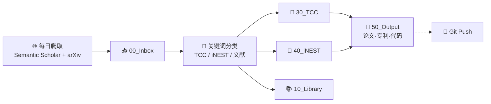

# 🏠 TCC × iNEST 研发中枢

> 📅 `$= date(today).format("YYYY-MM-DD dddd")` | 📥 `$= dv.pages('"00_Inbox"').where(p => p.file.name != ".gitkeep").length` 待处理 | 🔗 11555 链接

---

## ⚡ 一键操作

```button
name 🔄 Git Pull
type command
action obsidian-git:pull
color blue
```
```button
name 📤 Git Push
type command
action obsidian-git:push
color green
```
```button
name 📋 审查歧义
type link
action 60_MOC/00_Needs_Review.md
color purple
```
```button
name 📊 诊断报告
type link
action 60_MOC/00_Diagnostic_Report.md
color purple
```

---

## 📈 实时统计

```dataviewjs
const inbox = dv.pages('"00_Inbox"').where(p => p.file.name != ".gitkeep").length;
const lib = dv.pages('"10_Library"').where(p => p.file.name != ".gitkeep").length;
const tcc = dv.pages('"30_TCC"').where(p => p.file.name != ".gitkeep").length;
const inest = dv.pages('"40_iNEST"').where(p => p.file.name != ".gitkeep").length;
const output = dv.pages('"50_Output"').where(p => p.file.name != ".gitkeep").length;
const review = dv.pages('"_archive/_needs_review"').where(p => p.file.name != ".gitkeep").length;
dv.el("div", `<div class="stats-row">
  <div class="stat-card ${inbox > 0 ? 'warn' : ''}"><div class="stat-num">${inbox}</div><div class="stat-label">📥 待处理</div></div>
  <div class="stat-card"><div class="stat-num">${lib}</div><div class="stat-label">📚 文献</div></div>
  <div class="stat-card"><div class="stat-num">${tcc}</div><div class="stat-label">🧠 TCC</div></div>
  <div class="stat-card"><div class="stat-num">${inest}</div><div class="stat-label">🔧 iNEST</div></div>
  <div class="stat-card"><div class="stat-num">${output}</div><div class="stat-label">📝 产出</div></div>
  <div class="stat-card ${review > 0 ? 'warn' : ''}"><div class="stat-num">${review}</div><div class="stat-label">❓ 待审</div></div>
</div>`);
```

---

## 🖥️ 终端命令（复制到 PowerShell 运行）

> [!tip]+ 📥 每日文献抓取
> ```powershell
> python 90_System/scripts/daily_crawl.py
> ```

> [!tip]+ 🤖 收件箱智能分类
> ```powershell
> python 90_System/scripts/process_inbox.py --limit 20
> python 90_System/scripts/process_inbox.py --dry-run
> ```

> [!tip]+ 🔗 重建双向链接
> ```powershell
> python 90_System/scripts/build_graph.py --auto-fix
> ```

> [!tip]+ ⚡ 一键全流程
> ```powershell
> python 90_System/scripts/pipeline.py daily
> ```

---

## 🗺️ 全景管线



---

## ⚡ 今日焦点

```dataviewjs
const recent = dv.pages('"30_TCC" or "40_iNEST" or "50_Output" or "10_Library" or "20_Ideas"')
  .where(p => p.file.mtime > dv.date("now") - dv.duration("7 days"))
  .sort(p => p.file.mtime, "desc")
  .limit(6);
if (recent.length === 0) {
  dv.paragraph("📭 近一周无活跃文档。运行每日抓取获取新内容。");
} else {
  dv.list(recent.map(p => dv.fileLink(p.file.path, false, p.file.name) + " — " + p.file.mtime.toFormat("MM-dd HH:mm")));
}
```

---

## 📊 成果看板

> [!info]+ 📝 论文
> ```dataview
> TABLE WITHOUT ID file.link AS "标题", phase AS "阶段"
> FROM "50_Output/51_Papers" WHERE phase SORT file.mtime DESC LIMIT 6
> ```

> [!info]+ 🔧 工程开发
> ```dataview
> TABLE WITHOUT ID file.link AS "模块", status AS "状态"
> FROM "30_TCC/33_Engineering" or "40_iNEST/43_Engineering" or "50_Output/54_Code"
> WHERE status SORT file.mtime DESC LIMIT 6
> ```

> [!info]+ 📋 项目策划
> ```dataview
> TABLE WITHOUT ID file.link AS "项目", phase AS "阶段"
> FROM "30_TCC/34_Projects" or "40_iNEST/44_Projects"
> WHERE phase SORT file.mtime DESC LIMIT 6
> ```

---

## 📥 收件箱

```dataview
TABLE WITHOUT ID file.link AS "笔记", file.cday AS "导入日期"
FROM "00_Inbox" WHERE file.name != ".gitkeep" SORT file.cday DESC LIMIT 10
```

---

## 🔬 最新文献

```dataview
TABLE WITHOUT ID file.link AS "标题", file.mtime AS "日期"
FROM "10_Library" SORT file.mtime DESC LIMIT 6
```

---

> *TCC × iNEST · 摄入 → 分类 → 加工 → 产出 · ` + "`$= date(today).format("YYYY-MM-DD")`" + '''*
