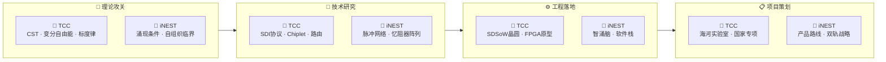

# 🏠 TCC × iNEST 研发中枢

> 📅 `$= date(today).format("YYYY-MM-DD dddd")` | 🔄 [手动同步](obsidian://commander?cmd=obsidian-git%3Apull) | 📊 [HTML看板](http://127.0.0.1:8900/home/work/.openclaw/workspace/dashboard/index.html)

---

## 📈 实时统计

```dataviewjs
const inbox = dv.pages('"00_Inbox"').where(p => p.file.name != "00_Inbox 使用说明").length;
const papers = dv.pages('"TCC_2_论文撰写" or "iNEST_2_论文撰写"').where(p => p.phase).length;
const patents = dv.pages('"TCC_3_专利撰写" or "iNEST_3_专利撰写"').where(p => p.phase).length;
const projects = dv.pages('"TCC_1_项目策划" or "iNEST_1_项目策划"').where(p => p.phase).length;
dv.el("div", `
<div class="stats-row">
  <div class="stat-card"><div class="stat-num">${inbox}</div><div class="stat-label">📥 待处理</div></div>
  <div class="stat-card"><div class="stat-num">${papers}</div><div class="stat-label">📝 论文进行中</div></div>
  <div class="stat-card"><div class="stat-num">${patents}</div><div class="stat-label">📜 专利进行中</div></div>
  <div class="stat-card"><div class="stat-num">${projects}</div><div class="stat-label">📋 项目进行中</div></div>
</div>
`);
```

---

## 🗺️ 全景管线



---

## ⚡ 今日焦点

> [!tip]+ 🔍 近 7 天动态 & 行动建议
> ```dataviewjs
const recent = dv.pages('"TCC_1_项目策划" or "iNEST_1_项目策划" or "TCC_2_论文撰写" or "iNEST_2_论文撰写" or "00_Inbox" or "papers" or "03_Topics"')
  .where(p => p.file.mtime > dv.date("now") - dv.duration("7 days"))
  .sort(p => p.file.mtime, "desc")
  .limit(6);
if (recent.length === 0) {
  dv.paragraph("📭 近一周无活跃文档。请从 00_Inbox 开始处理。");
} else {
  dv.list(recent.map(p => dv.fileLink(p.file.path, false, p.file.name) + " — " + p.file.mtime.toFormat("MM-dd HH:mm")));
}
dv.paragraph("> 💡 优先级: 00_Inbox 清空 → 论文推进 → 专利撰写 → 仿真验证 → 项目策划");
> ```

---

## 📊 成果看板

> [!info]+ 📝 论文
> <div class="dv-track">
> <div class="col-tcc">
> 
> **🧠 TCC**
> ```dataview
> TABLE WITHOUT ID
>   file.link AS "标题",
>   phase AS "阶段",
>   journal AS "目标期刊"
> FROM "TCC_2_论文撰写"
> WHERE phase
> SORT file.mtime DESC
> LIMIT 4
> ```
> 
> </div>
> <div class="col-inest">
> 
> **🔧 iNEST**
> ```dataview
> TABLE WITHOUT ID
>   file.link AS "标题",
>   phase AS "阶段",
>   journal AS "目标期刊"
> FROM "iNEST_2_论文撰写"
> WHERE phase
> SORT file.mtime DESC
> LIMIT 4
> ```
> 
> </div>
> </div>

> [!info]+ 📜 专利
> <div class="dv-track">
> <div class="col-tcc">
> 
> **🧠 TCC**
> ```dataview
> TABLE WITHOUT ID
>   file.link AS "标题",
>   phase AS "阶段",
>   type AS "类型"
> FROM "TCC_3_专利撰写"
> WHERE phase
> SORT file.mtime DESC
> LIMIT 3
> ```
> 
> </div>
> <div class="col-inest">
> 
> **🔧 iNEST**
> ```dataview
> TABLE WITHOUT ID
>   file.link AS "标题",
>   phase AS "阶段",
>   type AS "类型"
> FROM "iNEST_3_专利撰写"
> WHERE phase
> SORT file.mtime DESC
> LIMIT 3
> ```
> 
> </div>
> </div>

> [!info]+ 🔧 工程开发
> <div class="dv-track">
> <div class="col-tcc">
> 
> **🧠 TCC**
> ```dataview
> TABLE WITHOUT ID
>   file.link AS "模块",
>   status AS "状态"
> FROM "TCC_4_工程开发"
> WHERE status
> SORT file.mtime DESC
> LIMIT 4
> ```
> 
> </div>
> <div class="col-inest">
> 
> **🔧 iNEST**
> ```dataview
> TABLE WITHOUT ID
>   file.link AS "模块",
>   status AS "状态"
> FROM "iNEST_4_工程开发"
> WHERE status
> SORT file.mtime DESC
> LIMIT 4
> ```
> 
> </div>
> </div>

> [!info]+ 📋 项目策划
> <div class="dv-track">
> <div class="col-tcc">
> 
> **🧠 TCC**
> ```dataview
> TABLE WITHOUT ID
>   file.link AS "项目",
>   phase AS "阶段",
>   deadline AS "截止"
> FROM "TCC_1_项目策划"
> WHERE phase
> SORT file.mtime DESC
> LIMIT 4
> ```
> 
> </div>
> <div class="col-inest">
> 
> **🔧 iNEST**
> ```dataview
> TABLE WITHOUT ID
>   file.link AS "项目",
>   phase AS "阶段",
>   deadline AS "截止"
> FROM "iNEST_1_项目策划"
> WHERE phase
> SORT file.mtime DESC
> LIMIT 4
> ```
> 
> </div>
> </div>

---

## 🧪 仿真与实验

> [!info]+ 🔬 仿真任务
> <div class="dv-track">
> <div class="col-tcc">
> 
> **🧠 SDI 仿真** (`sdi_sim`)
> ```dataview
> TABLE WITHOUT ID
>   file.link AS "实验",
>   file.mtime AS "更新"
> FROM "sdi_sim"
> SORT file.mtime DESC
> LIMIT 3
> ```
> 
> </div>
> <div class="col-inest">
> 
> **🔧 通用仿真** (`simulation`)
> ```dataview
> TABLE WITHOUT ID
>   file.link AS "实验",
>   file.mtime AS "更新"
> FROM "simulation"
> SORT file.mtime DESC
> LIMIT 3
> ```
> 
> </div>
> </div>

---

## 📥 收件箱

> [!warning]+ ⚠️ 待分类 (目标: 0)
> ```dataview
> TABLE WITHOUT ID
>   file.link AS "笔记",
>   file.cday AS "导入日期"
> FROM "00_Inbox"
> WHERE file.name != "00_Inbox 使用说明"
> SORT file.cday DESC
> LIMIT 10
> ```
> 
> > 处理完移动到 `03_Topics/<分类>/`，打标签后 git commit

---

## 🔬 文献摄入

```dataview
TABLE WITHOUT ID
  file.link AS "标题",
  file.mtime AS "日期"
FROM "Literature" or "03_Topics/Web-Clips" or "papers"
SORT file.mtime DESC
LIMIT 6
```

---

## 🛠️ 快捷操作

- 📥 **同步收件箱**: 打开 Get 笔记 → 自动拉取 → 进入 `00_Inbox`
- 🔄 **Git 同步**: `Ctrl+P` → `git: pull` / `git: push`
- 📝 **新建论文**: `Ctrl+P` → `QuickAdd: 新建论文模板`
- 🏷️ **分类笔记**: 移动到 `03_Topics/` 子目录，添加 frontmatter tags
- 📊 **更新看板**: 编辑 frontmatter 的 `phase` / `status` / `deadline` 字段，本页自动刷新

---

> *TCC × iNEST 研发中枢 · 理论 → 技术 → 工程 → 项目 · `$= date(today).format("YYYY-MM-DD")`*
