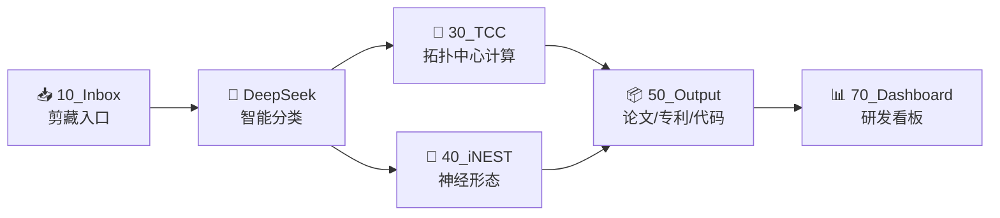

# 🧠 TCC + iNEST 研发中枢

> **知识库规模**: 5,500+ 篇 | **TCC**: 2,672 篇 | **iNEST**: 1,736 篇 | **高价值洞察**: 256 条
> 
> 更新时间: `$= dv.current().file.mtime.toFormat("yyyy-MM-dd HH:mm")`

---

## 📊 全局概览

```dataviewjs
const tcc = dv.pages('"30_TCC"').length;
const inest = dv.pages('"40_iNEST"').length;
const output = dv.pages('"50_Output"').length;
const total = tcc + inest + output;

dv.paragraph(`
| 维度 | 数量 | 占比 |
|------|------|------|
| 🧠 TCC 拓扑中心计算 | **${tcc}** | ${(tcc/total*100).toFixed(1)}% |
| 🧬 iNEST 神经形态 | **${inest}** | ${(inest/total*100).toFixed(1)}% |
| 📦 成果产出 | **${output}** | ${(output/total*100).toFixed(1)}% |
| 📚 知识总量 | **${total}** | 100% |
`);
```

---

## 🧠 TCC — 拓扑中心计算 (2,672篇)

| 维度 | 篇数 | 说明 |
|------|------|------|
| 📐 理论攻关 | **1,137** | CST/拓扑/SDI理论基础 |
| 🔧 技术研究 | **1,222** | Chiplet/封装/互联/架构 |
| 💻 工程开发 | **5** | IP核/RTL/FPGA验证 |
| 📋 项目策划 | **230** | 海河实验室/重点专项 |
| 🔬 仿真实验 | **73** | CST/sdi_sim/EDA |

```dataview
TABLE file.mtime as "更新时间"
FROM "30_TCC/31_Theory" OR "30_TCC/32_Tech"
SORT file.mtime DESC
LIMIT 5
```

---

## 🧬 iNEST — 神经形态计算 (1,736篇)

| 维度 | 篇数 | 说明 |
|------|------|------|
| 📐 理论攻关 | **1,109** | 涌现/临界/复杂度理论 |
| 🔧 技术研究 | **491** | SNN/忆阻器/神经形态 |
| 💻 工程开发 | **0** | 待启动 |
| 📋 项目策划 | **64** | 类脑专项布局 |
| 🔬 仿真实验 | **32** | 神经形态仿真 |

```dataview
TABLE file.mtime as "更新时间"
FROM "40_iNEST/41_Theory" OR "40_iNEST/42_Tech"
SORT file.mtime DESC
LIMIT 5
```

---

## 📦 成果产出 (411篇)

| 类型 | 数量 | 跳转 |
|------|------|------|
| 📝 论文 | **175** | [[50_Output/51_Papers/论文计划列表\|论文清单]] |
| 📋 专利 | **37** | [[50_Output/52_Patents/\|专利清单]] |
| 📖 专著 | **8** | [[50_Output/53_Monographs/\|专著规划]] |
| 💻 工程代码 | **125** | [[50_Output/54_Code/\|代码仓库]] |
| 📘 项目指南 | **5** | [[50_Output/55_Guides/\|指南文档]] |

---

## 💡 高价值洞察 (DeepSeek V4 Pro)

| 方向 | 论文灵感 | 专利灵感 |
|------|----------|----------|
| 🧠 TCC | **114** | **90** |
| 🧬 iNEST | **142** | **33** |

📖 [查看完整洞察报告](60_MOC/02_DeepSeek_Insights.md)

---

## 🔬 研究管线流程


```mermaid
graph LR
    A[📥 10_Inbox<br/>剪藏入口] --> B[🤖 DeepSeek<br/>智能分类]
    B --> C[🧠 30_TCC<br/>拓扑中心计算]
    B --> D[🧬 40_iNEST<br/>神经形态]
    C --> E[📦 50_Output<br/>论文/专利/代码]
    D --> E
    E --> F[📊 70_Dashboard<br/>研发看板]
```

---

## ⚡ 快捷操作

- 🔄 [运行每日管线](90_System/scripts/pipeline_v3.py)
- 📥 [处理 Inbox](90_System/scripts/process_inbox.py)
- 🔗 [Git 同步](90_System/scripts/gitee_sync.py)
- 📊 [研发看板](70_Dashboard/index.html)
- 🗺️ [全景导航](60_MOC/TCC_iNEST_成果全景.md)
- 🔍 [去重复核](60_MOC/00_Dedup_Review.md)
- 🩺 [知识库诊断](60_MOC/00_Diagnostic_Report.md)

---

## 📈 研究方向

### TCC 重点方向
- 🔲 CST理论完备性证明与仿真验证
- 🔲 SDSoW晶圆级互联架构设计
- 🔲 Chiplet 2.5D/3D封装热力耦合仿真
- 🔲 RISC-V SDI-CC 交换芯片IP开发
- 🔲 海河实验室晶上先导项目

### iNEST 重点方向
- 🔲 介观峰值定理实验验证
- 🔲 SNN脉冲神经网络硬件加速器
- 🔲 忆阻器突触可塑性建模
- 🔲 复杂网络临界涌现动力学
- 🔲 类脑动态可塑物理网络

---

> *TCC + iNEST 研发中枢 · Powered by DeepSeek V4 Pro · Codex SuperAgent v4.1*

---

## 🔗 Codex ↔ Obsidian 联动

| 命令 | 功能 | 触发方式 |
|------|------|----------|
| `quick_task.py inbox` | 一键处理Inbox | Obsidian按钮 / 终端 |
| `quick_task.py pipeline` | 完整研究管线 | 每日08:00自动 |
| `quick_task.py sync` | Git同步 | 每日21:00自动 |
| `quick_task.py weekly` | 周度报告 | 周日03:00自动 |
| `startup_linkage.bat` | 开机自启全部服务 | 登录自动 |

📖 [联动配置指南](90_System/LINKAGE_GUIDE.md)
🔌 [Claudian → Codex 配置](90_System/LINKAGE_GUIDE.md#1-claudian-plugin-configuration)
