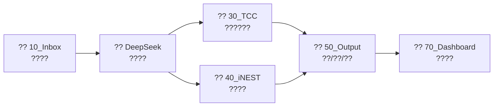

# ?? TCC + iNEST ????

> **?????**: 5,500+ ? | **TCC**: 2,672 ? | **iNEST**: 1,736 ? | **?????**: 256 ?
> 
> ????: `$= dv.current().file.mtime.toFormat("yyyy-MM-dd HH:mm")`

---

## ?? ????

```dataviewjs
const tcc = dv.pages('"30_TCC"').length;
const inest = dv.pages('"40_iNEST"').length;
const output = dv.pages('"50_Output"').length;
const total = tcc + inest + output;

dv.paragraph(`
| ?? | ?? | ?? |
|------|------|------|
| ?? TCC ?????? | **${tcc}** | ${(tcc/total*100).toFixed(1)}% |
| ?? iNEST ???? | **${inest}** | ${(inest/total*100).toFixed(1)}% |
| ?? ???? | **${output}** | ${(output/total*100).toFixed(1)}% |
| ?? ???? | **${total}** | 100% |
`);
```

---

## ?? TCC ? ?????? (2,672?)

| ?? | ?? | ?? |
|------|------|------|
| ?? ???? | **1,137** | CST/??/SDI???? |
| ?? ???? | **1,222** | Chiplet/??/??/?? |
| ?? ???? | **5** | IP?/RTL/FPGA?? |
| ?? ???? | **230** | ?????/???? |
| ?? ???? | **73** | CST/sdi_sim/EDA |

```dataview
TABLE file.mtime as "????"
FROM "30_TCC/31_Theory" OR "30_TCC/32_Tech"
SORT file.mtime DESC
LIMIT 5
```

---

## ?? iNEST ? ?????? (1,736?)

| ?? | ?? | ?? |
|------|------|------|
| ?? ???? | **1,109** | ??/??/????? |
| ?? ???? | **491** | SNN/???/???? |
| ?? ???? | **0** | ??? |
| ?? ???? | **64** | ?????? |
| ?? ???? | **32** | ?????? |

```dataview
TABLE file.mtime as "????"
FROM "40_iNEST/41_Theory" OR "40_iNEST/42_Tech"
SORT file.mtime DESC
LIMIT 5
```

---

## ?? ???? (411?)

| ?? | ?? | ?? |
|------|------|------|
| ?? ?? | **175** | [[50_Output/51_Papers/??????\|????]] |
| ?? ?? | **37** | [[50_Output/52_Patents/\|????]] |
| ?? ?? | **8** | [[50_Output/53_Monographs/\|????]] |
| ?? ???? | **125** | [[50_Output/54_Code/\|????]] |
| ?? ???? | **5** | [[50_Output/55_Guides/\|????]] |

---

## ?? ????? (DeepSeek V4 Pro)

| ?? | ???? | ???? |
|------|----------|----------|
| ?? TCC | **114** | **90** |
| ?? iNEST | **142** | **33** |

?? [????????](60_MOC/02_DeepSeek_Insights.md)

---

## ?? ??????


```mermaid
graph LR
    A[?? 10_Inbox<br/>????] --> B[?? DeepSeek<br/>????]
    B --> C[?? 30_TCC<br/>??????]
    B --> D[?? 40_iNEST<br/>????]
    C --> E[?? 50_Output<br/>??/??/??]
    D --> E
    E --> F[?? 70_Dashboard<br/>????]
```

---

## ? ????

- ?? [??????](90_System/scripts/pipeline_v3.py)
- ?? [?? Inbox](90_System/scripts/process_inbox.py)
- ?? [Git ??](90_System/scripts/gitee_sync.py)
- ?? [????](70_Dashboard/index.html)
- ??? [????](60_MOC/TCC_iNEST_????.md)
- ?? [????](60_MOC/00_Dedup_Review.md)
- ?? [?????](60_MOC/00_Diagnostic_Report.md)

---

## ?? ????

### TCC ????
- ?? CST????????????
- ?? SDSoW?????????
- ?? Chiplet 2.5D/3D????????
- ?? RISC-V SDI-CC ????IP??
- ?? ???????????

### iNEST ????
- ?? ??????????
- ?? SNN???????????
- ?? ??????????
- ?? ???????????
- ?? ??????????

---

> *TCC + iNEST ???? ? Powered by DeepSeek V4 Pro ? Codex SuperAgent v4.1*

---

## ?? Codex ? Obsidian ??

| ?? | ?? | ???? |
|------|------|----------|
| `quick_task.py inbox` | ????Inbox | Obsidian?? / ?? |
| `quick_task.py pipeline` | ?????? | ??08:00?? |
| `quick_task.py sync` | Git?? | ??21:00?? |
| `quick_task.py weekly` | ???? | ??03:00?? |
| `startup_linkage.bat` | ???????? | ???? |

?? [??????](90_System/LINKAGE_GUIDE.md)
?? [Claudian ? Codex ??](90_System/LINKAGE_GUIDE.md#1-claudian-plugin-configuration)
