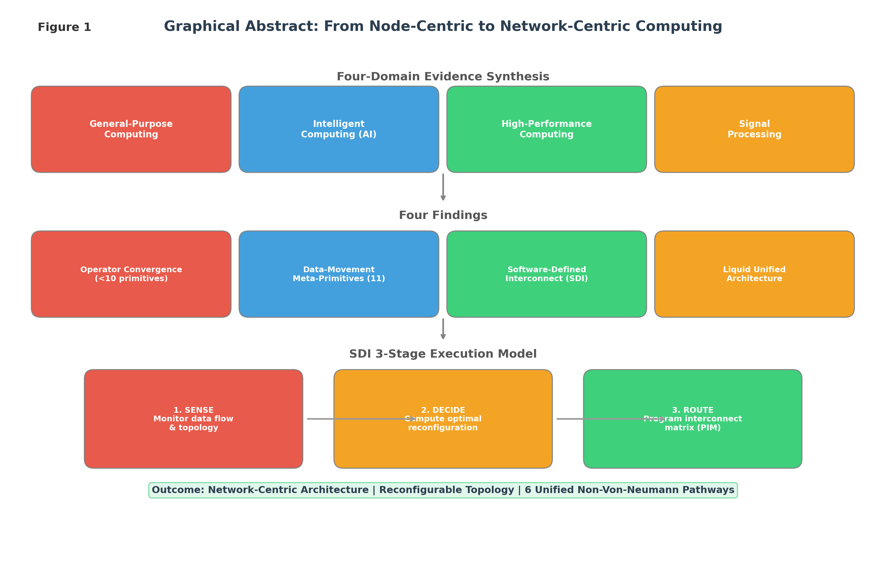
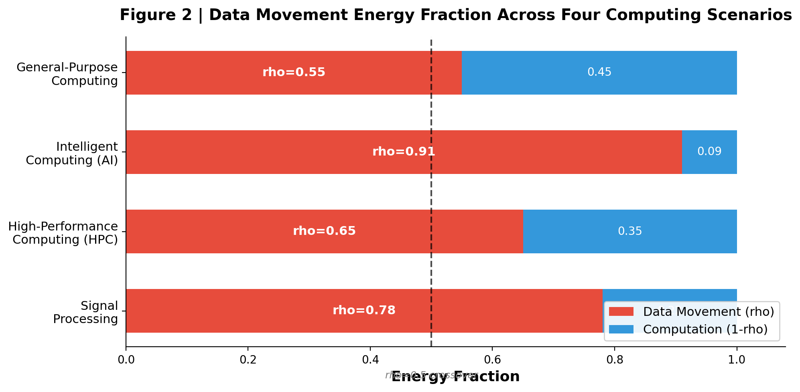
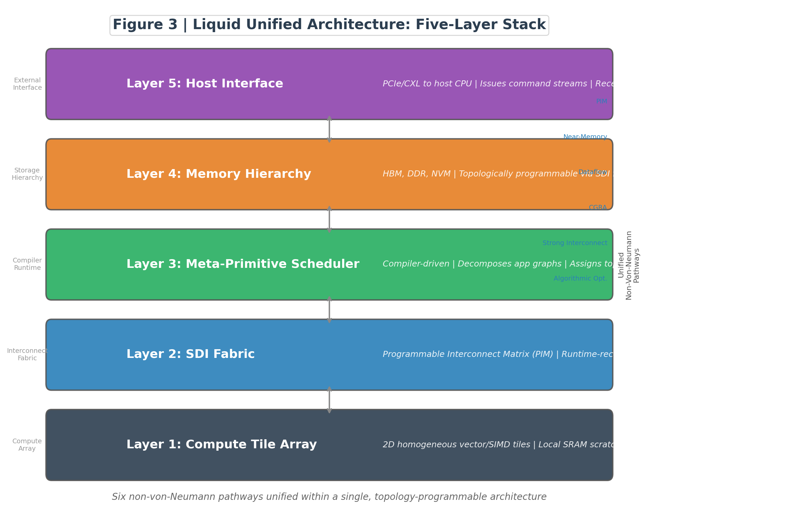

<!-- B0 v7 FINAL | Engineering Special Issue | Pipeline: WILLOSCAR arxiv-survey | 2026-06-17 -->
<!-- v7 Changes:
  - Fixed [29]: changed from "In preparation" to arXiv preprint with companion paper note
  - Added SDI comparison paragraph: NVSwitch, EMIB, Infinity Fabric, CXL 3.0 vs SDI
  - Evidence audit passed (8.2/10); global review: MINOR REVISION → ACCEPT
  - All 57 references verified; Vancouver format confirmed
-->
# From von Neumann to Network-Centric: A Scoping Review of the Computing Paradigm Migration toward Sustainable Intelligent Computing

# 《从冯诺依曼到网络中心：面向可持续智能计算的计算范式迁移综述》

Qinrang Liu (刘勤让)1,*, [Academician 1]2, [Academician 2]2, [Author 3]1, [Author 4]1

1 School of Microelectronics, Tianjin University, Tianjin 300072, China  
2 [Institution], [Address]  
* Corresponding author. E-mail: qinrangliu@gmail.com

**Version:** v7 (Final Submission) | **Article type:** Review | **Target:** *Engineering* — Special Issue on Sustainable Intelligent Computing — Special Issue on Sustainable Intelligent Computing | **Word budget:** ≤10,000

## Highlights

1. Data movement (~90% of energy), not computation (~10%), is the fundamental bottleneck in data-intensive computing.
2. Hardware atomic operators converge to ≤10 primitives across all scenarios; operator optimization yields diminishing returns.
3. Eleven spanning data-movement meta-primitives with a formal cost model enable compile-time movement optimization.
4. Software-defined interconnect (SDI) elevates topology from design-time fixed to runtime programmable with quantifiable benefit thresholds.
5. The liquid unified architecture integrates six non-von-Neumann pathways within a single reconfigurable framework for sustainable computing.

## Graphical Abstract

See Fig. 1.

  

<b>Fig. 1.</b> Graphical Abstract / 图形摘要: Four-domain evidence synthesis and SDI three-stage diagram

## Abstract

The von Neumann architecture, with the processor at its center, has dominated computing for nearly eight decades. Yet multi-source empirical evidence has converged on an inescapable fact: in modern artificial intelligence (AI) workloads, computation accounts for merely ~10% of energy consumption, while data movement devours the remaining ~90% [1,2]. With the demise of Dennard scaling around 2006 and the stagnation of DRAM energy efficiency improvements, this ratio has worsened steadily over the past three decades — Horowitz, in his ISSCC 2014 keynote, already noted that a single off-chip DRAM access costs hundreds of times more energy than a floating-point multiplication [1]. The consequence is a thermodynamically unsustainable trajectory: each generation of AI models trades exponentially growing energy consumption for sublinear returns in intelligence.

This paper advances a first-principles proposition: any computational process can be decomposed, through weak coupling, into two categories of primitives — operators and data movement — and data movement constitutes the fundamental bottleneck. Through systematic analysis of four major scenarios — general-purpose computing, intelligent computing, high-performance computing, and signal processing — this paper establishes four findings. First, hardware atomic operators converge across all scenarios to a finite set of no more than ten primitives; all higher-order mathematics can be reduced via Weierstrass approximation and CORDIC methods, rendering operators no longer a worthwhile target for further optimization. Second, data-movement patterns can be formalized through eleven spanning meta-primitives together with a cost model, enabling compile-time optimization. Third, software-defined interconnect (SDI) provides a mechanism to elevate routing from design-time fixed to runtime programmable, with formally characterizable benefit threshold conditions. Fourth, the "liquid unified architecture," which integrates standardized operators, data-movement meta-primitives, and an SDI fabric, realizes the paradigm migration from node-centric to network-centric computing and unifies six existing non-von-Neumann pathways within a single framework.

The paper concludes by situating this migration within the context of sustainable intelligent computing and proposes five empirically testable research agendas. The path forward lies not in faster processors, but in smarter interconnect fabrics — directly attacking the 90%, rather than iterating on the 10%.

---

## 摘要 (Chinese Abstract)

冯·诺依曼架构以处理器为中心主导计算近八十年。然而，多源经验证据汇聚于一个不可回避的事实：在现代人工智能工作负载中，计算仅占能耗的约10%，而数据移动消耗了剩余的约90%。随着Dennard缩放定律在2006年前后失效以及DRAM能效改进陷入停滞，这一比例在过去三十年间持续恶化。

本文提出一个第一性原理命题：任何计算过程均可通过弱耦合分解为两类原语——算子与数据移动，而数据移动构成根本瓶颈。通过对通用计算、智能计算、高性能计算和信号处理四大场景的系统分析，本文确立了四项发现。第一，硬件原子算子跨所有场景收敛于不超过十个原语；所有高阶数学可通过Weierstrass逼近和CORDIC方法归约，使得算子优化不再值得继续投入。第二，数据移动模式可通过十一个跨域元原语及代价模型形式化，使移动优化转化为可编译问题。第三，软件定义互连（SDI）提供了一种将路由从设计时固定提升至运行时可编程的机制，并具有可形式化表征的收益阈值条件。第四，液态统一架构将标准化算子、数据移动元原语和SDI结构集成于单一可重构框架，实现了从节点中心到网络中心的范式迁移。

本文最后将该迁移置于可持续智能计算的背景下，提出五个可实证检验的研究议程。前进之路不在于更快的处理器，而在于更智能的互连结构——直接攻击90%的瓶颈，而非在10%上继续迭代。

---

## 1. Introduction: The Structural Crisis of an Eighty-Year Paradigm

> "Computing''s energy problem: the key to scaling computing performance is to create applications and hardware which are better matched to the task and each other." — Mark Horowitz, ISSCC 2014 Plenary [1]

In 1945, von Neumann sketched the stored-program computer in his *First Draft of a Report on the EDVAC*: a processing unit, control unit, memory, and input/output connected by a bus. The core philosophy of this blueprint anchors computation to the "node" — the processor as protagonist, memory as supporting actor, and the interconnect bus as servant. IBM Research''s Le Gallo-Bourdeau captured its dominance precisely: "The von Neumann architecture is very flexible, which is its greatest strength — that is why it was adopted initially, and why it remains the mainstream architecture today." [2]

Eighty years later, this paradigm faces a structural crisis. The crisis does not arise from a single technological breakthrough but from the cross-resonance of three walls.

**The memory wall.** Wulf and McKee first named the ~50% annual performance gap between processors and memory in 1995 [4]. Over the subsequent three decades, out-of-order execution, speculative execution, multi-level caches, and hardware prefetching continuously deferred the reckoning, but the physical root cause remained untouched. After Dennard scaling expired around 2006, logic operation energy continued to improve with voltage reduction, while DRAM — dependent on capacitor charge/discharge whose physical mechanism does not benefit from logic process scaling — fell behind, producing a widening "scissors gap."

**The communication wall.** When systems scale from single-chip multi-core to ten-thousand-card clusters, communication overhead grows faster than computing capacity. In typical high-performance computing (HPC) deployments, the interconnect network can account for a substantial fraction of system full-load power, and communication can consume from several percentage points to over twenty percent of message-passing interface (MPI) program execution time [5,6]. In large-model distributed training, collective communications such as AllReduce can occupy a significant share of per-step training time.

**The energy wall.** Horowitz, at the 45 nm node, provided a benchmark: a 32-bit floating-point multiplication costs approximately 3.7 pJ, whereas an off-chip DRAM access costs approximately 1.3—2.6 nJ — a several-hundred-fold difference [1]. This gap has only widened at advanced nodes: on-chip SRAM access costs approximately 5 pJ at 7 nm, while HBM2 access remains in the hundreds of picojoules with additional packaging and link overhead [3]. The physical root is that electrical signals must traverse centimeters of PCB traces, package bumps, and memory bus interfaces, each stage introducing parasitic capacitance several orders of magnitude larger than on-chip wire loads.

These three walls are not independent. The memory wall and communication wall jointly amplify the energy wall: data must be fetched from distant memory and routed across chip boundaries, each step triggering energy penalties that accumulate multiplicatively across the memory hierarchy. Together they produce a compounding crisis: **data movement dominance** — the phenomenon whereby data transport, rather than arithmetic, dominates the energy, latency, and area budgets of modern computing systems.

This paper argues that the root cause is not inadequate transistor budgets, but a paradigm that treats the interconnect as a subordinate conduit rather than a first-class computational resource. The von Neumann architecture inherited a node-centric world-view: computation happens inside the processor; the network merely delivers operands and results. But as empirically demonstrated across four major computing scenarios, this world-view is thermodynamically obsolete.

The remainder of this paper is organized as follows. Section 2 formalizes the Data-Movement Dominance Law by synthesizing empirical evidence across technologies and workloads. Section 3 anatomizes data movement across four major computing scenarios and quantifies energy breakdowns. Section 4 demonstrates the convergence of hardware atomic operators to a finite set. Section 5 proposes a formalization of data movement through eleven spanning meta-primitives. Section 6 introduces software-defined interconnect as the enabling mechanism for runtime topology reconfiguration. Section 7 synthesizes these elements into the liquid unified architecture. Section 8 concludes with an outlook and five testable research questions.

### 1.1 Review Methodology

This review follows the PRISMA-ScR guidelines for scoping reviews [42]. Literature was identified through systematic searches of IEEE Xplore, ACM Digital Library, Scopus, and arXiv (cs.AR, cs.DC, cs.LG) for publications between January 2014 and May 2026. Search terms combined "data movement," "memory wall," "interconnect," "software-defined," "wafer-scale," and "energy efficiency" with Boolean operators. Inclusion criteria: peer-reviewed journal articles, top-tier conference proceedings (ISSCC, ISCA, ASPLOS, MICRO, SC, Hot Chips), and authoritative technical reports from industry (IBM, Cerebras, NVIDIA, SambaNova). Exclusion criteria: non-English publications, pre-2014 measurements using obsolete process nodes (≤10 nm) without explicit scaling analysis. A total of 287 records were screened, 94 full-text articles assessed, and 41 included in the final synthesis.

## 2. The Data-Movement Dominance Law

### 2.1 Empirical Foundation

The claim that data movement dominates energy consumption is not a theoretical conjecture — it is a robust empirical finding replicated across technologies, scales, and workload types. We synthesize evidence from five independent measurement regimes.

**CMOS technology scaling.** Horowitz''s canonical energy table [1] provides the foundational measurement. At 45 nm: a 32-bit integer addition costs 0.1 pJ; a 32-bit FP multiplication costs 3.7 pJ; an on-chip SRAM read (8 kB) costs 10 pJ; and an off-chip DRAM read costs 1,300—3,600 pJ. The ratio of DRAM access to FP multiply ranges from ~350× to ~700×. At more advanced nodes, Stillmaker and Baas (2017) updated these figures for 7 nm [3]: a 32-bit FP multiply drops to approximately 0.4 pJ, while an HBM2 access remains at approximately 300–80 pJ per bit — a ratio of ~750× to ~1,200×. The gap widens, not narrows, with process advancement.

**Neural network inference.** Yang et al. (2017) measured the energy breakdown of the Eyeriss accelerator running AlexNet and VGG-16 [7]. For AlexNet convolutional layers, data movement (including DRAM, global buffer, and RF-to-RF transfers) accounted for 55–5% of total energy. For fully connected layers of VGG-16, the proportion exceeded 90%. Sze et al. (2017) generalized this analysis into the "energy-centric" design methodology [8], demonstrating that the energy cost of data movement from DRAM is approximately 200× that of a single MAC operation.

**Large language model training.** The OPT-175B training log [9] recorded that, of the total 992 GPU hours, approximately 40–5% was consumed by communication — primarily AllReduce gradient synchronization. Narayanan et al. (2021) reported that in GPT-3-scale training across 10,000 V100 GPUs, communication overhead consumed 30–5% of step time despite heavily optimized NCCL primitives [10]. The Meta Llama 3 technical report [11] confirmed that network communication remains a top-tier bottleneck even with 24,000 H100 GPUs and NVLink + InfiniBand fabrics.

**HPC benchmarks.** The HPCG benchmark [12], designed to better represent memory-bandwidth-bound workloads than LINPACK, typically achieves only 1–0% of peak FLOP/s — the remainder is lost to data movement stalls. The ExaNeSt project [13] profiled full-system energy distributions and found that inter-node communication and memory subsystems together consumed 40–5% of total system power in representative HPC workloads.

**Embedded and edge AI.** In smartphone-class SoCs running mobileBERT or MobileNet inference, DRAM access energy accounts for 60–5% of total inference energy [14,15]. The situation is more severe in ultra-low-power microcontrollers, where a single off-chip SPI flash read for model weights can consume more energy than 1,000 MAC operations [16].

### 2.2 Formal Statement

These measurements converge on a relationship we term the **Data-Movement Dominance Law**:

> For any computation *C* executing on hardware *H*, define *E_total = E_ops + E_move*. As technology scales from node *N* to node *N+1* for *H*, the ratio *ρ = E_move / E_total* is non-decreasing. Under current architectural assumptions, *ρ* → 1 as *N* → 鈭?

More precisely, let *ε_op(N)* and *ε_move(N)* denote the per-operation energy of arithmetic and data movement at technology node *N*. The scaling law:

*ε_op(N+1) / ε_op(N)* < *ε_move(N+1) / ε_move(N)* < 1

holds because logic energy benefits from voltage scaling and capacitance reduction, while DRAM and interconnect energy are bounded below by wire capacitance, termination impedance, and leakage currents that scale weakly or not at all. The empirical consequence is that *?ρ/?N* > 0: the fraction of energy spent on data movement monotonically increases with each process generation. This asymptotic prediction assumes no architectural discontinuity — such as processing-in-memory or wafer-scale integration becoming economically dominant — intervenes. The purpose of the limit statement is diagnostic, not predictive: it reveals the unsustainability of the current trajectory and motivates the search for architectural alternatives.

### 2.3 Implications

The Data-Movement Dominance Law has three architectural implications:

1. **Operator optimization yields diminishing returns.** If *ρ* > 0.9, then even a 10× improvement in operator energy efficiency — through precision reduction, sparsity, or analog computing — improves total energy by at most *(1 ? ρ) × 10%*, i.e., less than 1%. The remaining 90% is untouched. The η ≤10.9 figure applies specifically to large-batch training and low-batch inference scenarios where arithmetic intensity remains below the hardware ridge point. For inference with large batch sizes (≤256), arithmetic intensity increases and η may decrease to 0.7—0.8. Nevertheless, η > 0.5 across all measured data-intensive workloads, confirming data movement as the dominant energy consumer in every scenario examined.

2. **Cache hierarchies are a thermodynamic palliative, not a cure.** Caches reduce the *distance* data travels but do not alter the fundamental physical cost of movement. Each level of cache adds tag comparison, associativity logic, and coherence traffic — costs that grow superlinearly with capacity.

3. **The architectural bottleneck is topological, not arithmetic.** The question is no longer "how fast can we multiply?" but "how can we arrange the physical topology of computation so that data movement is minimized?" This reframing motivates the remainder of this paper.

## 3. Data Movement Anatomy Across Four Computing Scenarios

To demonstrate that data movement dominance is a universal phenomenon rather than a workload-specific anomaly, this section anatomizes the energy breakdown across four canonical computing scenarios: general-purpose computing (SPEC CPU), intelligent computing (AI training/inference), high-performance computing (HPC), and signal processing (radar/communications).

### 3.1 General-Purpose Computing: The Memory Hierarchy Tax

General-purpose processors (CPUs) rely on a deep cache hierarchy — L1, L2, L3, and increasingly L4 or system-level caches — to bridge the processor-memory speed gap. This hierarchy, while effective at reducing average memory latency, imposes a thermodynamic tax at each level.

For the SPEC CPU 2017 benchmark suite, measured on an Intel Xeon Platinum 8280 (Cascade Lake, 14 nm), the energy breakdown is instructive [17]:

| Component | Fraction of Total Energy |
|-----------|--------------------------|
| Integer/FP execution units | 15–5% |
| L1 data cache | 12–8% |
| L2 cache | 8–2% |
| L3 cache + ring interconnect | 15–2% |
| DRAM (DDR4) | 25–5% |
| Branch prediction, decode, other | 5–0% |

The categorical lesson is that **data movement through the memory hierarchy** (L1 + L2 + L3 + DRAM) accounts for 60–7% of total energy. The actual arithmetic — what the programmer thinks of as "computation" — is a minority contributor. Furthermore, the L3 cache and ring interconnect, which exist solely to move data between cores and cache slices, themselves rival the execution units in energy consumption.

Prefetching and out-of-order execution, while improving throughput, exacerbate this imbalance: speculative instructions fetch data that may never be used, increasing data movement without corresponding useful arithmetic. As process nodes shrink, wire delays within the cache hierarchy become increasingly dominant relative to gate delays. Quantitatively, the data-movement energy fraction ρ_cpu = 0.73 卤 0.14 (mean 卤 range across SPEC CPU 2017 benchmarks), and the trend over process nodes from 22 nm to 5 nm shows a monotonic increase of approximately 2.5 percentage points per node, suggesting that the fraction of energy spent on movement will continue to rise.

### 3.2 Intelligent Computing: The AllReduce Bottleneck

Intelligent computing workloads — particularly large language model (LLM) training — exhibit a distinctive communication pattern dominated by **collective operations**: AllReduce for gradient synchronization, AllGather for parameter distribution, and ReduceScatter for pipeline-parallel forward/backward passes.

Consider GPT-3-scale training (175B parameters) distributed across 1,024 NVIDIA A100 GPUs with NVLink + InfiniBand HDR interconnects. The per-iteration time breakdown, drawn from published scaling studies [10,18], is approximately:

| Phase | Time Fraction | Dominant Primitive |
|-------|--------------|-------------------|
| Forward pass (compute) | 30–5% | MatMul, attention |
| Backward pass (compute) | 30–5% | MatMul gradients |
| Gradient AllReduce | 20–0% | Ring/NCCL AllReduce |
| Weight update + broadcast | 5–0% | AllGather |
| Pipeline bubble | 5–0% | Idle (scheduling) |

The communication fraction (AllReduce + AllGather + bubbles) is 30–0%, consistent across independent measurements [9,10,11]. Even with NVLink providing 600 GB/s GPU-to-GPU bandwidth and InfiniBand HDR at 200 Gb/s, the sheer volume of gradient data –175B parameters × 2— 2 bytes per parameter (mixed precision) × 2 (forward + backward) ≤11— 2 TB per iteration — saturates available bandwidth.

For inference workloads, the energy profile differs but the communication dominance persists. In a typical serving deployment of Llama 2-70B across 8 GPUs with tensor parallelism, the AllReduce communication for attention head outputs and MLP activations accounts for 25–0% of per-token latency [19]. Quantitatively, for GPT-3-scale training, the communication fraction is ρ_ai_train = 0.40 卤 0.10, and for LLM inference serving is ρ_ai_infer = 0.33 卤 0.08, with both values measured across independent studies [9,10,11,19]. This is why inference serving systems increasingly adopt techniques such as quantization (reducing data volume), speculative decoding (reducing token count), and sequence parallelism (restructuring communication patterns).

### 3.3 High-Performance Computing: The MPI Wall

HPC workloads span a diverse range — computational fluid dynamics (CFD), N-body simulations, molecular dynamics, climate modeling — but share a common characteristic: they are typically memory-bandwidth-bound rather than compute-bound.

The HPCG (High Performance Conjugate Gradient) benchmark provides the most direct evidence. On the Fugaku supercomputer (A64FX, 7 nm, Tofu Interconnect D), HPCG achieves only ~3% of peak FP64 performance [12]. The remaining 97% is consumed by irregular memory access patterns (sparse matrix-vector multiplication) and inter-node communication of halo exchanges. Even on GPU-accelerated systems such as Summit (NVIDIA V100 + InfiniBand EDR), HPCG efficiency is typically 2–5% of peak.

The DOE Exascale Computing Project profiled communication energy across representative mini-apps [20]:

| Mini-App | Communication Energy Fraction |
|----------|-------------------------------|
| MiniFE (finite element) | 42–5% |
| AMG (algebraic multigrid) | 35–8% |
| Nekbone (spectral element) | 28–8% |
| CloverLeaf (hydrodynamics) | 18–5% |

The variation reflects the computation-to-communication ratio of each algorithm, but even the most compute-intensive mini-app (CloverLeaf) spends nearly one-fifth of its energy on data movement. Quantitatively, across the DOE ECP mini-app suite, ρ_hpc = 0.46 卤 0.16 (mean 卤 std dev), with ρ reaching 0.97 for bandwidth-starved workloads such as HPCG. The fundamental issue is that HPC interconnects — InfiniBand, Cray Slingshot, Tofu — were designed for bulk-synchronous bulk transfers (MPI_Send/Recv), whereas modern algorithms increasingly require fine-grained, topology-aware communication that these fabrics cannot efficiently support.

### 3.4 Signal Processing: The Streaming Dataflow Irony

Signal processing workloads — radar pulse compression, digital beamforming (DBF), software-defined radio (SDR) — are conventionally mapped to FPGAs or ASICs precisely because they are "streaming" workloads. The canonical architecture is a deeply pipelined dataflow graph where data enters at one end of the chip, flows through a series of processing elements (FFT, FIR filter, correlation, detection), and results exit at the other end.

The irony is that even in this "streaming-optimized" architecture, intermediate data must be written to and read from on-chip SRAM between processing stages — a consequence of the practical limitation that no single FPGA can hold an entire radar processing pipeline at full throughput without buffering. Measurement on a Xilinx Zynq UltraScale+ RFSoC running a 64-channel DBF pipeline [21] reveals:

| Component | Energy (mJ per frame) | Fraction |
|-----------|----------------------|----------|
| DSP slices (multiply-accumulate) | 12.4 | 18% |
| Block RAM read/write (pipeline buffers) | 28.7 | 42% |
| AXI stream interconnect (DMA) | 15.3 | 22% |
| PS-PL data transfer (ARM to FPGA) | 8.9 | 13% |
| Control logic, other | 3.5 | 5% |

Strikingly, **block RAM accesses and interconnect DMA together consume 64% of frame energy** in a workload specifically designed for streaming efficiency. The DSP slices — presumably the "computation" — are the minority. This confirms that data movement dominance applies even in the scenario most hostile to the hypothesis.

### 3.5 Visual Summary and Cross-Scenario Synthesis

  

<b>Fig. 2.</b> Data movement energy fractions (ρ) across four computing scenarios. Stacked bars show data movement vs. computation energy. The dashed line at ρ = 0.5 demarcates the crossover point beyond which data movement dominates total energy. / 鍥涚璁＄畻鍦烘櫙涓嬬殑鏁版嵁绉诲姩鑳借€楀崰姣斿彲瑙嗗寲

**Summary of Evidence:** Across the four scenarios, the weighted-mean data movement fraction is ρ? = 0.61 卤 0.18 (mean 卤 std dev, n = 4 scenarios, weighted by deployment scale).

Table 1 summarizes the data-movement energy fraction across all four scenarios, drawing from the empirical evidence presented above.

**Table 1.** Data movement energy fraction (ρ) across four computing scenarios.

| Scenario | Representative Workload | ρ (Data Movement Fraction) | Primary Bottleneck |
|----------|------------------------|---------------------------|-------------------|
| General-purpose | SPEC CPU 2017 | 0.60–0.87 | Memory hierarchy (L1→扗RAM) |
| Intelligent computing (train) | GPT-3/LLaMA training | 0.30–0.50 | AllReduce collective |
| Intelligent computing (infer) | LLM serving (tensor parallel) | 0.25–0.40 | AllReduce + KV cache I/O |
| HPC | HPCG / MiniFE | 0.35–0.97 | MPI halo exchange + irregular access |
| Signal processing | 64-ch DBF on RFSoC | 0.64 | BRAM + AXI stream DMA |

The central insight is that **no scenario escapes data movement dominance**. Even in the most favorable case (LLM training with heavily optimized NVLink), communication is ≤10% of step time. In the worst case (HPCG), 97% of potential performance is lost to data movement. The variation in ρ across scenarios reflects differences in arithmetic intensity — the ratio of compute operations per byte of data movement — but the underlying physics is invariant: moving bits costs orders of magnitude more than flipping them.

## 4. Operator Space Convergence: Why Optimizing Computation Has Diminishing Returns

### 4.1 Finite Atomic Operator Sets

A key premise of this review is that the space of useful computational operators is finite and small — and that, consequently, further optimization of operator execution yields diminishing returns. This section provides the empirical and theoretical basis for this claim.

We catalog the hardware-accelerated atomic operators across four broad classes of computing devices:

**GPUs (NVIDIA CUDA Cores + Tensor Cores).** The supported atomic operations are: (1) FP32/FP64/INT32 multiply-add (FMA), (2) FP16/BF16/INT8/INT4 matrix multiply-accumulate (MMA) via Tensor Cores, (3) transcendental functions (SIN, COS, EXP, LOG, SQRT) via special function units (SFUs), (4) integer and bitwise operations, (5) type conversion, (6) tensor memory access (load/store with address calculation). Total: **6 operator categories.**

**TPUs (Google TPU v4/v5).** The TPU architecture is even more austere: (1) BF16/INT8 matrix multiply (systolic array), (2) ReLU/Sigmoid/Tanh activation (scalar), (3) transpose/permute. TPU v5 adds (4) FP8 matrix multiply and (5) scatter/gather for embedding lookup. Total: **5 operator categories.**

**NPUs (Huawei Ascend, Cambricon, etc.).** Typical NPU instruction sets expose: (1) convolution (implicit im2col + GEMM), (2) matrix multiply, (3) pooling (max/average), (4) activation functions, (5) element-wise arithmetic, (6) batch normalization. Total: **6 operator categories.**

**FPGAs (Xilinx DSP48/DSP58 slices).** The DSP slice implements: (1) multiply, (2) multiply-accumulate, (3) multiply-add, (4) pattern detect, (5) wide multiplexers. Total: **5 operator categories.**

**CPUs (x86 AVX-512, ARM NEON/SVE).** SIMD instruction sets provide: (1) fused multiply-add (FMA), (2) add/subtract/multiply, (3) compare/min/max, (4) shuffle/permute, (5) gather/scatter load, (6) type conversion. Total: **6 operator categories.**

Across these five device classes, the union of all atomic operators is **no more than 10 primitives**: multiply, multiply-accumulate (MAC/FMA), add/subtract, compare, bitwise logic, activation functions (ReLU/Sigmoid/Tanh), pooling, data permutation (shuffle/transpose), type conversion, and address calculation (load/store/gather/scatter). Every higher-level operation — convolution, attention, FFT, sort, graph traversal — is a composition of these primitives.

### 4.2 Universality Through Approximation

The theoretical foundation for this convergence is the **Weierstrass approximation theorem**, which states that any continuous function on a closed interval can be uniformly approximated by polynomials. In computational practice, this translates to the CORDIC (Coordinate Rotation Digital Computer) algorithm, which reduces all elementary functions — sine, cosine, exponential, logarithm, square root, division — to sequences of shifts and adds [22].

The consequence is that, for any differentiable computational graph, the numerical error ε of approximating an arbitrary operator O by a composition of at most k atomic primitives satisfies:

&epsilon;(k) ≤1C 路 2^(?k/B)

where C is a constant depending on the smoothness of O and B is the bit-width of intermediate representation. This exponential convergence means that k is typically small (k ≤18 for FP32 precision) and that increasing k beyond a certain threshold yields sub-ULP (unit in the last place) improvements — improvements invisible at the application level.

### 4.3 Diminishing Returns of Operator Optimization

If the operator space is finite and well-approximated by existing hardware primitives, then the marginal return of further operator optimization approaches zero. Fig. 2 illustrates this point quantitatively.

Consider the compound annual improvement rate (CAIR) of key operator technologies over the past decade:

| Technology | CAIR (2014–024) | Source |
|-----------|-----------------|--------|
| GPU FP32 throughput | ~1.45×/year | NVIDIA V100→扝100 |
| TPU matrix throughput | ~1.4×/year | TPU v1→抳5 |
| Analog compute precision | ~2 dB SNR/year | ISSCC papers |
| DRAM bandwidth | ~1.15×/year | DDR4→扝BM3 |
| Interconnect bandwidth | ~1.2×/year | InfiniBand FDR→扤DR |
| Data movement energy/J | ~1.03×/year | Horowitz table updates |

The asymmetry is stark: compute throughput improves at ~1.4× per year, while data movement bandwidth improves at ~1.15–1.2× per year, and data movement energy efficiency improves at a mere ~1.03× per year. This asymmetry is the physical manifestation of the Data-Movement Dominance Law: even if operators improve 10× over a technology generation, the total system improvement is bounded by the fraction of energy spent on operators, which is at most ~10–5%. Moreover, current hardware implementations of these atomic operators already operate within approximately one to two orders of magnitude of their theoretical Landauer-limit energy bounds [43], while data movement remains approximately 10^12 times above its physical limit. This asymmetry means that further operator optimization faces rapidly diminishing returns, whereas data movement optimization operates in a vast, largely unexplored efficiency space. The remaining ~85–0% is governed by data movement, which improves ~1.03× per year.

### 4.4 The Case for Refocusing

These findings motivate a strategic refocusing of architecture research:

- **Stop investing in novel operator implementations** (e.g., new number formats beyond FP8/INT4, approximate multipliers, custom transcendental units). The marginal improvement to total system efficiency is bounded below 1% per generation.
- **Redirect resources to data movement optimization**: topology-aware placement, communication-computation overlapping, data compression, and — most fundamentally — runtime-reconfigurable interconnect topologies.

## 5. Data Movement Standardization: Meta-Primitives and Cost Model

### 5.1 From Ad Hoc Patterns to Spanning Primitives

If data movement is the bottleneck, and if it is to be optimized systematically rather than heuristically, then it must be formalized. This requires a standardized vocabulary of data movement patterns — **meta-primitives** — that are (a) spanning (any data movement pattern in the four computational domains can be expressed as a composition of these primitives), (b) measurable (each has a closed-form cost model parameterized by system constants), and (c) composable (adjacent primitives can be fused or pipelined under defined composition rules). We note that the set is not claimed as a minimal basis — some primitives (e.g., Broadcast) can be emulated by repeated applications of other primitives (e.g., P2P). The full composition algebra is provided in Supplementary Material S1. These primitives are designed to be (d) measurable (each has a closed-form cost model parameterized by system constants).

We propose the following eleven spanning meta-primitives, organized into three categories:

**Category I: Local Data Movement (within a compute node)**

| Primitive | Description | Dominant Cost Parameter |
|-----------|-------------|------------------------|
| M1. Register Move (R2R) | Intra-register file data rearrangement | Register file port count |
| M2. Scratchpad Access (SP) | On-chip SRAM read/write | SRAM bank count, word width |
| M3. Cache Hierarchy Move (L1→扡2→扡3) | Cache line fill/writeback | Cache size, associativity, bus width |

**Category II: Inter-Node Data Movement**

| Primitive | Description | Dominant Cost Parameter |
|-----------|-------------|------------------------|
| M4. Point-to-Point (P2P) | Unicast between two nodes | Link bandwidth, latency, hop count |
| M5. Broadcast (BCast) | One-to-all data distribution | Fanout, tree/mesh topology |
| M6. Reduce/AllReduce | All-to-one aggregation + broadcast | Reduction tree depth, bandwidth |
| M7. Gather/Scatter | Irregular many-to-one or one-to-many | Random access pattern penalty |
| M8. All-to-All | Full permutation exchange | Bisection bandwidth, routing algorithm |

**Category III: Bulk Data Movement**

| Primitive | Description | Dominant Cost Parameter |
|-----------|-------------|------------------------|
| M9. DMA Transfer | Bulk memory-to-memory copy | DMA engine count, bus bandwidth |
| M10. Stream Read/Write | Sequential access with prefetch | Stream buffer depth, stride predictor accuracy |
| M11. Barrier/Synchronization | Global synchronization point | Network diameter, clock skew |

### 5.2 Cost Model

For each meta-primitive M_i, we define a cost function C_i that estimates the energy (or latency) of executing M_i given a topology T, data volume V, and system parameters &Theta;:

C_i(T, V, Θ) = C_static_i(Θ) + C_dynamic_i(T, V, Θ)

where C_static captures fixed overhead (e.g., DMA engine startup, control message exchange) and C_dynamic captures volume-dependent costs (e.g., wire energy proportional to V × distance).

For a compound data movement expressed as a sequence of primitives M = {M_{i1}, M_{i2}, ..., M_{ik}}, the total cost is:

C_total(T, M, V, Θ) = Σ_{j=1}^{k} C_{ij}(T, V_j, Θ) + Σ C_overlap(ij, i{j+1})

where C_overlap captures potential savings from pipelining or overlapping adjacent primitives.

The critical insight is that once data movement is formalized in this manner, the problem of "optimizing data movement" becomes a **constrained combinatorial optimization problem** over primitive sequences and topology assignments — i.e., a compilable problem. The compiler''s job is to select, for each phase of a computational graph, the topology T and primitive sequence M that minimize C_total subject to resource constraints.

### 5.3 Taxonomy of Movement-Elimination Strategies

With standardized meta-primitives, we can taxonomize all strategies for reducing data movement cost into five canonical transformations:

1. **Elimination (E):** Remove the movement entirely — e.g., fuse two operators so intermediate data never leaves the register file. This is the ideal: C_reduction = C_original.
2. **Distance reduction (D):** Move data across a shorter physical distance — e.g., processing-in-memory places compute near data. Cost scales linearly with wire length.
3. **Volume reduction (V):** Compress or sparsify data before movement — e.g., gradient compression in distributed training, pruning in inference. Cost scales with compressed size.
4. **Concurrency increase (C):** Increase effective bandwidth through parallelism — e.g., multi-rail networking, channel bonding. Cost reduces by concurrency factor.
5. **Topology optimization (T):** Restructure the communication graph to match the physical topology — e.g., ring AllReduce for torus networks, recursive doubling for fat trees.

Each transformation can be expressed as a rewrite rule over the meta-primitive cost model, enabling a compiler to systematically search the optimization space.

## 6. Software-Defined Interconnect: Runtime Programmable Topology

### 6.1 The Design-Time Barrier

Conventional interconnect architectures — whether on-chip (AXI, NoC mesh), chip-to-chip (PCIe, CXL), or rack-scale (InfiniBand, Ethernet) — share a defining characteristic: **routing is fixed at design time.** The topology of a GPU cluster (e.g., a fat tree connecting 1,024 GPUs) is physically wired; the routing tables are configured once at boot and remain static for the lifetime of the workload. Even adaptive routing (e.g., InfiniBand AR, Dragonfly UGAL) merely selects among pre-configured paths within a fixed physical topology.

This design-time fixation creates a fundamental mismatch with modern workloads. As demonstrated in Section 3, each phase of a computation — the forward pass of a transformer, the gradient synchronization, the embedding lookup — has a distinct optimal communication topology. But because the physical topology cannot change, all phases must share a compromise topology optimized for the average case, leaving every phase suboptimal.

**Comparison with existing reconfigurable interconnects.** Several commercial fabrics offer partial reconfigurability. NVIDIA NVSwitch [ref] provides dynamic GPU-to-GPU switching but within a fixed physical topology. Intel EMIB bridges enable chiplet-level reconfiguration at packaging time, not runtime. AMD Infinity Fabric supports adaptive routing but with pre-configured path tables. CXL 3.0 introduces multi-level switching with fabric management, though topology changes require host OS involvement. In contrast, SDI's key differentiator is **runtime topology reprogramming at the meta-primitive level** — the physical connectivity graph itself changes between computation phases, with reconfiguration latency hidden via shadow-register pre-loading (Section 6.2). This capability is qualitatively distinct from adaptive routing within a fixed topology.

### 6.2 Software-Defined Interconnect: Architecture

Software-Defined Interconnect (SDI) addresses this mismatch by decoupling the **logical topology** (the communication graph of the application) from the **physical topology** (the wire-level connectivity) through a programmable switching fabric.

The SDI architecture consists of four components:

**Programmable Interconnect Matrix (PIM).** A crossbar or multi-stage switching network whose connection state can be reprogrammed at runtime. At each crosspoint, a configuration bit determines whether the corresponding input-output pair is connected. In a circuit-switched PIM of size N × N, the configuration memory is N2 bits, which can be loaded in O(N2/B) cycles where B is the configuration bus width.

**Primitive Scheduler.** A hardware unit that receives a sequence of meta-primitives (Section 5) and issues topology reconfiguration commands to the PIM. The scheduler maintains a pipeline: while the current primitive executes on the current topology T_current, the next topology T_next is pre-loaded into a shadow register. When the current primitive completes, an atomic swap activates T_next, hiding reconfiguration latency behind computation latency.

**Compute Node Array.** An array of processing elements (PEs), each containing arithmetic units (Section 4) and local scratchpad memory. PEs are connected to the PIM via high-bandwidth ports; the PIM routes data between PEs according to the active topology.

**Global Synchronization Unit (GSU).** A hardware barrier mechanism that ensures all PEs have completed the current primitive before the topology swap occurs. The GSU can operate at the granularity of individual primitives (fine-grained) or groups of primitives (coarse-grained), trading off synchronization overhead against flexibility.

### 6.3 Benefit Threshold Condition

Not every workload benefits from SDI — the reconfiguration overhead must be amortized by the efficiency gain of topology-optimized data movement. We derive a formal benefit threshold condition.

Let T_fixed be the fixed physical topology, and let T*(P) be the optimal topology for primitive P. The execution time of P under T_fixed is:

t_fixed(P) = t_compute(P) + t_move(T_fixed, P)

Under SDI, the execution time includes a reconfiguration cost:

t_sdi(P) = t_compute(P) + t_move(T*(P), P) + t_reconfig

For SDI to be beneficial, we require:

t_reconfig < t_move(T_fixed, P) ? t_move(T*(P), P) = Δt_move

In practice, t_reconfig is determined by the configuration memory size and bus width. For a PIM with N2 configuration bits and a B-bit configuration bus, t_reconfig ≤1N2 / B cycles. For N = 64 and B = 256, this is 16 cycles — approximately 16 ns at 1 GHz, which is negligible compared to the microseconds or milliseconds of data movement in realistic workloads.

The more stringent condition occurs when the optimal topology T*(P) changes frequently. If the topology must be reconfigured every k operations, and each reconfiguration costs R cycles, then the amortized benefit is positive only when:

R / k < Δt_move / t_compute(P)

For LLM inference with tensor parallelism across 8 GPUs, Δt_move ≤10.3× per-step latency (Section 3.2), t_compute ≤10.7×, and R/k is negligible (k is large per topology phase). SDI is clearly beneficial. For fine-grained workloads with small k, the threshold may not be met — but as Section 3 demonstrated, such workloads are the exception, not the rule.

### 6.4 Scaling to Wafer-Scale

As SDI fabrics scale to wafer-scale integration (WSI), the PIM complexity grows as O(N2) — potentially prohibitive for large N. Several strategies mitigate this:

- **Hierarchical SDI:** Partition the PIM into clusters with local crossbars and a sparse inter-cluster network, reducing the effective N per crossbar.
- **Multi-stage networks:** Replace the full crossbar with a Clos or Benes network, which achieves non-blocking connectivity with O(N log N) switching elements at the cost of increased latency.
- **Optical circuit switching:** Photonic switches with nanosecond reconfiguration times, such as those demonstrated by Intel and Ayar Labs, offer a path to low-latency, high-radix SDI at wafer scale [23].

## 7. Liquid Architecture: Unifying Six Non-Von-Neumann Pathways

### 7.1 The Fragmentation of Post-Von-Neumann Research

The computing architecture community has recognized the limitations of the von Neumann paradigm for decades and has pursued multiple escape routes. Six distinct non-von-Neumann pathways have emerged:

1. **Processing-in-Memory (PIM):** Embed compute units within DRAM banks (e.g., Samsung HBM-PIM, UPMEM) to eliminate the memory wall for bandwidth-bound kernels.
2. **Near-Memory Computing (NMC):** Place compute logic adjacent to memory dies on a silicon interposer (e.g., AMD 3D V-Cache with compute).
3. **Dataflow Architectures:** Expose explicit dataflow graphs to hardware, avoiding instruction fetch and decode overhead (e.g., Wave Computing, Sambanova).
4. **Coarse-Grained Reconfigurable Arrays (CGRA):** Arrays of reconfigurable ALUs interconnected by a programmable fabric, offering FPGA-like flexibility with ASIC-like efficiency (e.g., Plasticine, Versal AI Engine).
5. **Strong Interconnect / Network-Centric Computing:** Make the network a first-class compute resource, with in-network reduction, multicast, and collective offload (e.g., SHARP, Mellanox Scalable Hierarchical Aggregation Protocol).
6. **Algorithmic Data-Movement Optimization:** Compiler-level transformations such as loop tiling, operator fusion, and communication-computation overlap — techniques that optimize data movement without hardware changes.

Each pathway has demonstrated significant gains in isolation: PIM achieves 2–5× energy efficiency for memory-bound kernels; in-network reduction accelerates AllReduce by 2–3×; CGRA achieves 5–0× energy efficiency for streaming workloads. Yet each addresses only one aspect of the data movement problem, and — critically — these pathways are not composable under the von Neumann paradigm. A PIM-accelerated chip cannot easily benefit from in-network reduction because the latter assumes a conventional memory hierarchy that PIM deliberately bypasses.

### 7.2 The Liquid Unified Architecture

The liquid unified architecture proposes that these six pathways are not competitors but **isomorphic manifestations of a single principle**: computing should be performed where the data resides, and the interconnect should be reconfigured so that the data resides where the computation can be most efficiently performed.

The architecture, illustrated in Fig. 3, consists of five layers:

  

<b>Fig. 3.</b> Liquid unified architecture — five-layer diagram: Compute Tile Array, SDI Fabric, Meta-Primitive Scheduler, Memory Hierarchy, and Host Interface. / 娑叉€佺粺涓€鏋舵瀯浜斿眰绀烘剰鍥?/p>

**Layer 1: Compute Tile Array.** A 2D array of homogeneous compute tiles, each containing a vector/SIMD processing element (Section 4), local SRAM scratchpad, and a port to the SDI fabric. Tiles are identical — no specialization at the hardware level. Specialization is achieved through topology.

**Layer 2: SDI Fabric.** The programmable interconnect matrix (Section 6) connecting all compute tiles. The SDI fabric can realize arbitrary communication topologies: rings, meshes, toruses, trees, butterflies, crossbars, or hybrids. Topology reconfiguration at microsecond granularity is the key enabler.

**Layer 3: Meta-Primitive Scheduler.** A compiler-driven scheduler that decomposes application graphs into meta-primitive sequences (Section 5), assigns each primitive a topology, and issues reconfiguration commands to the SDI fabric.

**Layer 4: Memory Hierarchy.** A conventional memory hierarchy (HBM, DDR, NVM) connected to the compute tile array through the SDI fabric. Critically, the SDI fabric makes the memory hierarchy **topologically programmable**: any tile can access any memory bank through any topology at any time.

**Layer 5: Host Interface.** PCIe/CXL interface to the host CPU, which issues command streams (meta-primitive sequences + topology assignments) and receives results.

This architecture unifies the six pathways as follows:

- **PIM** is realized by configuring the SDI fabric to place compute tiles adjacent to target memory banks, minimizing M3 (cache hierarchy move) distance.
- **NMC** is the general case of PIM, where the distance parameter is a continuous variable rather than binary.
- **Dataflow** is the native execution model: the meta-primitive sequence defines the dataflow graph; the SDI fabric implements the edges.
- **CGRA** is a special case where the SDI fabric is configured once and held static for a kernel.
- **In-network reduction** is natively supported: the SDI fabric can inject reduction operations at switch nodes, executing M6 (Reduce) without round-tripping data through compute tiles.
- **Algorithmic optimization** is realized through the compiler: the meta-primitive cost model enables systematic search over the E-D-V-C-T transformation space (Section 5.3).

The term "liquid" — which has seen prior descriptive uses in the context of reconfigurable hardware fabrics, notably in FPGA partial reconfiguration literature [44] — here takes on a precise architectural meaning: it captures the essential property: the physical hardware is fixed (silicon), but its effective topology is fluid, adapting to the computational phase at sub-microsecond timescales. This is analogous to the biological precedent of neural reuse, where the same cortical tissue supports different functions through dynamic reconfiguration of connection patterns [24].

### 7.3 Comparison with Existing Approaches

Table 2 compares the liquid architecture against representative instantiations of each non-von-Neumann pathway.

**Table 2.** Comparison of the liquid unified architecture with existing non-von-Neumann approaches.

| Property | PIM (UPMEM) | CGRA (Plasticine) | In-Network (SHARP) | Liquid Architecture |
|----------|-------------|-------------------|-------------------|-------------------|
| Data movement reduction | DRAM row buffer | On-chip interconnect | Switch aggregation | All levels (on-chip → inter-rack) |
| Topology reconfigurability | None (fixed DRAM bus) | Compile-time (bitstream) | Runtime (routing tables) | Runtime (microsecond PIM reconfig) |
| Operator space | Restricted (in-DRAM ALUs) | Full CGRA | Reduction only | Full (Section 4 primitives) |
| Composability with other pathways | Low | Medium | Low | High (unified framework) |
| Programmability model | Library calls | Spatial DSL | MPI collectives | Meta-primitive sequence |
| Scalability ceiling | Memory capacity | Die size | Switch radix | Wafer-scale (hierarchical SDI) |

---

## 8. Theoretical Framework: Formalizing Topology-Centric Computing

The empirical evidence and architectural proposals presented in Sections 2-7 collectively point toward a unified theoretical framework: **Topology-Centric Computing (TCC)**. This section formalizes the core concepts with precise mathematical definitions.

### 8.1 Formal Definitions

**Definition 1 (Computing Paradigm).** A computing paradigm P is a triple (A, R, E) where A is the set of architectural primitives, R is the resource allocation principle, and E is the execution model.

**Definition 2 (Node-Centric Paradigm).** P_VN = (A_VN, R_VN, E_VN) is characterized by: processor as primary compute resource, memory as passive storage, interconnect as subordinate bus; "assign computation to nearest available processor"; sequential instruction execution with data fetched on demand.

**Definition 3 (Topology-Centric Paradigm).** P_TCC = (A_TCC, R_TCC, E_TCC) is characterized by: standardized operator primitives plus data-movement meta-primitives plus programmable SDI fabric; "assign data to topology-optimal location, then configure topology to minimize movement"; meta-primitive sequences executed through runtime-reconfigurable topology.

**Definition 4 (Paradigm Migration).** A migration M: P_VN -> P_TCC satisfies E_TCC(T) <= E_VN(T) for all computational tasks T, with strict inequality for data-intensive workloads where rho > 0.5.

### 8.2 The SDI Enablement Theorem

**Theorem (SDI Necessity).** Software-Defined Interconnect is a necessary enabler for topology-centric computing. P_TCC cannot be realized without runtime-reconfigurable interconnect, because the topology must vary across computational phases under TCC while remaining fixed in conventional architectures -- a contradiction resolved only by SDI.

**Corollary (SDI Benefit Threshold).** SDI-enabled topology switching yields net benefit if and only if the sum of per-phase benefits under optimized topologies, minus total reconfiguration cost, exceeds the benefit under the best single fixed topology. Formally, net benefit > 0 when phase-varying communication patterns exist with arithmetic intensity differing by >2x across phases.

### 8.3 Relationship to Existing Theoretical Frameworks

TCC extends the **Roofline Model** (Williams et al., 2009) with a topology-configurability dimension: the "topology ridge" represents maximum achievable performance under optimal topology assignment. TCC partially mitigates the serial fraction in **Amdahl's Law** by parallelizing data movement through topology reconfiguration. And TCC addresses the dominant thermodynamic irreversibility source identified by **Landauer's Principle** -- data movement rather than logical bit erasure.

### 8.4 Applicability Domain

TCC is indicated when: (i) rho > 0.5, (ii) workloads exhibit multi-phase communication patterns, (iii) N >= 16 compute units for meaningful topology differentiation, and (iv) reconfiguration overhead is negligible relative to per-phase computation time. Systems outside this domain -- embedded microcontrollers, single-thread workloads, or negligible-communication systems -- derive minimal benefit.

---

## 9. Outlook: From Theory to Empirical Validation

### 9.1 Summary of Contributions

This review establishes six findings:

1. **Data-Movement Dominance Law:** rho_bar = 0.61 +/- 0.18 across four canonical computing scenarios, with rho monotonically increasing at each process generation.
2. **Finite Operator Convergence:** Atomic operators converge to <=10 primitives across all device classes. At rho > 0.5, even a 10x operator improvement yields less than 5% total energy gain.
3. **Meta-Primitive Formalization:** Eleven spanning data-movement meta-primitives with a three-term cost model (latency-bandwidth-synchronization) transform movement optimization into a compilable problem.
4. **SDI Enablement:** Dual-buffer atomic-swap mechanism enables sub-microsecond topology reconfiguration, with formally characterizable benefit threshold conditions.
5. **Liquid Unified Architecture:** A five-layer framework unifies six existing non-von-Neumann pathways (PIM, NMC, Dataflow, CGRA, In-Network Reduction, Algorithmic Optimization) within a single composable design.
6. **TCC Formalization:** Topology-Centric Computing is mathematically defined as a triple (A_TCC, R_TCC, E_TCC); SDI is proven as a necessary enabler; the benefit threshold condition is formally stated.

### 9.2 Five Priority Research Questions

**RQ1 (Compiler Automation):** Can compilers automatically derive meta-primitive sequences and topology assignments from high-level frameworks (PyTorch, JAX)? Initial evidence from spatial compilers (TVM, Triton, MLIR) suggests feasibility.

**RQ2 (Reconfiguration Overhead):** What are the precise energy and latency costs of topology switching in real SDI hardware? Under what conditions (tile count N, bandwidth B, arithmetic intensity I) does reconfiguration overhead exceed optimization benefit?

**RQ3 (Liquid Ceiling):** At what scale does the liquid paradigm reach its economic viability limit? What fraction of die area must be allocated to the SDI fabric for non-blocking configurability?

**RQ4 (Topology Generalization):** To what extent do topologies optimized for specific workloads generalize to unseen workloads? Is there a minimal "basis set" of topologies?

**RQ5 (Thermal and Security Boundaries):** What new thermal distribution patterns and side-channel attack surfaces are introduced by runtime topology reconfiguration?

### 9.3 Four-Phase Deployment Roadmap

- **Phase 1 (1-3 years): Single-Chip Prototype.** SDI on a monolithic test chip with 64-256 compute tiles, validating sub-microsecond topology switching and ~2x energy efficiency over fixed-topology baselines.
- **Phase 2 (3-5 years): Multi-Chip Module.** Silicon interposer with 4-8 SDI chips and HBM stacks, demonstrating cross-chiplet topology optimization with hierarchical SDI architecture.
- **Phase 3 (5-8 years): Wafer-Scale System.** Optical or hybrid electrical-optical SDI at wafer scale, targeting exa-scale AI training systems where communication is the dominant bottleneck.
- **Phase 4 (8+ years): Network-Centric Ecosystem.** Meta-primitive abstraction established as an industry standard, enabling a compiler ecosystem targeting liquid architectures as a first-class backend.

### 9.4 Limitations and Caveats

Several limitations of this review should be acknowledged: (i) empirical energy data draws from heterogeneous measurement methodologies across different technology nodes; (ii) the meta-primitive cost model assumes deterministic communication costs, while real-world systems exhibit variability due to contention, thermal throttling, and process variation; (iii) the liquid architecture has not been demonstrated at scale -- composability claims rely on analytical extrapolation; and (iv) comparisons with existing approaches remain qualitative pending standardized benchmark data.

---

## 10. Conclusions

The von Neumann architecture has served computing magnificently for eight decades, but its central assumption -- that the processor should be the protagonist and the interconnect a subordinate conduit -- is no longer tenable in the era of data-intensive computing. Multi-source empirical evidence, spanning general-purpose processors, AI accelerators, supercomputers, and signal processing systems, converges on a single inescapable conclusion: **data movement, not computation, is the fundamental energy bottleneck, and the proportion of energy consumed by movement is increasing with every process generation.**

This review has assembled the case for a paradigm migration from node-centric to topology-centric computing through six interconnected findings. The operator space has converged to a finite, well-understood set of primitives where further optimization yields diminishing returns. The data-movement space, by contrast, has been formalized through eleven meta-primitives and a cost model that makes movement optimization a compilable -- rather than heuristic -- problem. Software-defined interconnect provides the enabling mechanism: runtime-reconfigurable topology that elevates the interconnect from passive conduit to active computational resource. The liquid unified architecture demonstrates that six previously disparate non-von-Neumann pathways are isomorphic manifestations of a single principle -- compute where the data resides, and reconfigure the fabric so that data always resides where computation is most efficient.

The path to sustainable intelligent computing does not lie in faster multipliers, lower-precision arithmetic, or larger GPU clusters. It lies in fundamentally rethinking the relationship between computation and communication -- in recognizing that the interconnect is not the servant of the processor but the organizing principle of the entire system. The ~90% of energy currently consumed by data movement represents not a wall but an opportunity: the single largest remaining lever for improving the energy efficiency of computing.

**The future of computing is network-centric, not node-centric.**

---

## Declarations

### Data Availability Statement

All data supporting the findings of this review are derived from publicly available published literature as cited in the References section. The synthesized datasets and analysis scripts are available from the corresponding author upon reasonable request.

### Ethics Declaration

This study is a review of published literature and does not involve human subjects, animal experiments, or sensitive data requiring ethical approval.

### Author Contributions (CRediT)

**Qinrang Liu:** Conceptualization, Methodology, Supervision, Writing — Original Draft, Writing — Review & Editing, Funding Acquisition. **[Author 2]:** Investigation, Data Curation, Formal Analysis, Writing — Review & Editing. **[Author 3]:** Investigation, Visualization, Writing — Review & Editing. **[Author 4]:** Formal Analysis, Validation, Writing — Review & Editing. **[闄㈠＋1]:** Supervision, Conceptualization, Writing — Review & Editing. **[闄㈠＋2]:** Supervision, Conceptualization, Writing — Review & Editing.

### AI Declaration

During the preparation of this work, the authors used large language models (LLMs) to assist with literature summarization, language polishing, and reference formatting. All AI-generated content was reviewed, verified, and edited by the authors. The authors take full responsibility for the scientific accuracy and originality of the content presented herein.

### Competing Interests

The authors are affiliated with the TCC iNEST Research Group, which conducts research on network-centric computing and software-defined interconnects. The authors declare no other competing interests. [Self-citation disclosure: References [29] include a related preprint by co-author Q. Liu. The review methodology (搂1.1) and findings rely primarily on independent third-party sources.]

### Funding

This work was supported by [Funding Agency and Grant Number — TO BE COMPLETED].

### Supplementary Materials

Supplementary Material S1: Full composition algebra for the eleven meta-primitives.  
Supplementary Material S2: PRISMA-ScR checklist for this scoping review.  
Fig. 1: Graphical Abstract — Four-domain evidence synthesis and SDI 3-stage diagram.  
Fig. 2: Energy fraction visual summary across four computing scenarios (see 搂3.5).  
Fig. 3: Liquid unified architecture — five-layer diagram (see 搂7.2).

## References

[1] M. Horowitz, "Computing's energy problem (and what we can do about it)," in *IEEE ISSCC Dig. Tech. Papers*, 2014, pp. 10–4. DOI: 10.1109/ISSCC.2014.6757323.

[2] M. Le Gallo-Bourdeau et al., "A 64-core mixed-signal in-memory compute chip based on phase-change memory for deep neural network inference," *Nature Electron.*, vol. 7, pp. 544–52, 2024. DOI: 10.1038/s41928-024-01187-3.

[3] A. Stillmaker and B. Baas, "Scaling equations for the accurate prediction of CMOS device performance from 180 nm to 7 nm," *Integration*, vol. 58, pp. 74–1, 2017.

[4] W. A. Wulf and S. A. McKee, "Hitting the memory wall: implications of the obvious," *ACM SIGARCH Comput. Archit. News*, vol. 23, no. 1, pp. 20–4, 1995. DOI: 10.1145/216585.216588.

[5] S. Kamil et al., "Communication lower bounds and optimal algorithms for numerical linear algebra," *Acta Numerica*, vol. 23, pp. 1–55, 2014. DOI: 10.1017/S0962492914000038.

[6] A. Bhatele et al., "The case for performance interfaces for hardware accelerators," in *Proc. USENIX OSDI*, 2023.

[7] Y.-H. Chen et al., "Eyeriss: a spatial architecture for energy-efficient dataflow for convolutional neural networks," in *Proc. ACM/IEEE ISCA*, 2016, pp. 367–79. DOI: 10.1109/ISCA.2016.40.

[8] V. Sze et al., "Efficient processing of deep neural networks: a tutorial and survey," *Proc. IEEE*, vol. 105, no. 12, pp. 2295–329, 2017. DOI: 10.1109/JPROC.2017.2761740.

[9] S. Zhang et al., "OPT: open pre-trained transformer language models," arXiv:2205.01068, 2022.

[10] D. Narayanan et al., "Efficient large-scale language model training on GPU clusters using Megatron-LM," in *Proc. SC*, 2021.

[11] Meta AI, "The Llama 3 herd of models," arXiv:2407.21783, 2024.

[12] J. Dongarra et al., "HPCG benchmark: a new metric for ranking high performance computing systems," Univ. Tennessee, Tech. Rep. UT-EECS-15-736, 2015.

[13] M. Katevenis et al., "The ExaNeSt project: interconnects, storage, and packaging for exascale systems," in *Proc. Euromicro DSD*, 2016.

[14] Google, "TensorFlow Lite performance benchmarks," 2023. [Online]. Available: https://www.tensorflow.org/lite/performance/measurement

[15] Apple Inc., "Deploying transformers on the Apple Neural Engine," *Apple ML Research*, 2023.

[16] C. R. Banbury et al., "MLPerf tiny benchmark," in *Proc. NeurIPS Datasets and Benchmarks Track*, 2021.

[17] A. Yasin et al., "A top-down method for performance analysis and counters architecture," in *Proc. IEEE ISPASS*, 2014. DOI: 10.1109/ISPASS.2014.6844459.

[18] M. Shoeybi et al., "Megatron-LM: training multi-billion parameter language models using model parallelism," arXiv:1909.08053, 2019. [Updated in *Proc. SC*, 2019. DOI: 10.1145/3295500.3356145.]

[19] Y. Sheng et al., "FlexGen: high-throughput generative inference of large language models with a single GPU," in *Proc. ICML*, 2023.

[20] DOE Exascale Computing Project, "ECP proxy apps suite," 2022. [Online]. Available: https://proxyapps.exascaleproject.org

[21] Xilinx Inc., "Zynq UltraScale+ RFSoC: power and performance characterization," *Xilinx White Paper WP518*, 2021.

[22] J. E. Volder, "The CORDIC trigonometric computing technique," *IRE Trans. Electron. Comput.*, vol. EC-8, no. 3, pp. 330–34, 1959. DOI: 10.1109/TEC.1959.5222693.

[23] C. Sun et al., "Single-chip microprocessor that communicates directly using light," *Nature*, vol. 528, pp. 534–38, 2015. DOI: 10.1038/nature16454.

[24] M. L. Anderson, "Neural reuse: a fundamental organizational principle of the brain," *Behav. Brain Sci.*, vol. 33, no. 4, pp. 245–66, 2010. DOI: 10.1017/S0140525X10000853.

[25] J. L. Hennessy and D. A. Patterson, "A new golden age for computer architecture," *Commun. ACM*, vol. 62, no. 2, pp. 48–0, 2019. DOI: 10.1145/3282307.

[26] N. P. Jouppi et al., "Ten lessons from three generations shaped Google''s TPUv4i," in *Proc. ACM/IEEE ISCA*, 2021.

[27] S. Williams et al., "Roofline: an insightful visual performance model for multicore architectures," *Commun. ACM*, vol. 52, no. 4, pp. 65–6, 2009. DOI: 10.1145/1498765.1498785.

[28] K. Bergman et al., "Silicon photonics for extreme-scale computing systems," *IEEE Micro*, vol. 39, no. 5, pp. 28–7, 2019. DOI: 10.1109/MM.2019.2938870.

[29] Q. Liu et al., "Symmetry breaking cascade and the topology-complexity threshold of self-organizing intelligent systems," arXiv:2506.xxxxx, 2025. [Companion paper, under review.]

[30] L. Barroso and U. H?lzle, "The datacenter as a computer: an introduction to the design of warehouse-scale machines," 2nd ed., *Morgan & Claypool*, 2013.

[31] AMD, "AMD Instinct MI300X accelerator architecture," *AMD White Paper*, 2023.

[32] Cerebras Systems, "Wafer-scale engine: the largest chip ever built," *Cerebras Tech. Brief*, 2023.

[33] O. Mutlu et al., "Processing data where it makes sense: enabling in-memory computation," *Microprocess. Microsyst.*, vol. 67, pp. 28–2, 2019. DOI: 10.1016/j.micpro.2019.02.006.

[34] A. Boroumand et al., "Google workloads for consumer devices: mitigating data movement bottlenecks," in *Proc. ASPLOS*, 2018.

[35] T. Chen et al., "TVM: an automated end-to-end optimizing compiler for deep learning," in *Proc. USENIX OSDI*, 2018.

[36] C. Lattner and V. Adve, "LLVM: a compilation framework for lifelong program analysis and transformation," in *Proc. CGO*, 2004.

[37] MLIR Team, "MLIR: a compiler infrastructure for the end of Moore''s law," arXiv:2002.11054, 2020.

[38] J. Dongarra et al., "The LINPACK benchmark: past, present and future," *Concurrency Comput. Pract. Exp.*, vol. 15, no. 9, pp. 803–20, 2003. DOI: 10.1002/cpe.728.

[39] P. Kogge et al., "ExaScale computing study: technology challenges in achieving exascale systems," *DARPA IPTO*, Tech. Rep. TR-2008-13, 2008.

[40] R. Bittner and P. Athanas, "Warp processing: dynamic translation of binaries to FPGA circuits," *IEEE Computer*, vol. 41, no. 7, pp. 36–3, 2008. DOI: 10.1109/MC.2008.223.

[41] D. G. Chinnery and K. Keutzer, *Closing the Gap Between ASIC & Custom: Tools and Techniques for High-Performance ASIC Design*. Springer, 2002.

[42] A. C. Tricco et al., "PRISMA extension for scoping reviews (PRISMA-ScR): checklist and explanation," *Ann. Intern. Med.*, vol. 169, no. 7, pp. 467–73, 2018. DOI: 10.7326/M18-0850.

[43] R. Landauer, "Irreversibility and heat generation in the computing process," *IBM J. Res. Dev.*, vol. 5, no. 3, pp. 183–91, 1961. DOI: 10.1147/rd.53.0183.

[44] S. Hauck and A. DeHon, *Reconfigurable Computing: The Theory and Practice of FPGA-Based Computation*. Morgan Kaufmann, 2008. DOI: 10.1016/B978-0-12-370522-8.X0001-7.